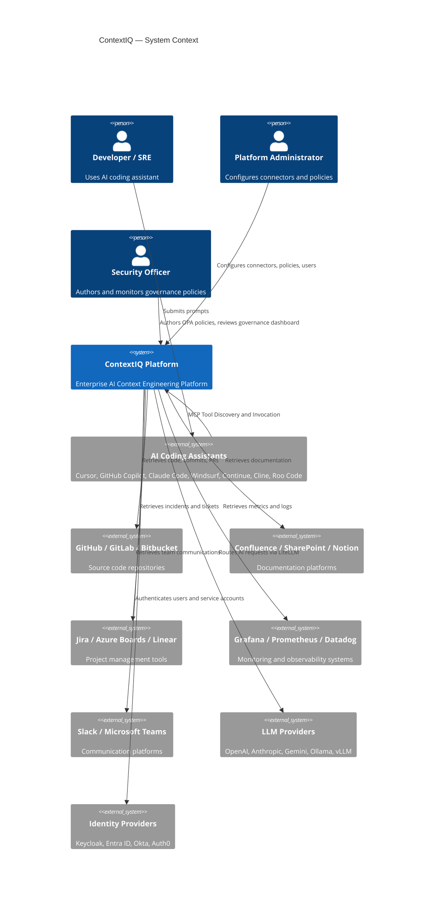
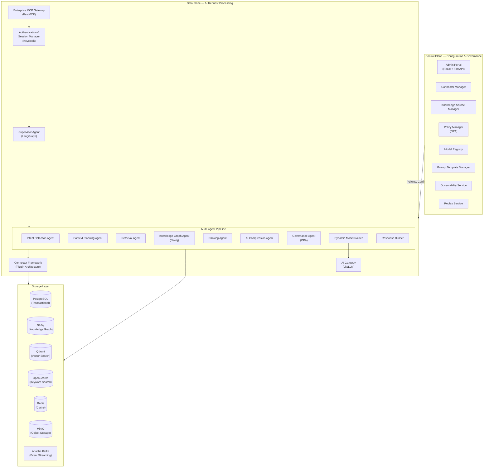
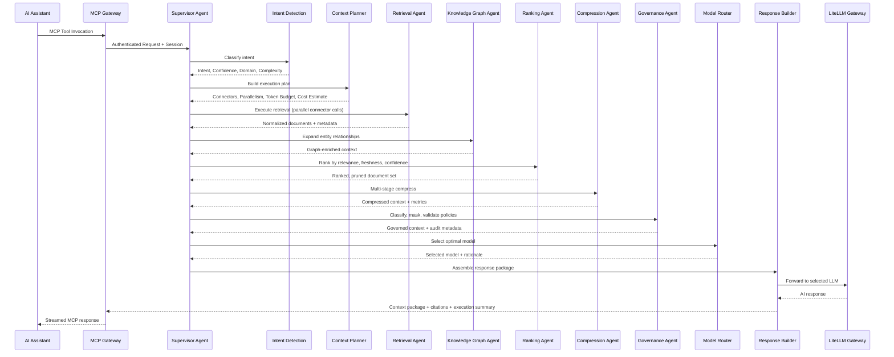
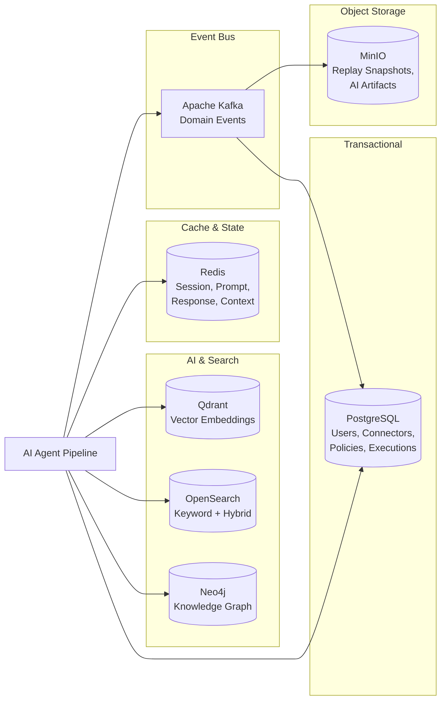
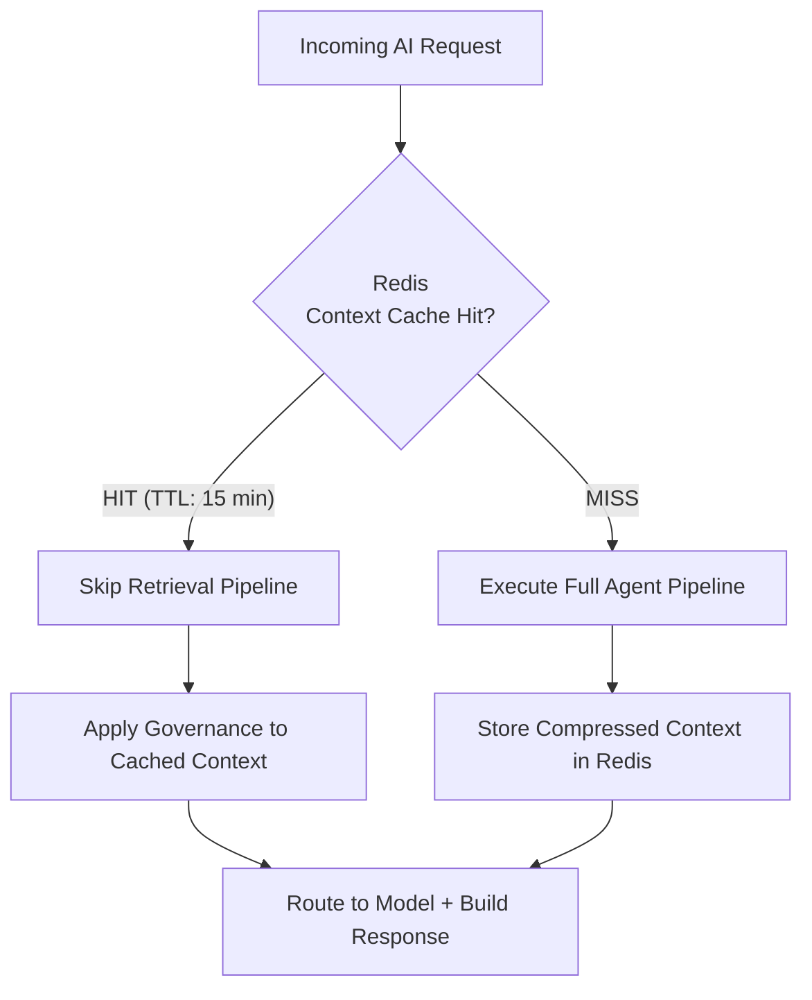
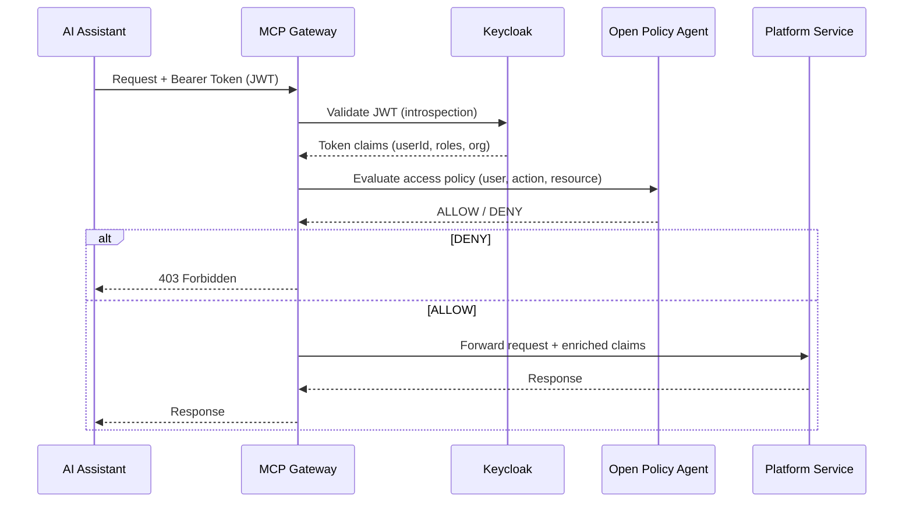
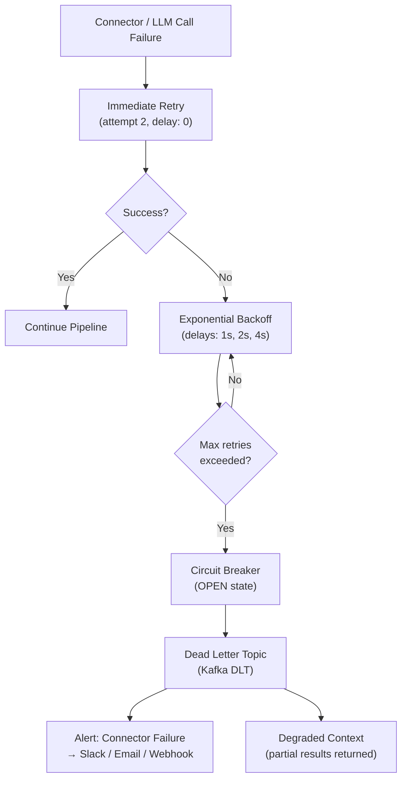

# ContextIQ — Architecture Design Specification

## Metadata

| Field | Value |
|---|---|
| Project | ContextIQ |
| Document Type | Architecture Design Specification |
| Version | 1.0 |
| Status | Draft |
| Author | GitHub Copilot (generated from spec.md v1.0 + BRD v1.0) |
| Sources | `.propel/context/docs/spec.md`, `docs/BRD.md` |
| Date | 2026-07-09 |

---

## 1. Architecture Goals

| ID | Goal |
|---|---|
| GOAL-001 | Deploy as a cloud-native, Kubernetes-first platform with no vendor lock-in on infrastructure. |
| GOAL-002 | Maintain vendor neutrality across LLM providers, cloud platforms, and identity systems. |
| GOAL-003 | Enforce governance, authentication, and authorization at every request boundary. |
| GOAL-004 | Provide full AI execution lineage — every agent decision, context chunk, and routing outcome is observable and replayable. |
| GOAL-005 | Perform context engineering before any LLM invocation to minimize token usage and maximize response quality. |
| GOAL-006 | Support pluggable connectors that integrate enterprise systems without modifying platform core code. |
| GOAL-007 | Orchestrate AI agents through a Supervisor pattern ensuring sequential integrity with parallelism where safe. |
| GOAL-008 | Achieve enterprise-grade scalability and availability through stateless services, horizontal autoscaling, and polyglot persistence. |

---

## 2. Architecture Principles

| ID | Principle | Implication |
|---|---|---|
| AP-001 | **Cloud Native** | All services run as Kubernetes-native workloads (Deployments, StatefulSets, HPAs). |
| AP-002 | **Open Standards** | MCP, REST, OpenAPI, OAuth2/OIDC, and OpenTelemetry are used at every integration boundary. |
| AP-003 | **Vendor Neutral** | LiteLLM abstracts all LLM providers; Keycloak abstracts identity; connectors abstract enterprise systems. |
| AP-004 | **Stateless Services** | All business services hold no local state; state is externalized to PostgreSQL, Redis, and Qdrant. |
| AP-005 | **Event Driven** | Kafka is used for all asynchronous inter-service communication to decouple producers from consumers. |
| AP-006 | **AI First** | Every user request passes through full AI orchestration before any LLM is invoked. |
| AP-007 | **Secure by Default** | Authentication, RBAC, OPA policy evaluation, secret masking, and TLS are enforced on every request. |
| AP-008 | **Observable by Design** | Every request emits metrics, structured logs, distributed traces, and replay metadata from the moment of ingress. |

---

## 3. System Context



---

## 4. Component Architecture

### 4.1 Control Plane vs. Data Plane Separation



---

### 4.2 Multi-Agent Execution Graph



---

## 5. Non-Functional Requirements

### 5.1 Availability and Reliability

| ID | Requirement | Target | Rationale |
|---|---|---|---|
| NFR-001 | Platform uptime shall meet ≥99.9% availability. | ≥99.9% | Enterprise production SLA; allows <8.7 hours downtime per year. |
| NFR-002 | Connector availability shall meet ≥99.9% uptime. | ≥99.9% | Connector failure directly impairs context retrieval quality. |
| NFR-015 | Individual agent failures shall not cause total request failure; degraded context is acceptable. | Graceful degradation | Partial connector failures must not block the full orchestration pipeline. |
| NFR-016 | The platform shall support rolling updates with zero downtime for all stateless services. | Zero-downtime deployments | Enterprise deployments cannot accept maintenance windows. |

---

### 5.2 Performance

| ID | Requirement | Target | Rationale |
|---|---|---|---|
| NFR-003 | Average end-to-end AI request response time shall be less than 2 seconds. | <2 seconds | Developer productivity is directly impaired beyond 2 seconds. |
| NFR-013 | AI context compression ratio shall achieve ≥90% token reduction on average. | ≥90% | Drives AI cost reduction target of ≥60%. |
| NFR-014 | Intent detection shall achieve ≥95% classification accuracy. | ≥95% accuracy | Inaccurate intent causes mis-directed retrieval, wasting tokens and degrading quality. |
| NFR-017 | Context retrieval ranking shall achieve ≥95% relevance accuracy. | ≥95% accuracy | Poorly ranked context increases token usage and reduces AI response quality. |

---

### 5.3 Scalability

| ID | Requirement | Target | Rationale |
|---|---|---|---|
| NFR-004 | All stateless services shall support horizontal scaling via Kubernetes Horizontal Pod Autoscaler. | Auto-scale on CPU, memory, and queue depth | Workload is bursty; stateless design enables elastic scale. |
| NFR-005 | The platform shall support multi-AZ deployment for high availability. | Multi-AZ active-active | Single-AZ failure must not cause platform outage. |
| NFR-018 | Database write throughput shall support at least 1,000 AI requests per second at peak. | 1,000 RPS peak | Based on enterprise-scale concurrent developer usage projections. |

---

### 5.4 Security

| ID | Requirement | Target | Rationale |
|---|---|---|---|
| NFR-006 | Authentication shall use OAuth2, OIDC, or SAML 2.0. | OAuth2 / OIDC / SAML 2.0 | Enterprise SSO integration requires federated identity standards. |
| NFR-007 | All data in transit shall be encrypted using TLS 1.3. | TLS 1.3 | Prevents interception of enterprise knowledge between services. |
| NFR-008 | All data at rest shall be encrypted using AES-256. | AES-256 | Protects enterprise data if storage volumes are compromised. |
| NFR-019 | All credentials and secrets shall be stored in HashiCorp Vault and never in code or ConfigMaps. | Zero secrets in code | OWASP A02 and A07 compliance. |
| NFR-020 | RBAC shall be enforced at the API gateway layer; OPA policies shall be enforced in the Governance Agent. | Defense in depth | Two independent authorization layers prevent privilege escalation. |

---

### 5.5 Observability

| ID | Requirement | Target | Rationale |
|---|---|---|---|
| NFR-009 | All services shall emit metrics, logs, and traces via OpenTelemetry. | 100% coverage | Enables vendor-neutral observability stack switching. |
| NFR-010 | AI execution traces shall be captured in Langfuse with agent-level granularity. | Per-agent trace spans | Required for AI cost attribution, compression analysis, and quality tuning. |
| NFR-021 | Alerting latency for critical events (policy violation, model failure) shall be less than 30 seconds. | <30 second alert delivery | Security and reliability events require near-real-time notification. |

---

### 5.6 Recovery

| ID | Requirement | Target | Rationale |
|---|---|---|---|
| NFR-011 | Recovery Point Objective (RPO) shall be less than 15 minutes. | <15 minutes | Limits data loss window to one connector sync cycle. |
| NFR-012 | Recovery Time Objective (RTO) shall be less than 30 minutes. | <30 minutes | Kubernetes rolling redeployment plus database restore time target. |
| NFR-022 | All persistent data stores shall support automated daily backups with point-in-time recovery. | Daily backup + PITR | Enables recovery from data corruption or accidental deletion. |

---

### 5.7 Compliance and Retention

| ID | Requirement | Target | Rationale |
|---|---|---|---|
| NFR-023 | Audit logs shall be retained for a minimum of 1 year. | 1 year | ISO 27001, SOC 2, and HIPAA compliance requirement. |
| NFR-024 | Replay metadata shall be retained for a minimum of 90 days. | 90 days | Provides audit trail for AI governance reviews. |
| NFR-025 | Metrics and traces shall be retained for a minimum of 30 days. | 30 days | Operational debugging window with acceptable storage cost. |
| NFR-026 | The platform shall support GDPR, HIPAA, PCI DSS, ISO 27001, and SOC 2 compliance standards. | Multi-standard | Enterprise regulated industries require multi-framework compliance. |

---

### 5.8 Deployment

| ID | Requirement | Target | Rationale |
|---|---|---|---|
| NFR-027 | The platform shall support deployment in cloud, hybrid, on-premises, and air-gapped environments. | All four modes | Enterprise customers with data residency requirements cannot use cloud-only SaaS. |
| NFR-028 | The platform shall have no hard dependency on a specific cloud provider's managed services. | Vendor neutral | Prevents cloud lock-in and enables multi-cloud strategies. |

---

## 6. Technical Requirements

### 6.1 Backend Services

| ID | Requirement | Technology | Justification |
|---|---|---|---|
| TR-001 | All backend services shall be implemented in Python 3.11+. | Python | Ecosystem alignment with LangGraph, LiteLLM, FastMCP, and AI libraries. |
| TR-002 | REST API services shall use FastAPI with OpenAPI 3.1 schema generation. | FastAPI | High performance async framework; native OpenAPI support for contract-first APIs. |
| TR-003 | The MCP server shall be implemented using FastMCP. | FastMCP | Native MCP protocol implementation; supports tool discovery and streaming. |
| TR-004 | Multi-agent orchestration shall use LangGraph with a StateGraph definition per workflow. | LangGraph | Provides supervisor pattern, shared state, conditional routing, and retry logic. |
| TR-005 | All LLM API calls shall be routed through LiteLLM. | LiteLLM | Single unified API for OpenAI, Anthropic, Gemini, Ollama, vLLM, and LM Studio. |

---

### 6.2 Data Stores

| ID | Requirement | Technology | Justification |
|---|---|---|---|
| TR-006 | Transactional and configuration data shall be stored in PostgreSQL 16+. | PostgreSQL | ACID compliance; mature ecosystem; supports JSONB for flexible configuration storage. |
| TR-007 | Knowledge graph relationships shall be stored in Neo4j 5+. | Neo4j | Native graph database; Cypher query language optimized for traversal and relationship queries. |
| TR-008 | Vector embeddings for semantic search shall be stored in Qdrant. | Qdrant | High-performance vector search; supports hybrid search; Rust-native for low latency. |
| TR-009 | Full-text and hybrid search shall be powered by OpenSearch 2+. | OpenSearch | Apache-licensed fork of Elasticsearch; supports BM25, keyword, fuzzy, and kNN hybrid. |
| TR-010 | Distributed caching shall use Redis 7+ with TTL-based eviction. | Redis | Sub-millisecond latency; supports session, prompt, and response caching patterns. |
| TR-011 | Binary artifact storage (replay snapshots, diagrams, reports) shall use MinIO. | MinIO | S3-compatible API; supports air-gapped deployment; no cloud dependency. |

---

### 6.3 Infrastructure and Messaging

| ID | Requirement | Technology | Justification |
|---|---|---|---|
| TR-012 | Asynchronous event streaming shall use Apache Kafka 3+. | Apache Kafka | Durable, ordered event log; decouples agent pipeline stages and observability consumers. |
| TR-013 | Container orchestration shall use Kubernetes 1.28+. | Kubernetes | Industry standard; supports HPA, StatefulSets, namespaces, and GitOps workflows. |
| TR-014 | Helm charts shall be provided for all platform components. | Helm 3 | Standardized packaging; enables parameterized deployment across environments. |
| TR-015 | GitOps-based deployment shall use ArgoCD 2+. | ArgoCD | Declarative GitOps operator; auto-syncs Kubernetes manifests from Git. |
| TR-016 | Ingress shall be managed by NGINX Ingress Controller with TLS termination. | NGINX Ingress | Lightweight; supports WebSocket (required for MCP streaming); TLS-native. |
| TR-017 | Secrets shall be managed by HashiCorp Vault 1.15+ with dynamic secrets support. | HashiCorp Vault | Supports dynamic credentials for databases and cloud providers; auto-rotation. |

---

### 6.4 Identity and Policy

| ID | Requirement | Technology | Justification |
|---|---|---|---|
| TR-018 | Identity and Access Management shall use Keycloak 24+. | Keycloak | Open-source OIDC/SAML provider; supports federation with Entra ID, Okta, Auth0. |
| TR-019 | Policy evaluation shall use Open Policy Agent (OPA) 0.65+ with Rego language. | OPA | Declarative, testable policies; integrates with Kubernetes admission control. |

---

### 6.5 Observability Stack

| ID | Requirement | Technology | Justification |
|---|---|---|---|
| TR-020 | Telemetry instrumentation shall use OpenTelemetry SDK for all services. | OpenTelemetry | Vendor-neutral; single SDK for metrics, logs, and traces. |
| TR-021 | Metrics collection and storage shall use Prometheus 2+. | Prometheus | De-facto standard for Kubernetes metrics; pull-based with rich query language (PromQL). |
| TR-022 | Dashboards and alerting shall use Grafana 10+. | Grafana | Unified dashboard for Prometheus, Loki, and Jaeger; rich alerting rules. |
| TR-023 | Log aggregation shall use Grafana Loki 3+. | Loki | Cost-efficient log storage; native Grafana integration; label-based indexing. |
| TR-024 | Distributed tracing shall use Jaeger 2+. | Jaeger | OpenTelemetry-native trace storage; supports service dependency graphs. |
| TR-025 | AI-specific observability (prompt, context, model, cost, token usage) shall use Langfuse 3+. | Langfuse | Purpose-built for LLM observability; per-agent trace spans; cost attribution. |

---

### 6.6 API Design

| ID | Requirement | Detail |
|---|---|---|
| TR-026 | All REST APIs shall follow the base path `/api/v1` with versioned routing. | Enables non-breaking version transitions. |
| TR-027 | All APIs shall return standardized error responses with `timestamp`, `traceId`, `service`, `errorCode`, `message`, and `severity`. | Enables consistent client error handling and trace correlation. |
| TR-028 | The MCP server shall support both SSE (Server-Sent Events) and WebSocket transport for streaming. | Required for real-time AI assistant integration. |
| TR-029 | All public APIs shall be documented via auto-generated OpenAPI 3.1 schemas served at `/api/v1/docs`. | Enables client SDK generation and contract-first testing. |

---

## 7. Data Requirements

### 7.1 Polyglot Persistence Strategy

| ID | Requirement | Storage | Rationale |
|---|---|---|---|
| DR-001 | User, organization, project, connector, and policy records shall be stored in PostgreSQL. | PostgreSQL | Relational integrity and transactional guarantees required for configuration data. |
| DR-002 | Every AI request execution trace shall be persisted as an immutable record in PostgreSQL. | PostgreSQL | Provides audit-grade immutability with ACID guarantees; supports replay queries. |
| DR-003 | Execution snapshots (full input/output per agent) shall be stored as compressed JSON objects in MinIO. | MinIO | Execution snapshots are large binary objects unsuitable for relational storage. |
| DR-004 | Semantic embeddings for all indexed enterprise content shall be stored in Qdrant collections. | Qdrant | Vector search requires specialized ANN index structures unavailable in relational DBs. |
| DR-005 | Enterprise entity relationships (Service, Repository, Developer, Incident, API, Database) shall be stored as nodes and edges in Neo4j. | Neo4j | Relationship traversal queries (e.g., 2-hop service dependencies) require graph structures. |
| DR-006 | Full-text searchable content (logs, documentation, wikis, Jira tickets) shall be indexed in OpenSearch. | OpenSearch | BM25 + kNN hybrid search not available in PostgreSQL or Qdrant alone. |
| DR-007 | Active session state, compressed context packages, and LLM response caches shall be stored in Redis. | Redis | Sub-millisecond reads for in-flight request state; TTL-based eviction prevents unbounded growth. |
| DR-008 | AI artifact objects (replay snapshots, diagrams, reports, prompt archives) shall be stored in MinIO. | MinIO | S3-compatible object storage for unstructured binary data. |

---

### 7.2 Data Schema

| ID | Requirement | Detail |
|---|---|---|
| DR-009 | Execution records shall contain: `execution_id`, `session_id`, `user_id`, `intent`, `complexity`, `selected_model`, `token_in`, `token_out`, `compression_ratio`, `latency_ms`, `cost_usd`, `status`, `created_at`. | Enables cost attribution, performance trending, and replay lookup. |
| DR-010 | Vector embedding records in Qdrant shall include payload metadata: `source`, `repository`, `owner`, `tags`, `language`, `timestamp`, `chunk_id`. | Required for post-retrieval filtering and citation generation. |
| DR-011 | Audit log records shall contain: `timestamp`, `user_id`, `session_id`, `execution_id`, `trace_id`, `action`, `resource`, `result`, `ip_address`, `user_agent`. | Compliance requirement per NFR-023 and ISO 27001. |
| DR-012 | Knowledge Graph nodes shall carry labels: `Repository`, `Service`, `API`, `Developer`, `Team`, `Incident`, `Deployment`, `Database`, `Wiki`, `Architecture`, `BusinessCapability`. | Enables typed graph queries for relationship-based context expansion. |
| DR-013 | Knowledge Graph relationships shall use: `OWNS`, `DEPLOYS`, `CALLS`, `USES`, `RELATED_TO`, `DOCUMENTED_BY`, `DEPENDS_ON`, `ASSIGNED_TO`. | Covers ownership, dependency, and documentation relationship patterns. |

---

### 7.3 Data Flow and Retention

| ID | Requirement | Detail |
|---|---|---|
| DR-014 | Kafka topics shall follow the naming convention `<domain>.<event>` (e.g., `compression.completed`, `governance.violated`). | Consistent naming enables topic-based policy and consumer group management. |
| DR-015 | All Kafka events shall include: `eventType`, `executionId`, `timestamp`, `version`, and a domain-specific `payload` object. | Enables schema evolution and event replay. |
| DR-016 | Data retention policies shall be configurable per data type without code changes. | Operational requirement to meet varying regulatory retention periods. |
| DR-017 | Execution replay records shall be write-once; updates and deletes shall be rejected at the application layer. | Ensures immutability required for audit and compliance (NFR-024). |
| DR-018 | Qdrant collections shall be partitioned by content type: `source_code`, `documentation`, `incidents`, `logs`, `architecture`, `meeting_notes`, `wikis`. | Enables targeted retrieval with collection-level filtering and quota management. |

---

### 7.4 Data Security

| ID | Requirement | Detail |
|---|---|---|
| DR-019 | All database volumes shall be encrypted at rest using AES-256 (NFR-008). | Applied to PostgreSQL, Neo4j, Qdrant, OpenSearch, MinIO, and Redis volumes. |
| DR-020 | Database credentials shall be managed by HashiCorp Vault using dynamic secret generation with automatic rotation. | Prevents long-lived credential exposure. |
| DR-021 | PII and sensitive field values in PostgreSQL shall be encrypted at the column level using `pgcrypto`. | Defense-in-depth for user data beyond full-disk encryption. |

---

## 8. AI Requirements

### 8.1 Agent Architecture

| ID | Requirement | Detail |
|---|---|---|
| AIR-001 | The multi-agent pipeline shall be implemented as a LangGraph `StateGraph` with a shared `ExecutionState` object passed between all agent nodes. | Provides type-safe state propagation and enables conditional routing. |
| AIR-002 | The `ExecutionState` object shall contain at minimum: `executionId`, `sessionId`, `user`, `assistant`, `intent`, `confidence`, `complexity`, `executionPlan`, `selectedConnectors`, `retrievedDocuments`, `knowledgeGraph`, `rankedContext`, `compressedContext`, `governedContext`, `selectedModel`, `response`, `metrics`. | Complete state required for replay, observability, and governance auditability. |
| AIR-003 | The Supervisor Agent shall implement conditional routing: if intent confidence < 0.8, escalate to a clarification step before planning. | Prevents low-confidence intent from triggering expensive multi-connector retrieval. |
| AIR-004 | Agent execution shall be parallelized at the Retrieval stage: each selected connector shall be called concurrently within the token budget. | Reduces total latency for multi-source requests (target <2s, NFR-003). |
| AIR-005 | Each agent node shall emit a structured event to the corresponding Kafka topic on completion. | Enables decoupled observability consumers and replay event sourcing. |

---

### 8.2 Intent Detection

| ID | Requirement | Detail |
|---|---|---|
| AIR-006 | Intent Detection Agent shall classify prompts into at minimum: `CodeSearch`, `IncidentInvestigation`, `DocumentationLookup`, `ArchitectureReview`, `CodeExplanation`, `DependencyAnalysis`, `SecurityAudit`, `CostAnalysis`. | Covers the primary developer and SRE use cases in the BRD. |
| AIR-007 | Intent classification shall include: `intent`, `confidence` (0.0–1.0), `domain`, `complexity` (`Low/Medium/High`), and `recommendedConnectors` list. | Required inputs for the Context Planning Agent. |
| AIR-008 | Intent detection shall achieve ≥95% accuracy on the ContextIQ intent benchmark dataset. | NFR-014 validation criterion. |

---

### 8.3 Context Compression

| ID | Requirement | Detail |
|---|---|---|
| AIR-009 | The Compression Agent shall implement three compression stages in order: Rule-Based → Semantic → LLM-Based Summarization. | Cheaper stages run first to reduce input to the more expensive LLM stage. |
| AIR-010 | Rule-Based Compression shall remove: exact duplicate lines, repeated stack traces (retain first occurrence), boilerplate imports, and auto-generated code headers. | Deterministic, zero-cost compression applied before any LLM call. |
| AIR-011 | Semantic Compression shall merge text chunks with cosine similarity > 0.92 into a single representative chunk. | Eliminates near-duplicate content across different connector sources. |
| AIR-012 | LLM-Based Summarization shall be applied to chunks exceeding the per-chunk token budget defined in the execution plan. | Preserves semantic meaning while meeting token budget constraints. |
| AIR-013 | The Compression Agent shall target a compression ratio of ≥90% averaged across all request types (NFR-013). | KPI alignment. |

---

### 8.4 Dynamic Model Routing

| ID | Requirement | Detail |
|---|---|---|
| AIR-014 | The Model Capability Registry shall store per-model metadata: `provider`, `modelId`, `codingScore`, `reasoningScore`, `contextWindow`, `costPer1kTokens`, `avgLatencyMs`, `visionSupport`, `functionCallingSupport`, `onPremSupport`, `healthStatus`. | Required inputs for routing decisions. |
| AIR-015 | The Dynamic Model Router shall implement a weighted scoring function: `score = (codingScore × intentWeight) + (reasoningScore × complexityWeight) - (costPer1kTokens × costWeight) - (avgLatencyMs × latencyWeight)`. | Configurable weights allow organizations to prioritize cost, speed, or quality. |
| AIR-016 | Model routing shall respect organization-level policies from OPA before scoring: if OPA returns DENY for a model, it is excluded from scoring. | Governance overrides optimization — compliance takes precedence. |
| AIR-017 | The router shall implement a failover chain: if the primary model is unhealthy, automatically route to the next-best eligible model. | Supports NFR-015 (graceful degradation). |
| AIR-018 | Model routing decisions shall be recorded in the execution trace with: `evaluatedModels`, `selectedModel`, `selectionRationale`, `policyConstraints`. | Required for replay auditability (FR-038). |

---

### 8.5 Knowledge Graph

| ID | Requirement | Detail |
|---|---|---|
| AIR-019 | The Knowledge Graph Agent shall support configurable traversal depth (default: 2 hops, maximum: 4 hops). | Prevents unbounded graph expansion that could exceed token budget. |
| AIR-020 | Graph entity discovery shall use entity extraction from retrieved document chunks to identify node labels before querying Neo4j. | Grounds graph queries in content signals rather than executing blind traversals. |
| AIR-021 | Knowledge Graph indexing shall process connector sync events from Kafka and update Neo4j node/edge records incrementally. | Prevents full graph rebuilds on each connector synchronization cycle. |

---

### 8.6 Semantic Search

| ID | Requirement | Detail |
|---|---|---|
| AIR-022 | Embedding generation shall use a configurable embedding model (default: `text-embedding-3-small` or equivalent open-source model). | Allows organizations to use on-prem embedding models for data residency. |
| AIR-023 | Retrieval shall support hybrid search: combine Qdrant vector similarity (weight: 0.7) with OpenSearch BM25 keyword score (weight: 0.3) using Reciprocal Rank Fusion (RRF). | Hybrid search consistently outperforms pure vector or keyword search in enterprise knowledge retrieval benchmarks. |
| AIR-024 | Context Store hit shall be checked before retrieval execution; if a semantically equivalent compressed context exists in Redis (TTL: 15 minutes), the retrieval stage shall be skipped. | Reduces connector calls and LLM costs for repeated or similar queries. |

---

## 9. Technology Stack Summary

| Layer | Component | Technology | Version |
|---|---|---|---|
| API Framework | Backend Services | FastAPI | 0.110+ |
| MCP Server | AI Assistant Interface | FastMCP | 2.0+ |
| Orchestration | Multi-Agent Workflow | LangGraph | 0.2+ |
| LLM Gateway | Model Abstraction | LiteLLM | 1.40+ |
| Vector Search | Semantic Retrieval | Qdrant | 1.9+ |
| Graph Database | Relationship Context | Neo4j | 5.0+ |
| Relational DB | Transactional Data | PostgreSQL | 16+ |
| Cache | In-Flight State | Redis | 7.2+ |
| Full-Text Search | Keyword Retrieval | OpenSearch | 2.13+ |
| Object Storage | Artifacts / Replay | MinIO | RELEASE.2024+ |
| Event Streaming | Async Decoupling | Apache Kafka | 3.7+ |
| Identity | Authentication | Keycloak | 24+ |
| Policy Engine | Governance | Open Policy Agent | 0.65+ |
| Secrets | Credential Management | HashiCorp Vault | 1.15+ |
| Telemetry | Instrumentation | OpenTelemetry | 1.24+ |
| Metrics | Collection + Storage | Prometheus | 2.52+ |
| Dashboards | Visualization + Alerts | Grafana | 10.4+ |
| Logs | Aggregation | Grafana Loki | 3.0+ |
| Tracing | Distributed Traces | Jaeger | 2.0+ |
| AI Observability | LLM Traces | Langfuse | 3.0+ |
| Container Runtime | Packaging | Docker | 26+ |
| Orchestration | Kubernetes | Kubernetes | 1.29+ |
| Package Manager | Helm Charts | Helm | 3.14+ |
| GitOps | Continuous Deployment | ArgoCD | 2.10+ |
| Ingress | External Access | NGINX Ingress | 1.10+ |
| Language | Runtime | Python | 3.11+ |

---

## 10. Data Architecture

### 10.1 Polyglot Persistence Overview



---

### 10.2 Context Store Cache Flow



---

## 11. API Architecture

### 11.1 REST API Surface

```text
Base URL: /api/v1

Authentication
  POST /auth/login
  POST /auth/logout
  POST /auth/refresh

Connectors
  GET    /connectors
  POST   /connectors
  PUT    /connectors/{id}
  DELETE /connectors/{id}
  GET    /connectors/{id}/health
  POST   /connectors/{id}/sync

Knowledge Sources
  GET  /knowledge/sources
  POST /knowledge/sources
  PUT  /knowledge/sources/{id}
  POST /knowledge/sources/{id}/index
  GET  /knowledge/search
  GET  /knowledge/graph

MCP Tools
  GET  /tools
  GET  /tools/{name}
  POST /tools/{name}/invoke

Policies
  GET    /policies
  POST   /policies
  PUT    /policies/{id}
  DELETE /policies/{id}
  POST   /policies/{id}/simulate

Models
  GET  /models
  POST /models
  PUT  /models/{id}
  GET  /models/{id}/health

Users
  GET    /users
  POST   /users
  PUT    /users/{id}/role
  DELETE /users/{id}

Replay
  GET /replay
  GET /replay/{executionId}
  GET /replay/{executionId}/export

Dashboard
  GET /dashboard
  GET /dashboard/metrics
  GET /dashboard/cost
  GET /dashboard/governance
```

---

### 11.2 MCP Tool Interface

```text
MCP Endpoint: /mcp/v1

Tool Discovery:
  Method: tools/list
  Response: Array of { name, description, inputSchema, outputSchema, permissions, version }

Tool Invocation:
  Method: tools/call
  Request: { name, arguments }
  Response: { content, isError, executionId, citations, metrics }

Supported Transports:
  - SSE (Server-Sent Events) for streaming
  - WebSocket for bidirectional session management
  - HTTP for single-shot invocations
```

---

## 12. Event-Driven Architecture

### 12.1 Kafka Topic Registry

| Topic | Producer | Consumers | Purpose |
|---|---|---|---|
| `intent.events` | Intent Detection Agent | Observability, Replay | Intent classification results |
| `planner.events` | Context Planning Agent | Observability, Replay | Execution plan decisions |
| `retrieval.events` | Retrieval Agent | Observability, Replay | Connector calls and results |
| `knowledge.events` | Knowledge Graph Agent | Observability, Replay, Graph Indexer | Graph expansion results |
| `ranking.events` | Ranking Agent | Observability, Replay | Context ranking decisions |
| `compression.events` | Compression Agent | Observability, Replay | Compression metrics |
| `governance.events` | Governance Agent | Observability, Replay, Alert Engine | Policy evaluations, masking actions |
| `model.events` | Dynamic Model Router | Observability, Replay | Routing decisions |
| `response.events` | Response Builder | Observability, Replay | Final response metadata |
| `connector.sync` | Connector Scheduler | Retrieval Agent, Indexer | Connector sync triggers |
| `observability.events` | All Services | Grafana, Loki, Langfuse | Aggregated telemetry events |

---

### 12.2 Standard Event Envelope

```json
{
  "eventType": "compression.completed",
  "executionId": "ctx-xxxxxxxx-xxxx-xxxx-xxxx-xxxxxxxxxxxx",
  "sessionId": "sess-xxxx",
  "userId": "usr-xxxx",
  "timestamp": "2026-07-09T10:30:00.000Z",
  "version": "1.0",
  "payload": {
    "originalTokens": 46800,
    "compressedTokens": 820,
    "compressionRatio": 0.982
  }
}
```

---

## 13. Security Architecture

### 13.1 Authentication and Authorization Flow



---

### 13.2 Security Controls

| Layer | Control | Implementation |
|---|---|---|
| Transport | TLS 1.3 encryption | NGINX Ingress TLS termination; mTLS between services via Istio (optional) |
| Authentication | JWT validation | Keycloak OIDC; token introspection at every request |
| Authorization | RBAC | Role claims in JWT; enforced at API gateway |
| Policy | Fine-grained access | OPA Rego policies evaluated per request in Governance Agent |
| Secrets | Credential management | HashiCorp Vault; dynamic secrets with auto-rotation |
| Data | Encryption at rest | AES-256 on all Kubernetes PersistentVolumes |
| Data | Column-level encryption | `pgcrypto` for PII fields in PostgreSQL |
| Code | Secret scanning | Gitleaks in CI/CD pipeline |
| Images | Vulnerability scanning | Trivy + Grype on every container build |
| Supply chain | Dependency scanning | Dependabot + Semgrep SAST |
| Governance | Sensitive data masking | Governance Agent: PII detection, secret detection, masking before LLM |
| Audit | Immutable logs | Write-once audit records in PostgreSQL; exported to SIEM |

---

## 14. Deployment Architecture

### 14.1 Kubernetes Namespace Strategy

| Namespace | Contents |
|---|---|
| `contextiq-system` | Platform core: MCP Gateway, Supervisor, Agents |
| `contextiq-platform` | Admin Portal, Connector Manager, Policy Manager |
| `contextiq-databases` | PostgreSQL, Neo4j, Qdrant, Redis, OpenSearch |
| `contextiq-storage` | MinIO, Kafka |
| `contextiq-observability` | Prometheus, Grafana, Loki, Jaeger, Langfuse |
| `contextiq-security` | Keycloak, HashiCorp Vault, OPA |
| `contextiq-connectors` | Connector pods (one Deployment per connector type) |

---

### 14.2 Kubernetes Workload Types

| Service Type | Workload | Scaling |
|---|---|---|
| MCP Gateway | Deployment | HPA: CPU >70%, req/s >500 |
| Supervisor Agent | Deployment | HPA: CPU >70%, queue depth >100 |
| Agent Services | Deployment | HPA: CPU >70% |
| Connector Pods | Deployment | HPA: CPU >60% |
| Admin Portal (API) | Deployment | HPA: CPU >70% |
| PostgreSQL | StatefulSet | Manual (vertical + read replicas) |
| Neo4j | StatefulSet | Manual (causal cluster) |
| Qdrant | StatefulSet | Manual (distributed mode) |
| Redis | StatefulSet | Sentinel mode (3 replicas) |
| OpenSearch | StatefulSet | Manual (data node scaling) |
| MinIO | StatefulSet | Manual (distributed mode) |
| Kafka | StatefulSet | Manual (broker scaling) |
| Keycloak | Deployment | HPA: CPU >70% |
| Vault | StatefulSet | HA with Raft storage |

---

### 14.3 CI/CD Pipeline

```mermaid
flowchart LR
    A["Developer\ngit push"] --> B["GitHub\nPull Request"]
    B --> C["GitHub Actions\nCI Pipeline"]

    subgraph CI["CI Stages"]
        C --> D["Lint + Type Check\n(ruff, mypy)"]
        D --> E["Unit Tests\n(pytest)"]
        E --> F["Integration Tests\n(pytest + testcontainers)"]
        F --> G["Security Scan\n(Trivy, Gitleaks, Semgrep)"]
        G --> H["Docker Build\n+ Push to Registry"]
        H --> I["Helm Package\n+ Push to Chart Registry"]
    end

    I --> J["ArgoCD\nDetects new chart version"]
    J --> K["Kubernetes\nRolling Update"]
    K --> L["Smoke Tests\n+ Health Checks"]
```



---

## 15. Observability Architecture

### 15.1 Telemetry Signal Matrix

| Signal | Tool | Coverage |
|---|---|---|
| Metrics | Prometheus + Grafana | All services: request rate, error rate, latency (RED metrics), saturation |
| Structured Logs | Loki + Grafana | All services: JSON structured logs with `traceId`, `executionId`, `userId` |
| Distributed Traces | Jaeger | All services: per-request trace with inter-service spans |
| AI Execution Traces | Langfuse | Agent pipeline: per-agent spans with prompt, context, tokens, cost, latency |
| Events | Kafka + Grafana | Domain events from all agent pipeline stages |

---

### 15.2 Key Dashboards

| Dashboard | Key Panels |
|---|---|
| Executive | Total requests/day, active users, total AI cost, compression ratio, avg latency |
| AI Operations | Intent distribution, agent execution times, compression performance, retrieval accuracy, ranking quality |
| Model Router | Model selection distribution, cost savings vs. baseline, failover rate, latency by model |
| Connector Health | Sync status per connector, error rate, avg response time, last sync timestamp |
| Governance | Policy evaluation count, DENY rate, secrets masked/hour, PII detections, blocked requests |
| Knowledge | Indexed document count by source, embedding count, search accuracy, cache hit ratio |
| Platform Health | Pod status, CPU/memory by namespace, Kafka consumer lag, database connection pool |

---

## 16. Error Handling and Resilience

### 16.1 Retry Strategy



---

### 16.2 Standardized Error Response

```json
{
  "timestamp": "2026-07-09T10:30:00.000Z",
  "traceId": "trace-xxxxxxxxxxxxxxxxxxxx",
  "executionId": "ctx-xxxxxxxxxxxxxxxxxxxx",
  "service": "RetrievalAgent",
  "errorCode": "CTX-RET-003",
  "message": "GitHub connector timeout after 3 retries",
  "severity": "HIGH",
  "retryable": true,
  "context": {
    "connector": "github",
    "repository": "payment-service",
    "attemptCount": 3
  }
}
```

---

### 16.3 Error Code Convention

| Prefix | Service |
|---|---|
| `CTX-GW-###` | MCP Gateway |
| `CTX-INT-###` | Intent Detection Agent |
| `CTX-PLN-###` | Context Planning Agent |
| `CTX-RET-###` | Retrieval Agent |
| `CTX-KG-###` | Knowledge Graph Agent |
| `CTX-RNK-###` | Ranking Agent |
| `CTX-CMP-###` | Compression Agent |
| `CTX-GOV-###` | Governance Agent |
| `CTX-MDL-###` | Dynamic Model Router |
| `CTX-RSP-###` | Response Builder |
| `CTX-CON-###` | Connector Framework |
| `CTX-ADM-###` | Administration Portal |

---

## 17. Architecture Decision Records

### ADR-001 — LangGraph for Multi-Agent Orchestration

**Decision:** Use LangGraph `StateGraph` for multi-agent pipeline orchestration.

**Alternatives considered:** LlamaIndex Workflows, custom async DAG, Temporal.

**Rationale:** LangGraph provides typed shared state, conditional edge routing, built-in retry logic, and native LiteLLM integration. Temporal introduces operational complexity (separate cluster) and is deferred to Phase 3.

**Consequences:** Agent pipeline logic is expressed as Python node functions; conditional routing replaces imperative control flow.

---

### ADR-002 — LiteLLM as LLM Gateway

**Decision:** All LLM API calls are routed through LiteLLM.

**Alternatives considered:** Direct OpenAI SDK, custom provider abstraction layer.

**Rationale:** LiteLLM provides a unified API compatible with 100+ providers, built-in retry/fallback, cost tracking, and token counting. Custom abstraction would duplicate this effort.

**Consequences:** Model identifiers follow LiteLLM format (e.g., `openai/gpt-4o`, `anthropic/claude-3-5-sonnet`).

---

### ADR-003 — Polyglot Persistence over Single-Database Strategy

**Decision:** Use PostgreSQL, Neo4j, Qdrant, OpenSearch, Redis, and MinIO as separate data stores.

**Alternatives considered:** PostgreSQL-only (with pgvector, JSONB, and FTS), MongoDB Atlas.

**Rationale:** Each store is optimized for its workload. `pgvector` lacks the ANN index performance of Qdrant at enterprise scale. PostgreSQL graph traversal (using recursive CTEs) cannot match Neo4j for 3–4 hop relationship queries.

**Consequences:** Operational complexity increases; managed via Kubernetes StatefulSets and Helm charts to minimize per-store configuration burden.

---

### ADR-004 — Open Policy Agent for Governance

**Decision:** Use OPA with Rego for all policy evaluation.

**Alternatives considered:** Custom rule engine, AWS Cedar, Casbin.

**Rationale:** OPA is cloud-native, decoupled from application code, supports policy-as-code versioning in Git, and integrates natively with Kubernetes admission control for deployment-level policy enforcement.

**Consequences:** Security Officers must learn Rego; Policy Simulation feature is required to lower the authoring learning curve.

---

### ADR-005 — Event-Driven Pipeline via Kafka

**Decision:** Use Apache Kafka for asynchronous inter-agent communication and observability event fan-out.

**Alternatives considered:** RabbitMQ, Redis Streams, HTTP callbacks.

**Rationale:** Kafka's durable ordered log enables event sourcing for replay, consumer group fan-out for parallel observability sinks, and dead letter topics for error isolation. Redis Streams lacks replication guarantees required for audit.

**Consequences:** Kafka requires a StatefulSet cluster (3 brokers minimum for production HA); Zookeeper replaced by KRaft mode in Kafka 3.7+.

---

## 18. Requirement Traceability

### 18.1 NFR to Component

| NFR | Component(s) |
|---|---|
| NFR-001, NFR-005, NFR-016 | Kubernetes HPA, StatefulSet HA, ArgoCD rolling updates |
| NFR-002, NFR-003 | Connector Framework (HPA), Kafka (async), Redis (cache hit), NGINX Ingress |
| NFR-004 | Kubernetes HPA (CPU, memory, queue depth) |
| NFR-006, NFR-007, NFR-008 | NGINX Ingress (TLS), OpenTelemetry, Kubernetes Secrets |
| NFR-009, NFR-010 | OpenTelemetry SDK, Prometheus, Grafana, Loki, Jaeger, Langfuse |
| NFR-011, NFR-012 | PostgreSQL + Neo4j + Qdrant backup, Kubernetes multi-AZ |
| NFR-013, NFR-014, NFR-017 | Compression Agent, Intent Detection Agent, Ranking Agent |
| NFR-019, NFR-020 | HashiCorp Vault, Keycloak RBAC, OPA Governance Agent |
| NFR-023, NFR-024, NFR-025 | PostgreSQL audit log table, MinIO replay store, Prometheus retention |

---

### 18.2 TR / DR / AIR to FR

| Spec FR | Design Requirements |
|---|---|
| FR-001, FR-002, FR-003 | TR-003 (FastMCP), TR-028 (SSE/WebSocket) |
| FR-024 | AIR-006, AIR-007, AIR-008 |
| FR-025 | AIR-001, AIR-003, AIR-004 |
| FR-026 | AIR-022, AIR-023, AIR-024, TR-008 (Qdrant), TR-009 (OpenSearch) |
| FR-027 | AIR-019, AIR-020, AIR-021, TR-007 (Neo4j) |
| FR-028 | AIR-023 (hybrid search scoring) |
| FR-029 | AIR-009, AIR-010, AIR-011, AIR-012, AIR-013 |
| FR-030, FR-033, FR-039, FR-040, FR-042 | AIR-016, TR-019 (OPA), NFR-019, NFR-020 |
| FR-031, FR-058 | AIR-014, AIR-015, AIR-016, AIR-017, AIR-018, TR-005 (LiteLLM) |
| FR-036, FR-037, FR-038, FR-043 | DR-002, DR-003, DR-017, TR-011 (Kafka) |
| FR-044, FR-047 | TR-020 (OTel), TR-021 (Prometheus), TR-022 (Grafana), TR-025 (Langfuse) |
| FR-051 | TR-005 (LiteLLM), ADR-002 |
| FR-054, FR-055 | TR-013 (Kubernetes), TR-015 (ArgoCD), TR-014 (Helm) |
| FR-059 | TR-017 (Vault), DR-020 |

---

*End of Architecture Design Specification*
