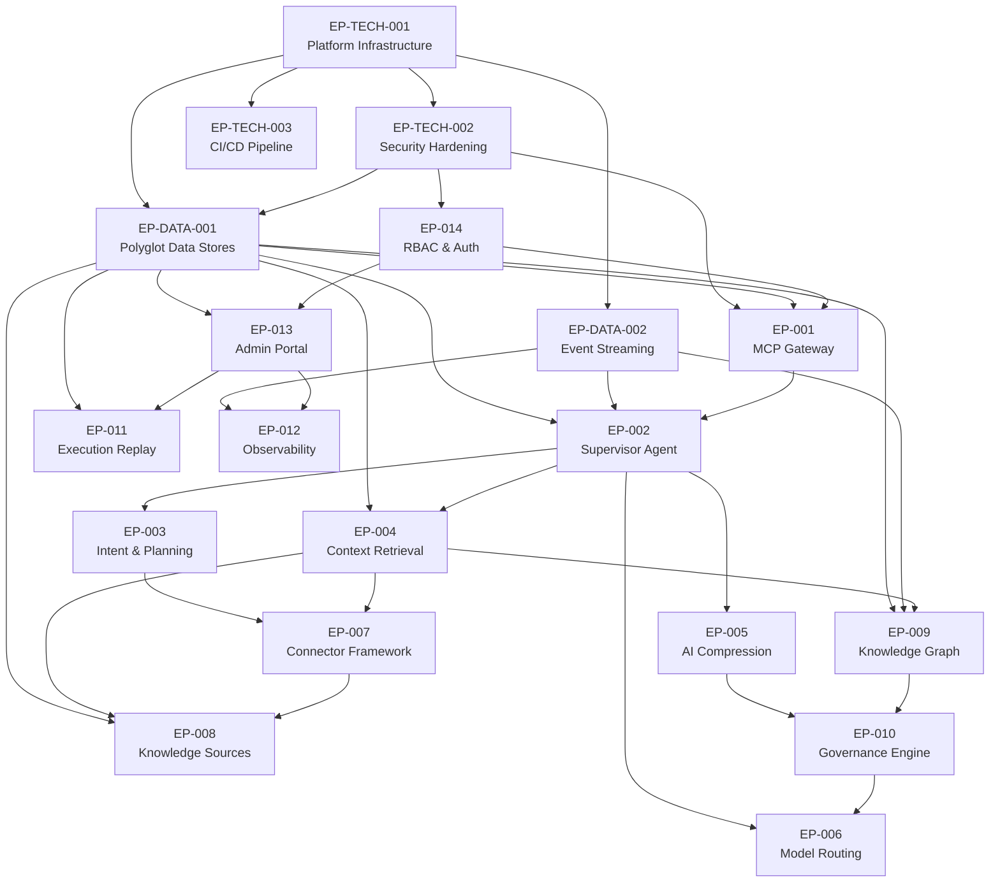

# ContextIQ — Epic Backlog

## Metadata

| Field | Value |
|---|---|
| Project | ContextIQ |
| Document Type | Epic Backlog |
| Version | 1.0 |
| Status | Draft |
| Author | GitHub Copilot (generated from spec.md v1.0 + design.md v1.0 + model.md v1.0) |
| Sources | `.propel/context/docs/spec.md`, `.propel/context/docs/design.md`, `.propel/context/docs/model.md` |
| Date | 2026-07-09 |

---

## Epic Summary

| ID | Name | Priority | Phase | Effort | Source |
|---|---|---|---|---|---|
| EP-001 | Enterprise MCP Gateway | P0 | Phase 1 | M | SPEC |
| EP-002 | Supervisor Agent & Multi-Agent Pipeline | P0 | Phase 1 | L | SPEC |
| EP-003 | Intent Detection & Context Planning | P0 | Phase 1 | M | SPEC |
| EP-004 | Context Retrieval Engine | P0 | Phase 1 | L | SPEC |
| EP-005 | AI Compression Engine | P0 | Phase 1 | M | SPEC |
| EP-006 | Dynamic Model Routing | P0 | Phase 1 | M | SPEC |
| EP-007 | Enterprise Connector Framework | P0 | Phase 1–2 | L | SPEC |
| EP-008 | Knowledge Source Management & Indexing | P0 | Phase 2 | M | SPEC |
| EP-009 | Knowledge Graph Agent | P0 | Phase 2 | L | SPEC |
| EP-010 | Governance Engine & Policy Enforcement | P0 | Phase 2 | L | SPEC |
| EP-011 | AI Execution Replay | P0 | Phase 2 | M | SPEC |
| EP-012 | Observability & AI Analytics | P0 | Phase 1–2 | L | SPEC |
| EP-013 | Administration Portal | P0 | Phase 2 | L | SPEC |
| EP-014 | Enterprise RBAC & Authentication | P0 | Phase 2 | M | SPEC |
| EP-TECH-001 | Platform Infrastructure & Kubernetes Deployment | P0 | Phase 1 | L | INFERRED |
| EP-TECH-002 | Security Hardening & Secrets Management | P0 | Phase 1 | M | INFERRED |
| EP-TECH-003 | CI/CD Pipeline & GitOps | P1 | Phase 1 | S | INFERRED |
| EP-DATA-001 | Polyglot Data Store Setup | P0 | Phase 1 | L | INFERRED |
| EP-DATA-002 | Event Streaming Infrastructure | P0 | Phase 1 | M | INFERRED |

**Effort scale:** S = 1–2 sprints · M = 2–4 sprints · L = 3–6 sprints · XL = 5–8 sprints

---

## Phase Alignment

| Phase | Duration | Epics | BRD Reference |
|---|---|---|---|
| Phase 1 — Foundation | 4–6 weeks | EP-001, EP-002, EP-003, EP-004, EP-005, EP-006, EP-007 (partial), EP-012 (basic), EP-TECH-001, EP-TECH-002, EP-TECH-003, EP-DATA-001, EP-DATA-002 | BRD §85 Phase 1 |
| Phase 2 — Enterprise Readiness | 6–8 weeks | EP-007 (complete), EP-008, EP-009, EP-010, EP-011, EP-012 (advanced), EP-013, EP-014 | BRD §85 Phase 2 |
| Phase 3 — Advanced Intelligence | 8–12 weeks | Future: AI Memory, Self-Learning Ranking, Auto Connector Discovery, Prompt Optimization | BRD §85 Phase 3 |

---

## Business Epics

---

### EP-001 — Enterprise MCP Gateway

| Field | Value |
|---|---|
| Priority | P0 |
| Phase | Phase 1 |
| Effort | M (2–4 sprints) |
| Status | Draft |
| Source | SPEC |

**Business Value**
Establishes the single, standards-based entry point through which all AI coding assistants (Cursor, GitHub Copilot, Claude Code, Windsurf, Continue, Cline, Roo Code) interact with enterprise knowledge. Without this epic, no AI assistant integration is possible.

**Description**
Implement the Enterprise MCP Gateway using FastMCP. The gateway must expose MCP Tool Discovery and Invocation endpoints, support SSE and WebSocket transport for streaming, authenticate every incoming request via Keycloak JWT validation, manage concurrent sessions via Redis, and route authenticated requests to the Supervisor Agent.

**Acceptance Criteria**
- AI assistants can connect to the MCP endpoint and list available tools via `tools/list`
- AI assistants can invoke tools via `tools/call` and receive structured responses
- All requests without a valid JWT return `403 Forbidden`
- Streaming responses are delivered via SSE transport within the 2-second latency target
- Minimum 50 concurrent sessions supported without degradation
- OTel metrics and traces emitted per request

**Requirement Mappings**

| Type | IDs |
|---|---|
| FR | FR-001, FR-002, FR-003, FR-004, FR-005, FR-014, FR-015, FR-016, FR-017, FR-018 |
| NFR | NFR-003, NFR-006, NFR-007, NFR-009 |
| TR | TR-003 (FastMCP), TR-028 (SSE/WebSocket), TR-029 (OpenAPI docs), TR-020 (OTel) |
| DM | DM-003 (Data Plane Components), DM-013 (E2E Sequence) |
| UC | UC-001, UC-005 |

**Dependencies**
- EP-TECH-001 (Kubernetes namespace and ingress must be operational)
- EP-TECH-002 (Keycloak and OPA must be available for auth)
- EP-DATA-002 (Redis session cache required)

---

### EP-002 — Supervisor Agent & Multi-Agent Pipeline

| Field | Value |
|---|---|
| Priority | P0 |
| Phase | Phase 1 |
| Effort | L (3–5 sprints) |
| Status | Draft |
| Source | SPEC |

**Business Value**
The Supervisor Agent is the core intelligence coordinator of ContextIQ. It replaces ad-hoc LLM prompting with a governed, orchestrated pipeline that improves response quality, enforces token budgets, and produces replayable execution traces. All downstream epics depend on this orchestration layer.

**Description**
Implement the Supervisor Agent as a LangGraph `StateGraph`. The agent must initialize a typed `ExecutionState` per request, wire all specialized agent nodes in the correct execution order, support parallel execution at the Retrieval stage, implement conditional routing for low-confidence intent, handle per-node retries, emit Kafka events per completed node, and record OTel spans per agent. The shared `ExecutionState` must carry all fields defined in AIR-002.

**Acceptance Criteria**
- LangGraph `StateGraph` wires all nine agent nodes in correct execution order
- `ExecutionState` is initialized with all required fields (AIR-002) on every request
- Conditional routing correctly escalates to clarification when intent confidence < 0.80 (AIR-003)
- Retrieval stage executes all selected connectors in parallel (AIR-004)
- Kafka event emitted to corresponding topic after each agent node completes (AIR-005)
- OTel trace span created per agent node with duration and status
- Execution trace persisted to PostgreSQL on every completion
- Pipeline degrades gracefully (partial context returned) on single-connector timeout

**Requirement Mappings**

| Type | IDs |
|---|---|
| FR | FR-017, FR-019, FR-024, FR-025, FR-032, FR-049 |
| NFR | NFR-003, NFR-009, NFR-015 |
| TR | TR-001 (Python), TR-004 (LangGraph), TR-020 (OTel), TR-012 (Kafka) |
| AIR | AIR-001, AIR-002, AIR-003, AIR-004, AIR-005 |
| DR | DR-002 (execution trace), DR-014 (Kafka topics), DR-015 (event envelope) |
| DM | DM-006 (Agent Class Hierarchy), DM-017 (State Machine) |
| UC | UC-001 |

**Dependencies**
- EP-001 (MCP Gateway routes requests to Supervisor)
- EP-DATA-001 (PostgreSQL for execution trace persistence)
- EP-DATA-002 (Kafka event bus)

---

### EP-003 — Intent Detection & Context Planning

| Field | Value |
|---|---|
| Priority | P0 |
| Phase | Phase 1 |
| Effort | M (2–3 sprints) |
| Status | Draft |
| Source | SPEC |

**Business Value**
Intent detection eliminates unnecessary retrieval by identifying what the developer needs before querying any enterprise system. Context planning selects only the connectors and tools needed, directly driving the ≥60% AI cost reduction target by preventing over-retrieval.

**Description**
Implement the Intent Detection Agent and Context Planning Agent as LangGraph nodes. Intent Detection classifies prompts into at least 8 intent classes (AIR-006), produces a structured result with confidence score (AIR-007), and targets ≥95% accuracy (AIR-008). Context Planning builds an optimized execution plan including connector selection, token budget, parallelism strategy, and cost/latency estimates (FR-025). Together they form the pre-retrieval stage of the pipeline.

**Acceptance Criteria**
- Intent classified into one of 8+ defined intent classes with confidence score 0.0–1.0
- Intent result includes: `intent`, `confidence`, `domain`, `complexity`, `recommendedConnectors`
- Classification accuracy ≥95% on benchmark dataset (AIR-008)
- Execution plan includes: `selectedConnectors`, `executionMode`, `tokenBudget`, `estimatedLatencySeconds`, `estimatedCostUsd`
- Low-confidence requests (< 0.80) trigger clarification signal to AI assistant
- Planner correctly routes single-connector vs. parallel multi-connector plans
- Both agents emit structured events to `intent.events` and `planner.events` Kafka topics

**Requirement Mappings**

| Type | IDs |
|---|---|
| FR | FR-024, FR-025, FR-032 |
| NFR | NFR-014 |
| TR | TR-001 (Python), TR-004 (LangGraph), TR-005 (LiteLLM for classification) |
| AIR | AIR-006, AIR-007, AIR-008 |
| DM | DM-006 (Agent Hierarchy), DM-010 (Context Request Lifecycle) |
| UC | UC-001, UC-002 |

**Dependencies**
- EP-002 (Supervisor Agent wires these nodes)
- EP-007 (Connector Registry must exist for planner to select from)

---

### EP-004 — Context Retrieval Engine

| Field | Value |
|---|---|
| Priority | P0 |
| Phase | Phase 1 |
| Effort | L (3–5 sprints) |
| Status | Draft |
| Source | SPEC |

**Business Value**
Retrieval is the core value-delivery mechanism — transforming raw developer prompts into enterprise-grounded answers. Hybrid search (vector + keyword) and Context Store caching directly drive the ≤2 second latency target and ≥95% context accuracy KPI.

**Description**
Implement the Retrieval Agent with three sub-capabilities: (1) parallel connector execution within the token budget, (2) hybrid search combining Qdrant vector similarity (weight 0.7) with OpenSearch BM25 (weight 0.3) using Reciprocal Rank Fusion, and (3) Context Store cache lookup in Redis before triggering full retrieval. Implement the Ranking Agent to score documents by relevance, freshness, confidence, and source reliability.

**Acceptance Criteria**
- Connector calls execute concurrently for all connectors in the plan (AIR-004)
- Hybrid search returns results combining Qdrant ANN and OpenSearch BM25 via RRF (AIR-023)
- Redis context cache checked before retrieval; cache HIT skips retrieval stage (AIR-024)
- Compressed context stored in Redis with 15-minute TTL on cache MISS
- Ranking Agent produces ordered document set with confidence scores ≥95% relevance accuracy (NFR-017)
- Connector timeout (>3s) produces partial results without blocking pipeline (NFR-015)
- Results emitted to `retrieval.events` and `ranking.events` Kafka topics

**Requirement Mappings**

| Type | IDs |
|---|---|
| FR | FR-026, FR-028 |
| NFR | NFR-003, NFR-015, NFR-017 |
| TR | TR-008 (Qdrant), TR-009 (OpenSearch), TR-010 (Redis) |
| AIR | AIR-022, AIR-023, AIR-024 |
| DR | DR-004 (Qdrant embeddings), DR-006 (OpenSearch index), DR-007 (Redis cache), DR-010 (vector metadata), DR-018 (Qdrant collections) |
| DM | DM-010 (Request Lifecycle), DM-012 (Polyglot Persistence) |
| UC | UC-001, UC-002 |

**Dependencies**
- EP-002 (Supervisor Agent orchestrates this node)
- EP-007 (Connectors must be available to retrieve from)
- EP-008 (Knowledge sources must be indexed)
- EP-DATA-001 (Qdrant, OpenSearch, Redis must be running)

---

### EP-005 — AI Compression Engine

| Field | Value |
|---|---|
| Priority | P0 |
| Phase | Phase 1 |
| Effort | M (2–3 sprints) |
| Status | Draft |
| Source | SPEC |

**Business Value**
Context compression is the primary cost-reduction mechanism. Achieving the ≥90% compression ratio target (NFR-013) enables the ≥60% AI cost reduction KPI. Without compression, raw enterprise context (40K+ tokens) would make every LLM call prohibitively expensive.

**Description**
Implement the AI Compression Agent as a three-stage pipeline: (1) Rule-Based Compression removing exact duplicates, repeated stack traces, boilerplate imports, and auto-generated headers, (2) Semantic Compression merging chunks with cosine similarity > 0.92 into single representative chunks, (3) LLM-Based Summarization for chunks exceeding the per-chunk token budget. Each stage reduces input to the next, minimizing expensive LLM calls.

**Acceptance Criteria**
- Three compression stages execute in order: Rule-Based → Semantic → LLM-Based (AIR-009)
- Rule-Based stage removes all exact duplicate lines and repeated stack traces (retain first occurrence) (AIR-010)
- Semantic stage merges chunks with cosine similarity > 0.92 (AIR-011)
- LLM-Based stage applied only to chunks exceeding per-chunk token budget (AIR-012)
- Average compression ratio ≥90% across all request types (AIR-013, NFR-013)
- Compression metrics recorded: `originalTokens`, `compressedTokens`, `compressionRatio`
- Metrics emitted to `compression.events` Kafka topic
- Semantic meaning validated post-compression (no hallucination introduced)

**Requirement Mappings**

| Type | IDs |
|---|---|
| FR | FR-029, FR-032 |
| NFR | NFR-013 |
| TR | TR-001 (Python), TR-004 (LangGraph), TR-005 (LiteLLM for LLM summarization) |
| AIR | AIR-009, AIR-010, AIR-011, AIR-012, AIR-013 |
| DM | DM-006 (Agent Hierarchy), DM-010 (Request Lifecycle) |
| UC | UC-001, UC-009 |

**Dependencies**
- EP-002 (Supervisor wires Compression node after Ranking)
- EP-004 (Ranking Agent output feeds Compression Agent)

---

### EP-006 — Dynamic Model Routing

| Field | Value |
|---|---|
| Priority | P0 |
| Phase | Phase 1 |
| Effort | M (2–3 sprints) |
| Status | Draft |
| Source | SPEC |

**Business Value**
Intelligent model routing eliminates manual model selection, automatically directing each request to the optimal LLM based on intent, cost, latency, and organizational policies. This directly drives the ≥60% AI cost reduction KPI by routing simple tasks to cheaper models and complex reasoning to capable ones.

**Description**
Implement the Dynamic Model Router and Model Capability Registry. The router applies a configurable weighted scoring function (AIR-015) against all eligible, healthy models. OPA policy evaluation filters out policy-DENY models before scoring (AIR-016). A failover chain ensures that if the top-scored model is unhealthy, the next best eligible model is selected automatically (AIR-017). All routing decisions are recorded in the execution trace (AIR-018). All LLM calls are forwarded to LiteLLM for vendor-neutral execution (TR-005).

**Acceptance Criteria**
- Model Capability Registry stores all required metadata fields per AIR-014
- Weighted scoring function produces ranked model candidates per AIR-015
- OPA DENY filters models before scoring — compliance always overrides optimization (AIR-016)
- Failover chain selects next-best model when primary is unhealthy (AIR-017)
- Routing decision (evaluated models, selected model, rationale, policy constraints) recorded in execution trace (AIR-018)
- LiteLLM successfully routes to OpenAI, Anthropic, Gemini, and Ollama providers
- Model health check runs on configurable interval; unhealthy models excluded from routing
- `model.events` published to Kafka on every routing decision

**Requirement Mappings**

| Type | IDs |
|---|---|
| FR | FR-031, FR-057, FR-058 |
| NFR | NFR-015 |
| TR | TR-005 (LiteLLM), TR-019 (OPA for model policies) |
| AIR | AIR-014, AIR-015, AIR-016, AIR-017, AIR-018 |
| DM | DM-006 (Agent Hierarchy), DM-015 (Model Routing Sequence) |
| UC | UC-010 |

**Dependencies**
- EP-002 (Supervisor Agent wires Model Router node)
- EP-010 (Governance must complete before routing)
- EP-TECH-002 (OPA must be deployed for policy filtering)

---

### EP-007 — Enterprise Connector Framework

| Field | Value |
|---|---|
| Priority | P0 |
| Phase | Phase 1 (GitHub, Confluence, Jira, Grafana) · Phase 2 (all remaining) |
| Effort | L (4–6 sprints) |
| Status | Draft |
| Source | SPEC |

**Business Value**
The Connector Framework is the integration layer that connects ContextIQ to enterprise knowledge. Without connectors, the platform has nothing to retrieve. MVP connectors (GitHub, Confluence, Jira, Grafana) address the highest-value developer and SRE use cases immediately.

**Description**
Implement the BaseConnector SDK with the seven required interface methods (`authenticate`, `discover`, `search`, `fetch`, `sync`, `health`, `metadata`). Develop Phase 1 connectors: GitHub, Confluence, Jira, Grafana. Each connector must support OAuth2, API Key, PAT, and JWT authentication (FR-008). A Connector Registry manages registration, discovery, and health monitoring. Connector lifecycle follows the state machine defined in DM-018.

**Acceptance Criteria**

*Framework (Phase 1):*
- `BaseConnector` abstract class with all 7 interface methods
- Connector Registry supports register, deregister, list healthy, check all health
- Connectors installable without platform code changes (FR-006)
- UI-driven configuration with zero code changes (FR-007)
- Connectivity test on registration; failure returns diagnostic error

*Phase 1 Connectors (MVP):*
- GitHub: `search_code`, `getCommitHistory`, `getPullRequests`, `getWorkflowRuns`
- Confluence: `searchPages`, `getPage`, `getChildPages`
- Jira: `searchIssues`, `getIssue`, `getLinkedIssues`
- Grafana: `queryLogs`, `queryMetrics`, `getAlerts`

*Phase 2 Connectors:*
- GitLab, Bitbucket, Azure DevOps, SharePoint, Notion, Linear, Azure Boards, Slack, Microsoft Teams, Datadog, Splunk, Prometheus, Loki, Jenkins, GitHub Actions

*All Connectors:*
- OAuth2, API Key, PAT, and JWT authentication mechanisms (FR-008)
- Continuous health monitoring with status surfaced to Admin Portal (FR-009)
- Configurable sync schedule per connector instance (FR-010)
- Connector lifecycle events published to `connector.sync` Kafka topic

**Requirement Mappings**

| Type | IDs |
|---|---|
| FR | FR-006, FR-007, FR-008, FR-009, FR-010, FR-050 |
| NFR | NFR-002 |
| TR | TR-001 (Python), TR-012 (Kafka sync events) |
| DM | DM-007 (Connector Class Hierarchy), DM-018 (Connector State Machine), DM-011 (Sync Flow) |
| UC | UC-003 |

**Dependencies**
- EP-TECH-001 (Kubernetes connector namespace)
- EP-DATA-002 (Kafka for sync events)

---

### EP-008 — Knowledge Source Management & Indexing

| Field | Value |
|---|---|
| Priority | P0 |
| Phase | Phase 2 |
| Effort | M (3–4 sprints) |
| Status | Draft |
| Source | SPEC |

**Business Value**
Knowledge source management enables administrators to precisely control which enterprise content is indexed, at what frequency, and with what priority — ensuring AI assistants always have fresh, targeted context rather than stale or irrelevant information.

**Description**
Implement the Knowledge Source Manager (Admin Portal component) and the indexing pipeline. Administrators can configure sources specifying connector, path, branch, project, priority, indexing strategy, and refresh interval (FR-011). Scheduled incremental indexing (FR-012, FR-013) fetches only updated content since `last_sync`, generates embeddings, upserts to Qdrant, indexes to OpenSearch, extracts entities, and updates Neo4j. Embedding model is configurable for on-premises data residency (AIR-022).

**Acceptance Criteria**
- Administrators can add, edit, remove, and prioritize knowledge sources through Admin Portal (FR-021)
- Source configuration supports: connector, source path, branch/project, priority (High/Medium/Low), indexing strategy, refresh interval
- Scheduled synchronization runs at configured intervals without manual intervention (FR-012)
- Incremental indexing only processes content changed since `last_sync` (FR-013)
- Embeddings generated using configurable model (default: `text-embedding-3-small`) (AIR-022)
- Qdrant collections partitioned by content type: `source_code`, `documentation`, `incidents`, `logs`, `architecture`, `meeting_notes`, `wikis` (DR-018)
- `connector.sync.completed` event emitted on successful sync (DR-014)
- `last_indexed` timestamp updated in PostgreSQL on each sync (DR-001)

**Requirement Mappings**

| Type | IDs |
|---|---|
| FR | FR-011, FR-012, FR-013, FR-021 |
| TR | TR-008 (Qdrant), TR-009 (OpenSearch), TR-012 (Kafka) |
| AIR | AIR-022 |
| DR | DR-001, DR-004, DR-006, DR-015, DR-018 |
| DM | DM-011 (Connector Sync Flow), DM-012 (Polyglot Persistence) |
| UC | UC-004 |

**Dependencies**
- EP-007 (Connectors must be registered before indexing)
- EP-013 (Admin Portal UI hosts Knowledge Source management screens)
- EP-DATA-001 (Qdrant and OpenSearch must be running)

---

### EP-009 — Knowledge Graph Agent

| Field | Value |
|---|---|
| Priority | P0 |
| Phase | Phase 2 |
| Effort | L (3–5 sprints) |
| Status | Draft |
| Source | SPEC |

**Business Value**
The Knowledge Graph transforms ContextIQ from a document retriever into a relationship-aware intelligence layer. By traversing ownership, dependency, and deployment relationships, the platform can answer complex questions like "Why did Payment Service fail?" by automatically connecting the service to its deployment, commits, related incidents, and architecture documents — without the developer having to navigate these connections manually.

**Description**
Implement the Knowledge Graph Agent as a LangGraph node and the background Knowledge Graph Indexer. The agent extracts entities from retrieved documents (AIR-020), queries Neo4j for direct relationships (OWNS, DEPLOYS, CALLS, USES, RELATED_TO, DOCUMENTED_BY, DEPENDS_ON, ASSIGNED_TO), traverses up to 4 hops (default 2) (AIR-019), and appends discovered entities to context. The Indexer consumes `knowledge.events` from Kafka and incrementally updates Neo4j nodes and edges (AIR-021).

**Acceptance Criteria**
- Knowledge Graph Agent extracts entities from document chunks and identifies node labels (AIR-020)
- Neo4j traversal executes Cypher queries for all 8 defined relationship types (DR-013)
- Traversal depth configurable from 1–4 hops; default is 2 (AIR-019)
- All 11 node types defined in DR-012 are modelled (Repository, Service, API, Developer, Team, Incident, Deployment, Database, Wiki, Architecture, BusinessCapability)
- Incremental graph updates consume `connector.sync.completed` events from Kafka (AIR-021)
- No full graph rebuilds on connector sync; only changed nodes/edges upserted
- Graph traversal results appended to `ExecutionState.knowledgeGraph`
- `knowledge.events` published to Kafka on agent completion

**Requirement Mappings**

| Type | IDs |
|---|---|
| FR | FR-027, FR-032 |
| TR | TR-007 (Neo4j), TR-012 (Kafka) |
| AIR | AIR-019, AIR-020, AIR-021 |
| DR | DR-005 (Neo4j nodes/edges), DR-012 (node labels), DR-013 (relationships) |
| DM | DM-009 (Knowledge Graph Schema), DM-006 (Agent Hierarchy), DM-013 (E2E Sequence) |
| UC | UC-002, UC-013 |

**Dependencies**
- EP-002 (Supervisor wires Knowledge Graph node)
- EP-004 (Retrieval Agent output feeds Knowledge Graph Agent)
- EP-007 (Connectors populate initial graph content via sync)
- EP-DATA-001 (Neo4j must be running)

---

### EP-010 — Governance Engine & Policy Enforcement

| Field | Value |
|---|---|
| Priority | P0 |
| Phase | Phase 2 |
| Effort | L (3–5 sprints) |
| Status | Draft |
| Source | SPEC |

**Business Value**
The Governance Engine is the trust layer that makes ContextIQ enterprise-safe. Without it, sensitive data (AWS keys, PII, PHI, customer data) could reach external LLMs. For regulated industries (finance, healthcare, government), this epic is a hard prerequisite for platform adoption.

**Description**
Implement the Governance Agent and Policy Engine. The agent runs a four-step pipeline per request: (1) Context Classification by sensitivity level, (2) PII Detection (names, emails, phone numbers, national IDs), (3) Secret Detection (AWS keys, API tokens, passwords, connection strings, certificates), (4) Data Masking with redaction placeholders. After masking, Role Validation checks user permissions and OPA evaluates all applicable organizational policies. Chunks with DENY decisions are removed. All governance actions are recorded in the execution trace.

**Acceptance Criteria**
- Context classified into PUBLIC, INTERNAL, CONFIDENTIAL, RESTRICTED sensitivity levels (FR-039)
- PII detection identifies: names, email addresses, phone numbers, national identifiers
- Secret detection identifies: AWS keys, API tokens, passwords, connection strings, certificates, access tokens (FR-040)
- Data masking replaces all detected values with `***` placeholders before any LLM invocation
- OPA evaluates all applicable policies per request; DENY removes chunk from context (FR-042)
- Policy versions stored and auditable; OPA Rego policies version-controlled (FR-034)
- Policy simulation endpoint available for Security Officers to test policies before publishing (UC-007)
- RBAC validated: user role checked against required connector permissions (FR-041)
- All governance actions (masking count, policy decisions) recorded in `ExecutionState`
- `governance.events` published to Kafka for alert engine consumption (UC-014)

**Requirement Mappings**

| Type | IDs |
|---|---|
| FR | FR-030, FR-033, FR-034, FR-035, FR-039, FR-040, FR-041, FR-042 |
| NFR | NFR-019, NFR-020, NFR-026 |
| TR | TR-019 (OPA) |
| DM | DM-014 (Governance Sequence), DM-006 (Agent Hierarchy) |
| UC | UC-006, UC-007, UC-014 |

**Dependencies**
- EP-002 (Supervisor wires Governance node after Compression)
- EP-005 (Compression Agent output feeds Governance Agent)
- EP-014 (RBAC must be implemented for role validation)
- EP-TECH-002 (OPA must be deployed)

---

### EP-011 — AI Execution Replay

| Field | Value |
|---|---|
| Priority | P0 |
| Phase | Phase 2 |
| Effort | M (2–3 sprints) |
| Status | Draft |
| Source | SPEC |

**Business Value**
Replay provides the auditability and accountability required for enterprise AI adoption. Security officers can investigate unexpected AI responses, compliance officers can satisfy regulatory audit requirements, and platform engineers can debug pipeline issues — all without requiring re-execution or developer intervention.

**Description**
Implement the Replay Service and Replay Explorer UI. Every AI request produces an immutable execution trace in PostgreSQL (DR-017) and a full agent snapshot in MinIO (DR-003). The Replay Service reconstructs the complete execution timeline, including per-agent inputs, outputs, governance actions, and routing decisions. The Replay Explorer UI allows search by date, user, session ID, or execution ID, with step-by-step timeline navigation and export functionality.

**Acceptance Criteria**
- Every AI request generates an immutable execution record in PostgreSQL (FR-036, FR-043)
- Immutability enforced at application layer: UPDATE and DELETE operations rejected on execution records (DR-017)
- Replay timeline displays all agent phases in order: Intent → Planning → Retrieval → Graph → Ranking → Compression → Governance → Routing → Response (FR-037)
- Per-agent inputs and outputs available in replay via MinIO snapshot retrieval (DR-003)
- Governance actions (masked fields, DENY decisions) visible in replay timeline (FR-038)
- Model routing decision with evaluated models and rationale visible in replay (FR-038)
- Replay searchable by: date range, user ID, session ID, execution ID
- Execution export to PDF/JSON available
- Replay data retained for 90 days minimum (NFR-024)

**Requirement Mappings**

| Type | IDs |
|---|---|
| FR | FR-019, FR-036, FR-037, FR-038, FR-043 |
| NFR | NFR-024 |
| DR | DR-002 (immutable trace), DR-003 (MinIO snapshot), DR-009 (execution schema), DR-017 (write-once) |
| DM | DM-017 (Execution State Machine) |
| UC | UC-008 |

**Dependencies**
- EP-002 (Supervisor records trace data during pipeline execution)
- EP-013 (Admin Portal hosts Replay Explorer UI)
- EP-DATA-001 (PostgreSQL and MinIO must be running)

---

### EP-012 — Observability & AI Analytics

| Field | Value |
|---|---|
| Priority | P0 |
| Phase | Phase 1 (basic metrics + logs) · Phase 2 (full dashboards + AI analytics) |
| Effort | L (3–5 sprints) |
| Status | Draft |
| Source | SPEC |

**Business Value**
Observability is required from day one to debug the platform during development and demonstrate value to engineering managers and executives post-launch. AI cost dashboards provide the quantitative evidence of token savings and cost reduction that drive continued platform investment.

**Description**
Implement the full observability stack: Prometheus for metrics, Grafana Loki for logs, Jaeger for distributed tracing, Langfuse for AI execution traces, and Grafana for dashboards and alerts. All services must instrument with OpenTelemetry SDK (TR-020). Phase 1 delivers platform health and basic AI request metrics. Phase 2 delivers the full suite of 7 dashboard modules: Executive, AI Operations, Model Router, Connector Health, Governance, Knowledge, Platform Health.

**Acceptance Criteria**

*Phase 1 (Foundation):*
- All services emit OTel metrics and traces (NFR-009, FR-053)
- Prometheus scrapes all service metrics endpoints
- Grafana dashboards show: request count, error rate, latency (RED metrics) per service
- Loki aggregates JSON structured logs with `traceId`, `executionId`, `userId` fields
- Jaeger captures inter-service distributed traces per request

*Phase 2 (Advanced):*
- Langfuse captures per-agent AI spans with prompt, context, tokens, cost, latency (NFR-010)
- All 7 dashboard modules implemented: Executive, AI Operations, Model Router, Connector Health, Governance, Knowledge, Platform Health
- Alerts configured for: policy violations, connector failures, high latency (>2s), model unavailability, high AI cost
- Alert delivery latency < 30 seconds (NFR-021)
- Notification channels: Email, Slack, Microsoft Teams, Webhooks (FR-047)
- Audit logs retained 1 year; metrics retained 30 days (NFR-023, NFR-025)

**Requirement Mappings**

| Type | IDs |
|---|---|
| FR | FR-044, FR-045, FR-046, FR-047, FR-053, FR-056 |
| NFR | NFR-009, NFR-010, NFR-021, NFR-023, NFR-025 |
| TR | TR-020 (OTel), TR-021 (Prometheus), TR-022 (Grafana), TR-023 (Loki), TR-024 (Jaeger), TR-025 (Langfuse) |
| DM | DM-019 (Kubernetes Topology — observability namespace) |
| UC | UC-011, UC-014 |

**Dependencies**
- EP-TECH-001 (Kubernetes observability namespace)
- EP-DATA-002 (Kafka events feed observability consumers)

---

### EP-013 — Administration Portal

| Field | Value |
|---|---|
| Priority | P0 |
| Phase | Phase 2 |
| Effort | L (4–6 sprints) |
| Status | Draft |
| Source | SPEC |

**Business Value**
The Administration Portal is the operational control center for platform administrators. It eliminates the need for CLI-based configuration or manual database edits, lowering the operational skill barrier for enterprise adoption and making ContextIQ self-service for platform teams.

**Description**
Implement the Administration Portal as a React SPA backed by a FastAPI Portal API. The portal hosts eight management modules: Connector Management, Knowledge Source Management, MCP Tool Management, User Management, AI Model Registry, Policy Management, Observability Dashboards, and Replay Explorer. The Portal API exposes `/api/v1` REST endpoints for all admin operations, protected by Keycloak JWT authentication.

**Acceptance Criteria**
- Connector Management: register, test, configure, health-check, disable connectors (FR-020)
- Knowledge Source Management: add, remove, schedule, prioritize sources (FR-021)
- MCP Tool Management: enable, disable, assign permissions to tools (FR-022)
- Platform Settings: configure default models, routing policies, compression settings, cache TTLs (FR-023)
- User Management: create users, assign roles, manage teams and departments (UC-012)
- AI Model Registry: register models, view health, set default model per org
- Policy Management: CRUD for OPA Rego policies, simulation sandbox, version history (UC-007)
- Observability Dashboards: embedded Grafana dashboards (UC-011)
- Replay Explorer: search, browse, step through, and export execution traces (UC-008)
- All admin actions generate audit log entries (FR-045)
- Portal requires Administrator or Platform Engineer role to access

**Requirement Mappings**

| Type | IDs |
|---|---|
| FR | FR-020, FR-021, FR-022, FR-023 |
| NFR | NFR-006, NFR-009 |
| TR | TR-002 (FastAPI), TR-018 (Keycloak), TR-026 (API versioning), TR-029 (OpenAPI docs) |
| DR | DR-011 (audit log schema) |
| DM | DM-004 (Control Plane Components) |
| UC | UC-003, UC-004, UC-007, UC-008, UC-011, UC-012 |

**Dependencies**
- EP-014 (RBAC and Keycloak for portal authentication)
- EP-TECH-001 (Kubernetes platform namespace)
- EP-DATA-001 (PostgreSQL for all configuration data)

---

### EP-014 — Enterprise RBAC & Authentication

| Field | Value |
|---|---|
| Priority | P0 |
| Phase | Phase 2 |
| Effort | M (2–3 sprints) |
| Status | Draft |
| Source | SPEC |

**Business Value**
RBAC and enterprise authentication are non-negotiable for enterprise adoption. Organizations will not deploy a platform that lacks SSO integration, role separation, and auditable access control. This epic enables procurement approval in regulated industries.

**Description**
Implement RBAC using Keycloak with federation support for enterprise identity providers (Entra ID, Okta, Auth0). Define the seven platform roles (Administrator, Platform Engineer, Developer, DevOps Engineer, SRE, Security Analyst, Auditor) with their permission sets. Implement JWT-based authentication at the MCP Gateway, portal API, and all service boundaries. All role assignments are audit-logged.

**Acceptance Criteria**
- Keycloak federated with enterprise IdPs: Entra ID, Okta, Auth0 (TR-018)
- Seven roles implemented with correct permission sets per spec.md §3 (FR-041)
- JWT issued by Keycloak; validated at MCP Gateway and Portal API on every request (NFR-006)
- Unauthorized requests receive `403 Forbidden` with no information leakage
- RBAC enforced at API gateway layer (NFR-020)
- Role assignment creates audit log entry (FR-045)
- OAuth2, OIDC, and SAML 2.0 authentication protocols supported (NFR-006)
- Service accounts supported via API Key authentication (FR-008)
- Users can be managed through Admin Portal UI (UC-012)

**Requirement Mappings**

| Type | IDs |
|---|---|
| FR | FR-018, FR-041 |
| NFR | NFR-006, NFR-019, NFR-020 |
| TR | TR-018 (Keycloak), TR-019 (OPA for policy-based authz) |
| DR | DR-011 (audit log: role assignments) |
| DM | DM-013 (Auth Sequence in E2E flow) |
| UC | UC-012 |

**Dependencies**
- EP-TECH-002 (Keycloak deployed and configured)
- EP-DATA-001 (PostgreSQL for user data storage)

---

## Technical Epics `[SOURCE:INFERRED]`

---

### EP-TECH-001 — Platform Infrastructure & Kubernetes Deployment

| Field | Value |
|---|---|
| Priority | P0 |
| Phase | Phase 1 |
| Effort | L (3–5 sprints) |
| Status | Draft |
| Source | INFERRED |

**Business Value**
All business epics depend on a functioning Kubernetes-based platform. This epic is the foundation that enables every other epic to deliver working software in a reproducible, scalable, enterprise-grade environment.

**Description**
Bootstrap the complete Kubernetes deployment topology: 7 namespaces (`contextiq-system`, `contextiq-platform`, `contextiq-connectors`, `contextiq-security`, `contextiq-databases`, `contextiq-storage`, `contextiq-observability`), NGINX Ingress Controller with TLS termination, Helm charts for all platform components, and ArgoCD for GitOps continuous deployment. All stateless services configured with Horizontal Pod Autoscalers. StatefulSets configured for all databases.

**Acceptance Criteria**
- All 7 namespaces created with appropriate RBAC and NetworkPolicies
- NGINX Ingress Controller serving TLS 1.3 terminated traffic on public endpoints (NFR-007)
- HPA configured for all stateless services: MCP Gateway, Supervisor, Agent Services, Connectors, Admin Portal (NFR-004)
- StatefulSets operational for: PostgreSQL, Neo4j, Qdrant, Redis, OpenSearch, MinIO, Kafka, Vault
- Helm charts published for all platform components (TR-014)
- ArgoCD syncing all Kubernetes manifests from Git; health status green (TR-015, FR-055)
- Multi-AZ node pool configuration for database StatefulSets (NFR-005)
- Rolling update strategy configured for all Deployments with zero-downtime (NFR-016, FR-060)
- Resource requests and limits defined for all containers

**Requirement Mappings**

| Type | IDs |
|---|---|
| FR | FR-052, FR-054, FR-055, FR-060 |
| NFR | NFR-001, NFR-004, NFR-005, NFR-007, NFR-016, NFR-027, NFR-028 |
| TR | TR-013 (Kubernetes), TR-014 (Helm), TR-015 (ArgoCD), TR-016 (NGINX) |
| GOAL | GOAL-001, GOAL-008 |
| DM | DM-019 (Kubernetes Deployment Topology) |

**Dependencies**
- None — this is the foundational infrastructure epic

---

### EP-TECH-002 — Security Hardening & Secrets Management

| Field | Value |
|---|---|
| Priority | P0 |
| Phase | Phase 1 |
| Effort | M (2–3 sprints) |
| Status | Draft |
| Source | INFERRED |

**Business Value**
Security hardening is a Phase 1 requirement, not a Phase 2 afterthought. Enterprise procurement and security teams will not approve a platform that doesn't enforce TLS, secret management, and vulnerability scanning from day one.

**Description**
Deploy and configure HashiCorp Vault in HA Raft mode for dynamic secret generation. Configure Vault database secrets engines for PostgreSQL, Neo4j, and Redis credential auto-rotation. Deploy Keycloak with enterprise IdP federation. Deploy OPA with initial platform policies. Configure TLS 1.3 on all service-to-service communication. Integrate Trivy, Gitleaks, Semgrep, and Grype into the CI pipeline.

**Acceptance Criteria**
- HashiCorp Vault deployed in HA Raft mode (3 replicas) (TR-017)
- Dynamic database credentials generated by Vault with 1-hour TTL and auto-rotation (DR-020)
- Zero secrets stored in Kubernetes ConfigMaps or container images (NFR-019)
- TLS 1.3 enforced on all ingress traffic (NFR-007)
- AES-256 encryption enabled on all PersistentVolumes (NFR-008, DR-019)
- Column-level encryption with `pgcrypto` applied to PII fields in PostgreSQL (DR-021)
- Keycloak deployed with initial realm, client, and role configuration (TR-018)
- OPA deployed with initial platform access policies (TR-019)
- Trivy, Gitleaks, Semgrep, and Grype integrated into CI pipeline; builds fail on CRITICAL findings
- All container images built from minimal base images (distroless or Alpine)

**Requirement Mappings**

| Type | IDs |
|---|---|
| FR | FR-059 |
| NFR | NFR-006, NFR-007, NFR-008, NFR-019, NFR-020 |
| TR | TR-017 (Vault), TR-018 (Keycloak), TR-019 (OPA) |
| DR | DR-019, DR-020, DR-021 |
| GOAL | GOAL-003 |

**Dependencies**
- EP-TECH-001 (Kubernetes infrastructure must be operational)

---

### EP-TECH-003 — CI/CD Pipeline & GitOps

| Field | Value |
|---|---|
| Priority | P1 |
| Phase | Phase 1 |
| Effort | S (1–2 sprints) |
| Status | Draft |
| Source | INFERRED |

**Business Value**
A production-grade CI/CD pipeline ensures that every code change is tested, scanned, packaged, and deployed consistently. It reduces human error, enforces quality gates, and enables the frequent releases required to reach MVP within the Phase 1 timeline.

**Description**
Implement the GitHub Actions CI pipeline with stages: Lint + Type Check (ruff, mypy), Unit Tests (pytest), Integration Tests (pytest + testcontainers), Security Scan (Trivy, Gitleaks, Semgrep), Docker Build + Push to Container Registry, Helm Package + Push to Chart Registry. ArgoCD (from EP-TECH-001) handles CD. Post-deployment smoke tests and health checks validate each release.

**Acceptance Criteria**
- CI pipeline runs on every pull request and merge to main
- Lint and type check stages enforce ruff and mypy with zero warnings (TR-001)
- Unit test coverage ≥80% required to pass CI gate
- Integration tests use testcontainers to spin up real dependencies (PostgreSQL, Redis, Kafka)
- Security scan: Trivy blocks on CRITICAL container vulnerabilities; Gitleaks blocks on committed secrets
- Docker images tagged with `{service}:{git-sha}` and pushed to container registry
- Helm charts packaged and versioned on every successful main merge
- ArgoCD detects new chart versions and triggers rolling deployment within 5 minutes
- Post-deployment smoke test validates MCP endpoint health and basic tool invocation

**Requirement Mappings**

| Type | IDs |
|---|---|
| FR | FR-055, FR-060 |
| NFR | NFR-016 |
| TR | TR-015 (ArgoCD), TR-014 (Helm) |
| GOAL | GOAL-001 |
| DM | DM-019 (CI/CD section) |

**Dependencies**
- EP-TECH-001 (ArgoCD must be deployed for CD stage)
- EP-TECH-002 (Secret scanning tools configured)

---

## Data Epics `[SOURCE:INFERRED]`

---

### EP-DATA-001 — Polyglot Data Store Setup

| Field | Value |
|---|---|
| Priority | P0 |
| Phase | Phase 1 |
| Effort | L (3–4 sprints) |
| Status | Draft |
| Source | INFERRED |

**Business Value**
The six specialized data stores are foundational dependencies for all retrieval, caching, graph traversal, audit, and replay capabilities. No business epic can deliver its acceptance criteria without the correct data infrastructure in place.

**Description**
Deploy and configure all six persistent data stores as Kubernetes StatefulSets: PostgreSQL (primary + 2 read replicas), Neo4j (causal cluster, 3 nodes), Qdrant (distributed, 3 nodes), OpenSearch (3 nodes), Redis (Sentinel, 1 primary + 2 replicas), MinIO (distributed, 4 nodes). Apply the full schema from DM-008 (PostgreSQL ERD) and DM-009 (Knowledge Graph Schema). Configure backup schedules, retention policies, and point-in-time recovery for all stores.

**Acceptance Criteria**
- PostgreSQL schema migrated with all 11 tables from DM-008 (Alembic migrations)
- Neo4j node labels and relationship types from DR-012 and DR-013 defined with constraints and indexes
- Qdrant collections created for all 7 content types defined in DR-018
- OpenSearch indexes created for: logs, documentation, wikis, incidents
- Redis Sentinel mode operational with 1 primary + 2 replicas; failover tested
- MinIO distributed mode operational with 4 nodes and bucket configuration
- All PersistentVolumes encrypted at rest using AES-256 (DR-019)
- Automated daily backups configured with point-in-time recovery (NFR-022)
- Vault database secrets engine configured for dynamic PostgreSQL, Neo4j, and Redis credentials (DR-020)
- RPO < 15 minutes verified via backup restoration test (NFR-011)

**Requirement Mappings**

| Type | IDs |
|---|---|
| FR | FR-048 |
| NFR | NFR-008, NFR-011, NFR-012, NFR-022 |
| TR | TR-006 (PostgreSQL), TR-007 (Neo4j), TR-008 (Qdrant), TR-009 (OpenSearch), TR-010 (Redis), TR-011 (MinIO) |
| DR | DR-001–DR-021 |
| GOAL | GOAL-008 |
| DM | DM-008 (PostgreSQL ERD), DM-009 (Knowledge Graph Schema), DM-012 (Polyglot Persistence Flow) |

**Dependencies**
- EP-TECH-001 (Kubernetes databases namespace must exist)
- EP-TECH-002 (Vault for dynamic credentials)

---

### EP-DATA-002 — Event Streaming Infrastructure

| Field | Value |
|---|---|
| Priority | P0 |
| Phase | Phase 1 |
| Effort | M (2–3 sprints) |
| Status | Draft |
| Source | INFERRED |

**Business Value**
Apache Kafka decouples the agent pipeline from observability consumers, enables event sourcing for replay, and provides dead letter queues for error isolation. Without it, observability, replay, and alerting capabilities cannot be built as independent services.

**Description**
Deploy Apache Kafka 3.7+ in KRaft mode (no ZooKeeper dependency) as a StatefulSet with 3 brokers. Create all 11 platform topics with appropriate partition counts, replication factors, and retention policies. Implement the standard event envelope schema (DR-015). Configure consumer groups for the Observability Stack, Replay Service, and Graph Indexer. Configure Dead Letter Topics (DLT) for failed event processing.

**Acceptance Criteria**
- Kafka KRaft cluster running with 3 brokers (StatefulSet) (TR-012)
- All 11 platform topics created per DR-014: `intent.events`, `planner.events`, `retrieval.events`, `knowledge.events`, `ranking.events`, `compression.events`, `governance.events`, `model.events`, `response.events`, `connector.sync`, `observability.events`
- Each topic configured with replication factor 3 and minimum ISR 2
- Standard event envelope validated on produce: `eventType`, `executionId`, `timestamp`, `version`, `payload` (DR-015)
- Dead Letter Topics created for all domain event topics
- Consumer groups registered for: ObservabilityService, ReplayService, GraphIndexer, AlertEngine
- Kafka consumer lag monitored in Grafana (Prometheus JMX exporter)
- Topic retention: domain events 30 days, `connector.sync` 7 days (NFR-025)

**Requirement Mappings**

| Type | IDs |
|---|---|
| NFR | NFR-009, NFR-025 |
| TR | TR-012 (Apache Kafka) |
| DR | DR-014 (topic naming), DR-015 (event envelope) |
| GOAL | GOAL-005, GOAL-008 |

**Dependencies**
- EP-TECH-001 (Kubernetes storage namespace must exist)

---

## Epic Dependency Graph

---

## Requirement Coverage Matrix

| Spec Section | EP | Coverage |
|---|---|---|
| FR-001 to FR-005 (MCP Gateway) | EP-001 | Full |
| FR-006 to FR-010 (Connector Framework) | EP-007 | Full |
| FR-011 to FR-013 (Knowledge Sources) | EP-008 | Full |
| FR-014 to FR-016 (Tool Registry) | EP-001 | Full |
| FR-017 to FR-019 (Request Lifecycle) | EP-002 | Full |
| FR-020 to FR-023 (Admin Portal) | EP-013 | Full |
| FR-024 to FR-025 (Intent + Planning) | EP-003 | Full |
| FR-026, FR-028 (Retrieval, Ranking) | EP-004 | Full |
| FR-027 (Knowledge Graph) | EP-009 | Full |
| FR-029 (Compression) | EP-005 | Full |
| FR-030, FR-033–FR-035, FR-039–FR-042 (Governance) | EP-010 | Full |
| FR-031, FR-057–FR-058 (Model Routing) | EP-006 | Full |
| FR-032 (Execution Summary) | EP-002 | Full |
| FR-036–FR-038, FR-043 (Replay) | EP-011 | Full |
| FR-044–FR-047 (Observability) | EP-012 | Full |
| FR-048–FR-050 (Platform Architecture) | EP-TECH-001, EP-DATA-001 | Full |
| FR-051 (LiteLLM) | EP-006 | Full |
| FR-052–FR-053 (Kubernetes + OTel) | EP-TECH-001, EP-012 | Full |
| FR-054–FR-056 (Deployment + OTel) | EP-TECH-001, EP-012 | Full |
| FR-059–FR-060 (Vault + Rolling Updates) | EP-TECH-002, EP-TECH-001 | Full |
| NFR-001 to NFR-028 | EP-TECH-001, EP-TECH-002, EP-012 | Full |
| TR-001 to TR-029 | Distributed across all TEs and DEs | Full |
| DR-001 to DR-021 | EP-DATA-001, EP-DATA-002 | Full |
| AIR-001 to AIR-024 | EP-002 through EP-009 | Full |

---

*End of Epic Backlog*
