# ContextIQ — UML Design Models

## Metadata

| Field | Value |
|---|---|
| Project | ContextIQ |
| Document Type | UML Design Models |
| Version | 1.0 |
| Status | Draft |
| Author | GitHub Copilot (generated from design.md v1.0 + spec.md v1.0) |
| Sources | `.propel/context/docs/design.md`, `.propel/context/docs/spec.md` |
| Date | 2026-07-09 |

---

## Diagram Index

| ID | Diagram | Type |
|---|---|---|
| DM-001 | System Context | C4 Context |
| DM-002 | Platform Containers | C4 Container |
| DM-003 | Data Plane Components | C4 Component |
| DM-004 | Control Plane Components | C4 Component |
| DM-005 | Domain Conceptual Model | Class Diagram |
| DM-006 | Agent Class Hierarchy | Class Diagram |
| DM-007 | Connector Class Hierarchy | Class Diagram |
| DM-008 | Relational Data Model | ER Diagram |
| DM-009 | Knowledge Graph Schema | ER Diagram |
| DM-010 | Context Request Lifecycle | Data Flow |
| DM-011 | Connector Synchronization Flow | Data Flow |
| DM-012 | Polyglot Persistence Data Flow | Data Flow |
| DM-013 | End-to-End AI Request | Sequence |
| DM-014 | Governance Agent Processing | Sequence |
| DM-015 | Dynamic Model Routing | Sequence |
| DM-016 | Administrator Connector Configuration | Sequence |
| DM-017 | AI Request Execution State Machine | State Diagram |
| DM-018 | Connector Lifecycle State Machine | State Diagram |
| DM-019 | Kubernetes Deployment Topology | Deployment |

---

## DM-001 — System Context

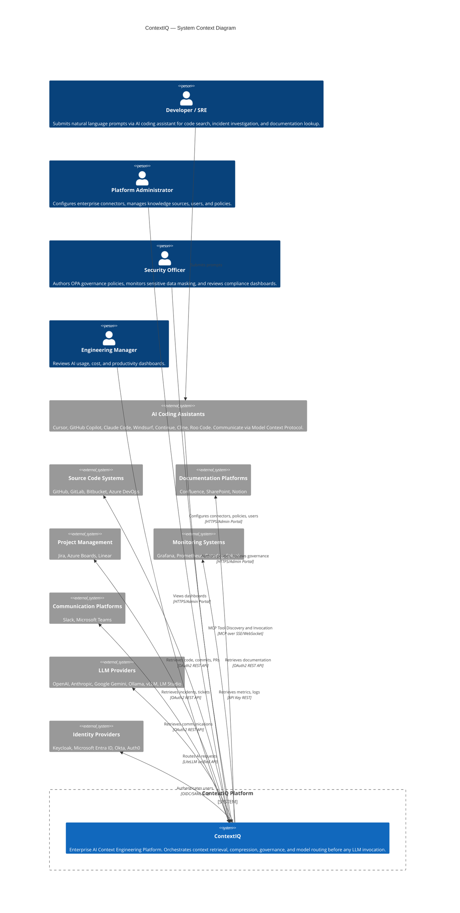

---

## DM-002 — Platform Containers

```mermaid
C4Container
    title ContextIQ — Container Diagram

    Person(user, "Developer / SRE", "Uses AI assistant")
    Person(admin, "Administrator", "Manages platform")

    System_Ext(ai_assistant, "AI Coding Assistant", "MCP client")
    System_Ext(llm, "LLM Providers", "via LiteLLM")
    System_Ext(idp, "Identity Provider", "Keycloak / Entra ID")
    System_Ext(enterprise_systems, "Enterprise Systems", "GitHub, Jira, Confluence, Grafana")

    System_Boundary(contextiq, "ContextIQ Platform") {

        Container(admin_portal, "Admin Portal", "React + FastAPI", "Web UI for connector management, policy authoring, RBAC, observability dashboards, and replay explorer.")

        Container(mcp_gateway, "Enterprise MCP Gateway", "FastMCP + Python", "Single MCP entry point. Authenticates AI assistants, manages sessions, routes to Supervisor Agent, streams responses.")

        Container(supervisor, "Supervisor Agent", "LangGraph StateGraph", "Coordinates multi-agent pipeline. Initializes execution state, delegates to specialized agents, records replay metadata.")

        Container(agent_pipeline, "Multi-Agent Pipeline", "LangGraph Nodes", "Intent Detection, Context Planning, Retrieval, Knowledge Graph, Ranking, Compression, Governance, Model Router, Response Builder.")

        Container(connector_framework, "Connector Framework", "Python Plugin SDK", "Plugin-based integrations with enterprise systems. BaseConnector SDK with authenticate, discover, search, fetch, sync, health.")

        Container(ai_gateway, "AI Gateway", "LiteLLM", "Unified LLM API. Authentication, rate limiting, retry, fallback, cost tracking, model abstraction across 100+ providers.")

        ContainerDb(postgres, "PostgreSQL", "PostgreSQL 16", "Users, organizations, connectors, policies, executions, audit logs, knowledge sources.")

        ContainerDb(neo4j, "Neo4j", "Neo4j 5", "Enterprise knowledge graph. Service, Repository, Developer, Incident, API, Deployment nodes and relationships.")

        ContainerDb(qdrant, "Qdrant", "Qdrant 1.9", "Vector embeddings for semantic search. Collections: source_code, documentation, incidents, logs, architecture.")

        ContainerDb(opensearch, "OpenSearch", "OpenSearch 2.13", "Keyword and hybrid BM25+kNN search across logs, documentation, wikis, Jira tickets.")

        ContainerDb(redis, "Redis", "Redis 7.2", "Session cache, context cache, prompt cache, response cache with TTL-based eviction.")

        ContainerDb(minio, "MinIO", "MinIO 2024", "S3-compatible object storage for replay snapshots, AI artifacts, architecture diagrams.")

        Container(kafka, "Apache Kafka", "Kafka 3.7 KRaft", "Event streaming for agent pipeline events, observability fan-out, dead letter queues.")

        Container(keycloak, "Keycloak", "Keycloak 24", "OIDC/SAML identity provider. Federates with Entra ID, Okta, Auth0. Issues JWTs for all platform interactions.")

        Container(opa, "Open Policy Agent", "OPA 0.65", "Declarative policy evaluation using Rego. Evaluates access, model, connector, cost, and compliance policies.")

        Container(vault, "HashiCorp Vault", "Vault 1.15", "Secrets management with dynamic credential generation and auto-rotation for all databases and APIs.")

        Container(observability, "Observability Stack", "Prometheus + Grafana + Loki + Jaeger + Langfuse", "Metrics, dashboards, alerts, log aggregation, distributed tracing, AI execution traces.")
    }

    Rel(ai_assistant, mcp_gateway, "MCP Tool Discovery & Invocation", "SSE / WebSocket / HTTP")
    Rel(admin, admin_portal, "Manages platform", "HTTPS")
    Rel(mcp_gateway, keycloak, "Validates JWT", "OIDC introspection")
    Rel(mcp_gateway, opa, "Evaluates access policy", "HTTP")
    Rel(mcp_gateway, supervisor, "Routes authenticated request", "Internal gRPC")
    Rel(supervisor, agent_pipeline, "Orchestrates agents", "LangGraph StateGraph")
    Rel(agent_pipeline, connector_framework, "Executes retrieval", "Plugin calls")
    Rel(connector_framework, enterprise_systems, "Fetches enterprise data", "OAuth2/API Key REST")
    Rel(agent_pipeline, qdrant, "Semantic search", "gRPC")
    Rel(agent_pipeline, opensearch, "Keyword search", "REST")
    Rel(agent_pipeline, neo4j, "Graph traversal", "Bolt")
    Rel(agent_pipeline, redis, "Cache read/write", "Redis protocol")
    Rel(agent_pipeline, opa, "Policy evaluation", "HTTP")
    Rel(agent_pipeline, kafka, "Publishes domain events", "Kafka producer")
    Rel(agent_pipeline, ai_gateway, "Routes LLM request", "REST")
    Rel(ai_gateway, llm, "LLM API calls", "HTTPS REST")
    Rel(agent_pipeline, postgres, "Persists execution traces", "psycopg3")
    Rel(agent_pipeline, minio, "Stores snapshots", "S3 API")
    Rel(kafka, observability, "Streams telemetry events", "Kafka consumer")
    Rel(mcp_gateway, observability, "Emits OTel metrics/traces", "OTel gRPC")
    Rel(vault, agent_pipeline, "Provides dynamic secrets", "Vault API")
    Rel(idp, keycloak, "Federated identity", "SAML / OIDC federation")
```

---

## DM-003 — Data Plane Components

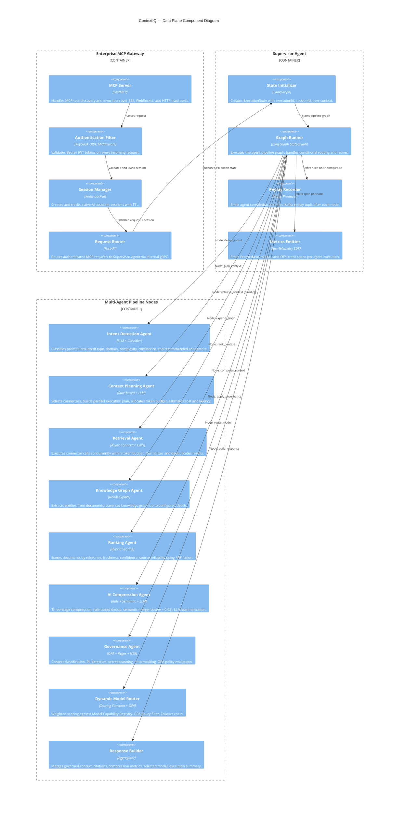

---

## DM-004 — Control Plane Components

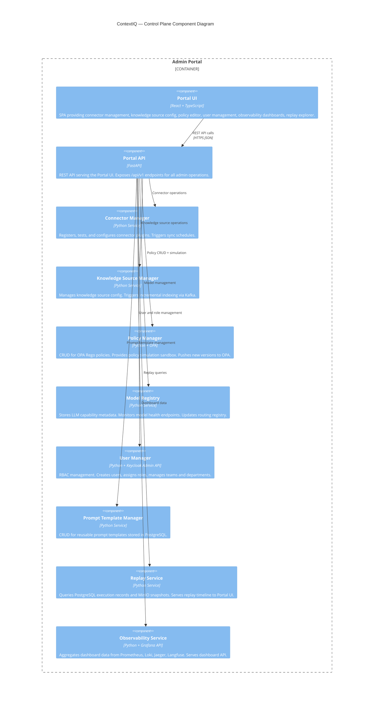

---

## DM-005 — Domain Conceptual Model

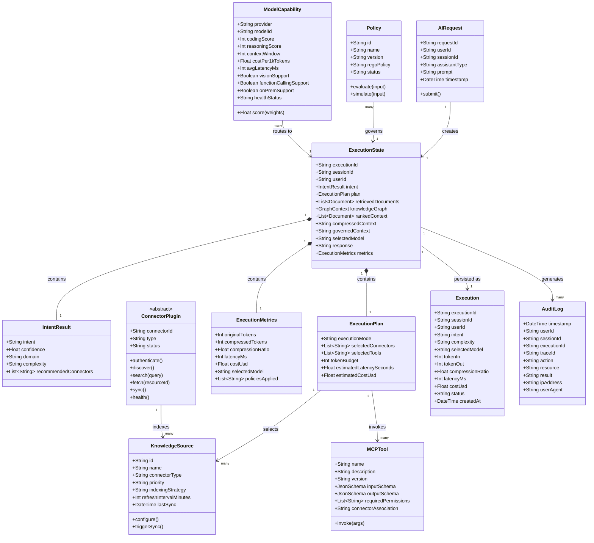

---

## DM-006 — Agent Class Hierarchy

```mermaid
classDiagram
    class BaseAgent {
        <<abstract>>
        +String agentId
        +String agentType
        +ExecutionState state
        +KafkaProducer eventProducer
        +OTelTracer tracer
        +execute(state) ExecutionState*
        +emitEvent(topic, payload)
        +recordSpan(spanName)
    }

    class SupervisorAgent {
        +LangGraph stateGraph
        +initializeState(request) ExecutionState
        +runPipeline(state) ExecutionState
        +handleRetry(node, error)
        +aggregateResults(state) ExecutionState
    }

    class IntentDetectionAgent {
        +LLMClient llmClient
        +List~String~ intentClasses
        +Float confidenceThreshold
        +classifyIntent(prompt) IntentResult
        +recommendConnectors(intent) List~String~
        +execute(state) ExecutionState
    }

    class ContextPlanningAgent {
        +ConnectorRegistry connectorRegistry
        +TokenBudgetCalculator budgetCalc
        +buildExecutionPlan(intent) ExecutionPlan
        +estimateLatency(connectors) Float
        +estimateCost(tokens, model) Float
        +execute(state) ExecutionState
    }

    class RetrievalAgent {
        +ConnectorFramework connectorFramework
        +QdrantClient qdrantClient
        +OpenSearchClient openSearchClient
        +retrieveParallel(plan) List~Document~
        +hybridSearch(query) List~Document~
        +normalizeResults(raw) List~Document~
        +execute(state) ExecutionState
    }

    class KnowledgeGraphAgent {
        +Neo4jDriver neo4jDriver
        +EntityExtractor entityExtractor
        +Int maxTraversalDepth
        +extractEntities(docs) List~Entity~
        +traverseGraph(entities) GraphContext
        +execute(state) ExecutionState
    }

    class RankingAgent {
        +Float vectorWeight
        +Float keywordWeight
        +reciprocalRankFusion(docs) List~Document~
        +scoreByFreshness(doc) Float
        +scoreByConfidence(doc) Float
        +execute(state) ExecutionState
    }

    class CompressionAgent {
        +RuleBasedCompressor ruleCompressor
        +SemanticCompressor semanticCompressor
        +LLMSummarizer llmSummarizer
        +Float cosineThreshold
        +compress(docs, budget) String
        +execute(state) ExecutionState
    }

    class GovernanceAgent {
        +PIIDetector piiDetector
        +SecretDetector secretDetector
        +DataMasker dataMasker
        +OPAClient opaClient
        +classifyContext(text) SensitivityLevel
        +maskSensitiveData(text) String
        +evaluatePolicy(input) PolicyResult
        +execute(state) ExecutionState
    }

    class DynamicModelRouter {
        +ModelCapabilityRegistry modelRegistry
        +OPAClient opaClient
        +WeightConfig weights
        +scoreModel(model, intent) Float
        +filterByPolicy(models) List~ModelCapability~
        +selectWithFailover(candidates) ModelCapability
        +execute(state) ExecutionState
    }

    class ResponseBuilder {
        +CitationGenerator citationGenerator
        +ExecutionSummarizer summarizer
        +assembleResponse(state) FinalResponse
        +attachCitations(context, docs) String
        +generateSummary(state) ExecutionSummary
        +execute(state) ExecutionState
    }

    BaseAgent <|-- SupervisorAgent
    BaseAgent <|-- IntentDetectionAgent
    BaseAgent <|-- ContextPlanningAgent
    BaseAgent <|-- RetrievalAgent
    BaseAgent <|-- KnowledgeGraphAgent
    BaseAgent <|-- RankingAgent
    BaseAgent <|-- CompressionAgent
    BaseAgent <|-- GovernanceAgent
    BaseAgent <|-- DynamicModelRouter
    BaseAgent <|-- ResponseBuilder

    SupervisorAgent "1" *-- "1" IntentDetectionAgent : orchestrates
    SupervisorAgent "1" *-- "1" ContextPlanningAgent : orchestrates
    SupervisorAgent "1" *-- "1" RetrievalAgent : orchestrates
    SupervisorAgent "1" *-- "1" KnowledgeGraphAgent : orchestrates
    SupervisorAgent "1" *-- "1" RankingAgent : orchestrates
    SupervisorAgent "1" *-- "1" CompressionAgent : orchestrates
    SupervisorAgent "1" *-- "1" GovernanceAgent : orchestrates
    SupervisorAgent "1" *-- "1" DynamicModelRouter : orchestrates
    SupervisorAgent "1" *-- "1" ResponseBuilder : orchestrates
```

---

## DM-007 — Connector Class Hierarchy

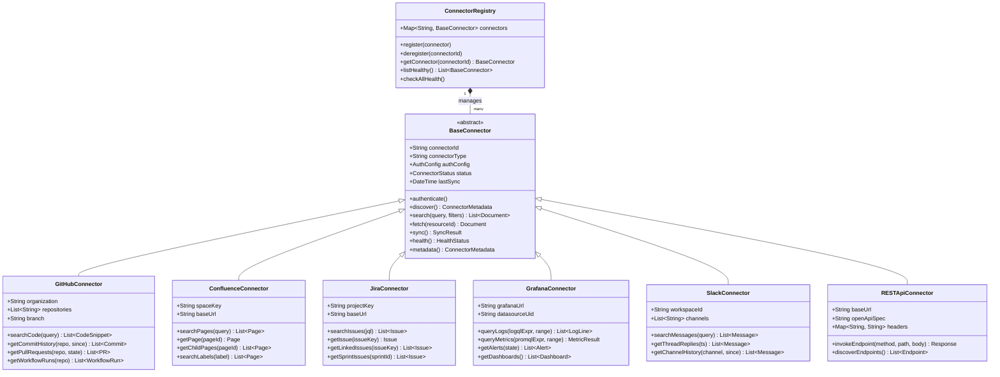

---

## DM-008 — Relational Data Model (PostgreSQL ERD)

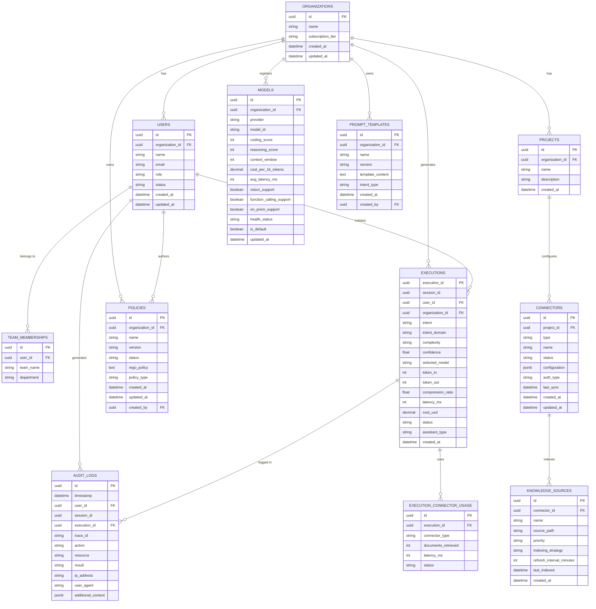

---

## DM-009 — Knowledge Graph Schema (Neo4j)

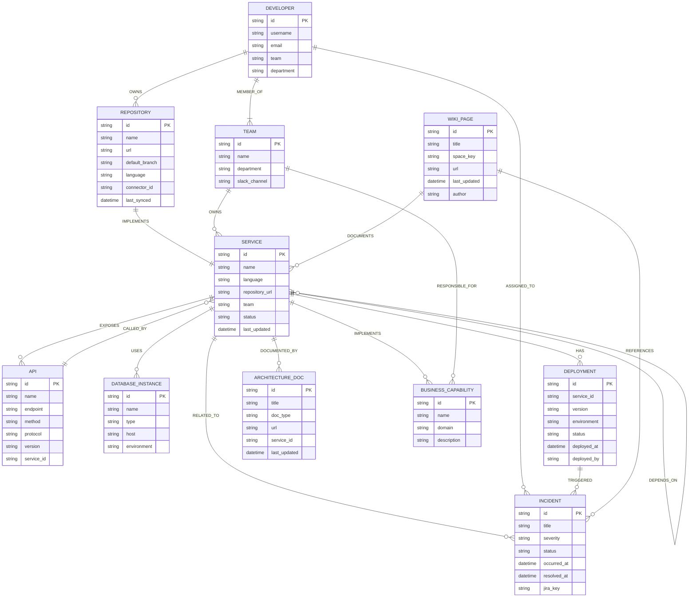

---

## DM-010 — Context Request Lifecycle (Data Flow)

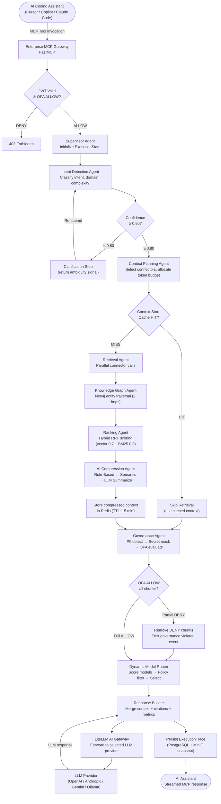

---

## DM-011 — Connector Synchronization Flow (Data Flow)

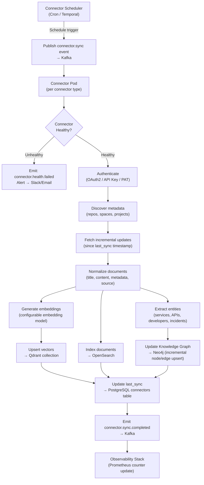

---

## DM-012 — Polyglot Persistence Data Flow

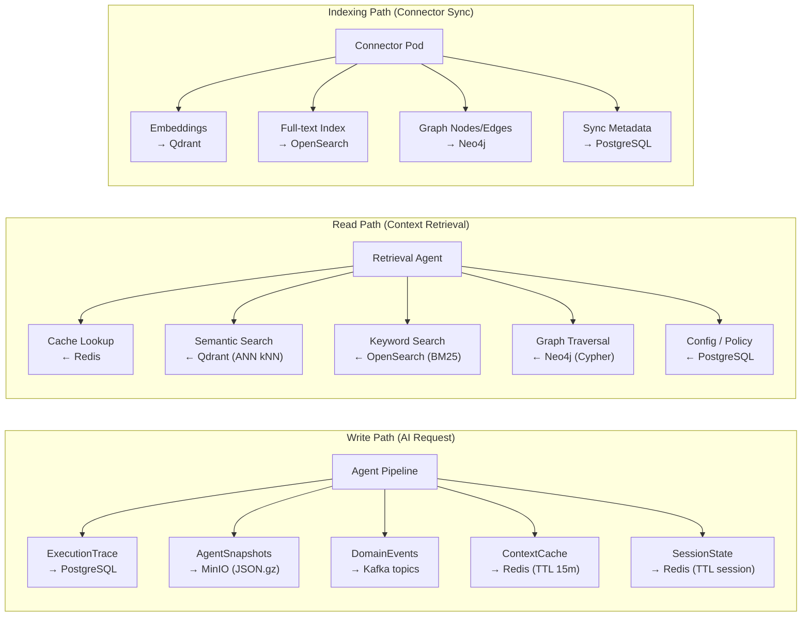

---

## DM-013 — End-to-End AI Request (Sequence)

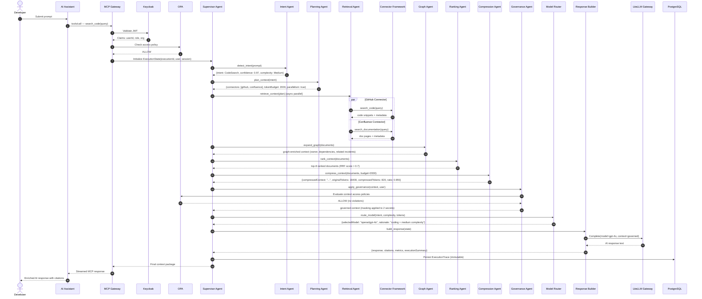

---

## DM-014 — Governance Agent Processing (Sequence)

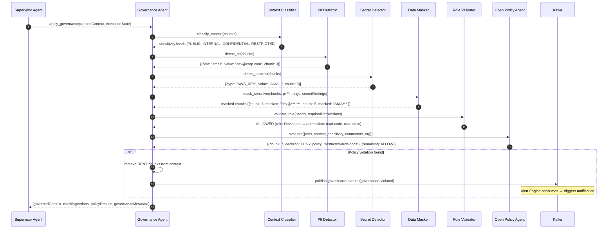

---

## DM-015 — Dynamic Model Routing (Sequence)

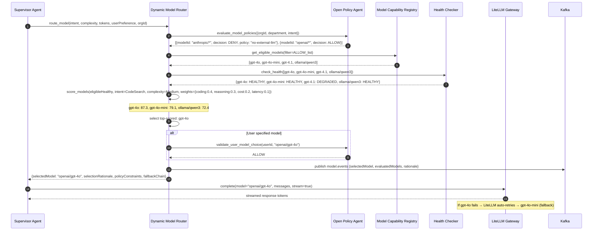

---

## DM-016 — Administrator Connector Configuration (Sequence)

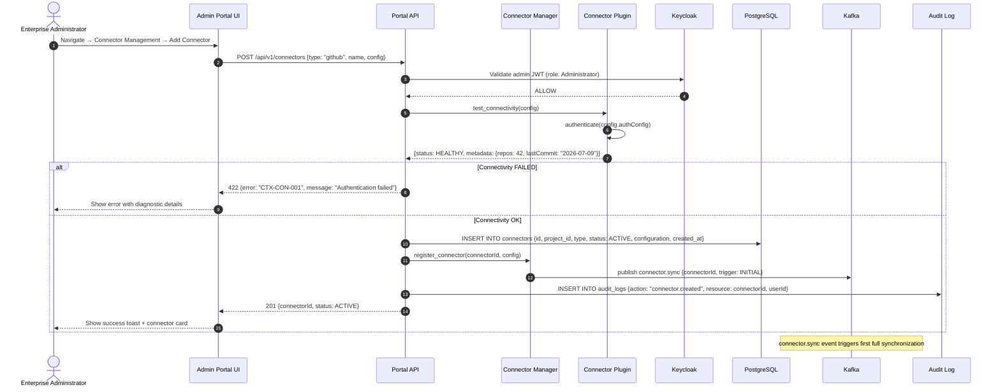

---

## DM-017 — AI Request Execution State Machine

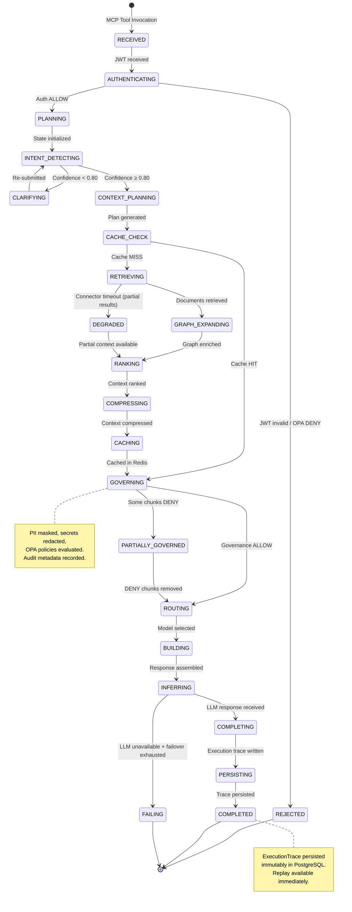

---

## DM-018 — Connector Lifecycle State Machine

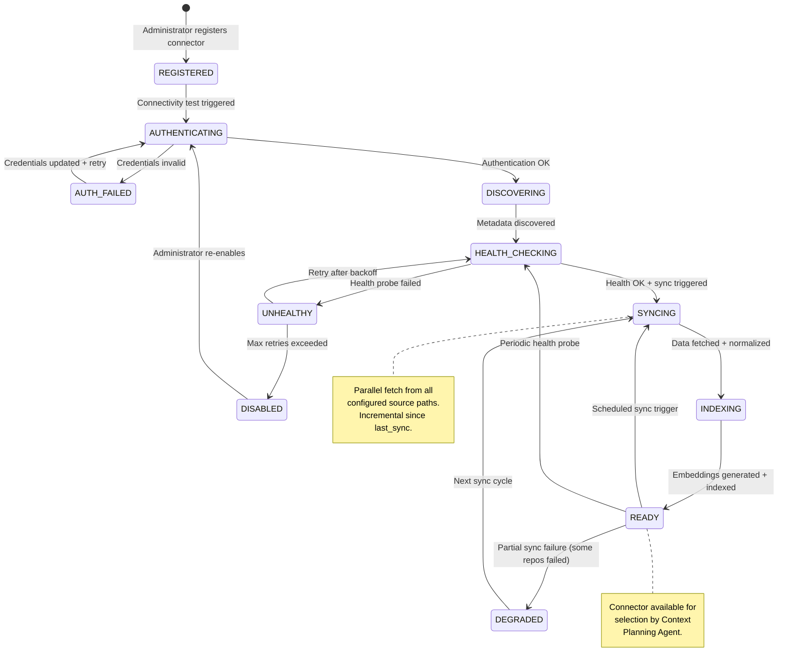

---

## DM-019 — Kubernetes Deployment Topology

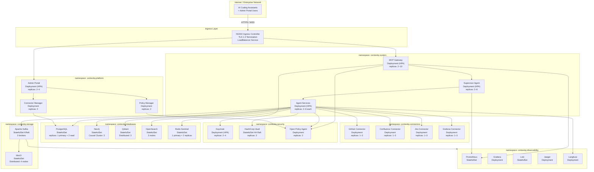

---

*End of UML Design Models*
