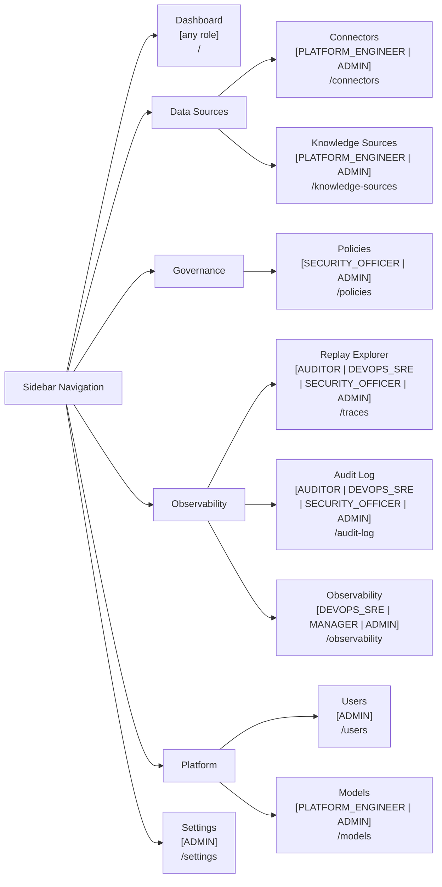

# ContextIQ — Information Architecture

## Metadata

| Field | Value |
|---|---|
| Document Type | Information Architecture |
| Version | 1.0 |
| Source | `figma_spec_contextiq.md` |
| Date | 2026-07-14 |

---

## 1. Site Map

Full hierarchical map of all 23 screens, grouped by navigation section. Screens are labelled with their spec ID for traceability back to `figma_spec_contextiq.md`.

```mermaid
flowchart TD
    ROOT([ContextIQ Platform]) --> AUTH
    ROOT --> SHELL

    AUTH["AUTH-001\n/login\nSSO Login"]

    SHELL["SHELL-001\nApp Shell\n(all authenticated routes)"]
    SHELL --> DASH

    DASH["DASH-001\n/\nExecutive Overview"]

    SHELL --> DS_GROUP
    subgraph DS_GROUP["Data Sources"]
        CONN_LIST["CONN-001\n/connectors\nConnector List"]
        CONN_FORM["CONN-002\n/connectors/new\n/connectors/:id/edit\nAdd / Edit Connector"]
        CONN_DETAIL["CONN-003\n/connectors/:id\nConnector Health"]
        KS_LIST["KS-001\n/knowledge-sources\nKnowledge Sources"]
        KS_FORM["KS-002\n/knowledge-sources/new\n/knowledge-sources/:id/edit\nAdd / Edit Source"]
    end

    CONN_LIST --> CONN_FORM
    CONN_LIST --> CONN_DETAIL

    KS_LIST --> KS_FORM

    SHELL --> GOV_GROUP
    subgraph GOV_GROUP["Governance"]
        POL_LIST["POL-001\n/policies\nPolicy List"]
        POL_EDITOR["POL-002\n/policies/new\n/policies/:id\nPolicy Editor"]
        POL_SIM["POL-003\n/policies/:id/simulate\nPolicy Simulation"]
    end

    POL_LIST --> POL_EDITOR
    POL_EDITOR --> POL_SIM

    SHELL --> OBS_GROUP
    subgraph OBS_GROUP["Observability"]
        REPLAY_LIST["REPLAY-001\n/traces\nReplay Explorer"]
        TRACE_VIEW["REPLAY-002\n/traces/:id\nTrace Timeline"]
        PHASE_DRILL["REPLAY-003\n(Drawer)\nAgent Phase Detail"]
        AUDIT_LOG["AUDIT-001\n/audit-log\nAudit Log"]
        AUDIT_VERIFY["AUDIT-002\n/audit-log/verify\nChain Integrity"]
        OBS_DASH["OBS-001\n/observability\nObservability Dashboard"]
    end

    REPLAY_LIST --> TRACE_VIEW
    TRACE_VIEW --> PHASE_DRILL

    AUDIT_LOG --> AUDIT_VERIFY

    SHELL --> PLATFORM_GROUP
    subgraph PLATFORM_GROUP["Platform"]
        USER_LIST["USER-001\n/users\nUser Management"]
        USER_ROLE["USER-002\n/users/:id\nRole Assignment"]
        MODEL_LIST["MODEL-001\n/models\nModel Registry"]
        MODEL_FORM["MODEL-002\n/models/add\nAdd / Edit Model"]
        MODEL_WEIGHTS["MODEL-003\n/models/weights\nRouting Weights"]
    end

    USER_LIST --> USER_ROLE

    MODEL_LIST --> MODEL_FORM
    MODEL_LIST --> MODEL_WEIGHTS

    SHELL --> ERR_GROUP
    subgraph ERR_GROUP["Error States"]
        ERR_403["ERR-001\n/403\nAccess Denied"]
        ERR_LOGIN["ERR-002\n/login\nUnauthenticated Redirect"]
    end
```

---

## 2. Navigation Tree

Sidebar navigation hierarchy as rendered in `SHELL-001`. Items show their required minimum role in brackets.

---

## 3. Route Map

All routes, methods, and required role guards in tabular form.

| Route | Screen ID | Guard | Notes |
|---|---|---|---|
| `/login` | AUTH-001 | — | Redirect to Keycloak SSO |
| `/` | DASH-001 | Any authenticated | Executive overview |
| `/connectors` | CONN-001 | PLATFORM_ENGINEER, ADMIN | List + filter |
| `/connectors/new` | CONN-002 | PLATFORM_ENGINEER, ADMIN | Create flow |
| `/connectors/:id` | CONN-003 | PLATFORM_ENGINEER, ADMIN | Health detail |
| `/connectors/:id/edit` | CONN-002 | PLATFORM_ENGINEER, ADMIN | Edit flow |
| `/knowledge-sources` | KS-001 | PLATFORM_ENGINEER, ADMIN | List + filter |
| `/knowledge-sources/new` | KS-002 | PLATFORM_ENGINEER, ADMIN | Create flow |
| `/knowledge-sources/:id/edit` | KS-002 | PLATFORM_ENGINEER, ADMIN | Edit flow |
| `/policies` | POL-001 | SECURITY_OFFICER, ADMIN | List + bulk actions |
| `/policies/new` | POL-002 | SECURITY_OFFICER, ADMIN | Editor (blank) |
| `/policies/:id` | POL-002 | SECURITY_OFFICER, ADMIN | Editor (existing) |
| `/policies/:id/simulate` | POL-003 | SECURITY_OFFICER, ADMIN | Test harness |
| `/traces` | REPLAY-001 | AUDITOR, DEVOPS_SRE, SECURITY_OFFICER, ADMIN | Search + list |
| `/traces/:id` | REPLAY-002 | AUDITOR, DEVOPS_SRE, SECURITY_OFFICER, ADMIN | Timeline + drawer |
| `/audit-log` | AUDIT-001 | AUDITOR, DEVOPS_SRE, SECURITY_OFFICER, ADMIN | Filter + table |
| `/audit-log/verify` | AUDIT-002 | AUDITOR, SECURITY_OFFICER, ADMIN | Chain integrity |
| `/users` | USER-001 | ADMIN | List |
| `/users/:id` | USER-002 | ADMIN | Role assignment drawer |
| `/models` | MODEL-001 | PLATFORM_ENGINEER, ADMIN | Registry table |
| `/models/add` | MODEL-002 | PLATFORM_ENGINEER, ADMIN | Add model form |
| `/models/weights` | MODEL-003 | PLATFORM_ENGINEER, ADMIN | Drag-reorder sliders |
| `/observability` | OBS-001 | DEVOPS_SRE, MANAGER, ADMIN | Tabbed dashboard |
| `/403` | ERR-001 | Any authenticated | Access denied |

---

## 4. Role Access Matrix

Which screens each role can access. ✓ = access granted, — = redirected to /403.

| Screen | DEVELOPER | PLATFORM_ENGINEER | DEVOPS_SRE | ADMIN | SECURITY_OFFICER | MANAGER | AUDITOR |
|---|---|---|---|---|---|---|---|
| Dashboard | ✓ | ✓ | ✓ | ✓ | ✓ | ✓ | ✓ |
| Connectors | — | ✓ | — | ✓ | — | — | — |
| Knowledge Sources | — | ✓ | — | ✓ | — | — | — |
| Policies | — | — | — | ✓ | ✓ | — | — |
| Replay Explorer | — | — | ✓ | ✓ | ✓ | — | ✓ |
| Audit Log | — | — | ✓ | ✓ | ✓ | — | ✓ |
| Audit Log Verify | — | — | — | ✓ | ✓ | — | ✓ |
| Users | — | — | — | ✓ | — | — | — |
| Models | — | ✓ | — | ✓ | — | — | — |
| Observability | — | — | ✓ | ✓ | — | ✓ | — |

---

*Source: `figma_spec_contextiq.md` Part 5 — Screen Inventory*
