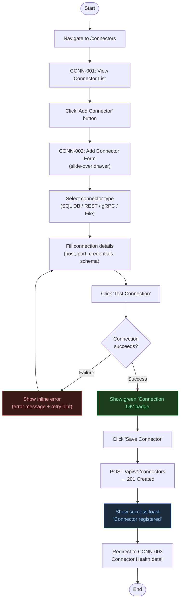
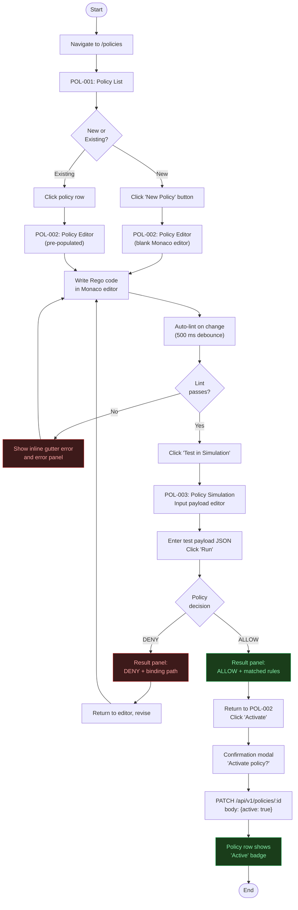
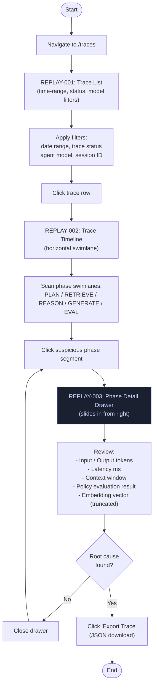
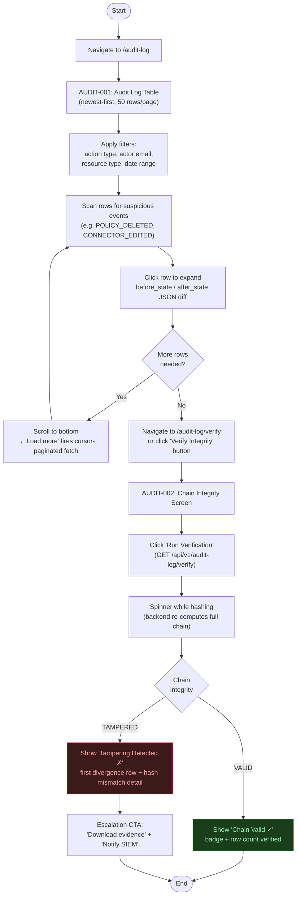
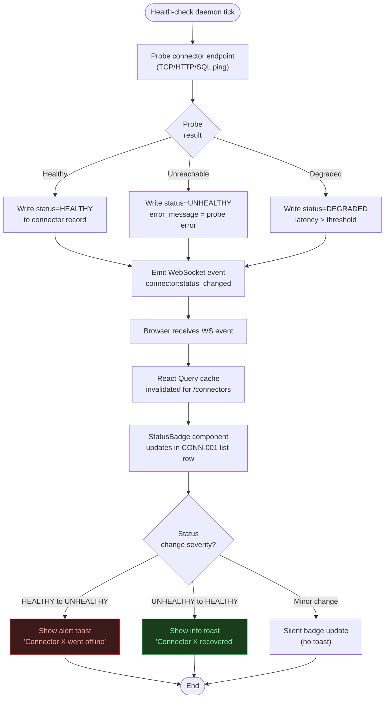

# ContextIQ — User Flow Diagrams

## Metadata

| Field | Value |
|---|---|
| Document Type | User Flow Diagrams |
| Version | 1.0 |
| Source | `figma_spec_contextiq.md` Part 7 — Interaction Flows |

---

## Flow 1 — Add Connector

**Actor:** Platform Engineer / Admin  
**Goal:** Register a new external data connector so the platform can ingest from it.

---

## Flow 2 — Policy Lifecycle

**Actor:** Security Officer / Admin  
**Goal:** Author, test, and activate a Rego policy that governs AI agent behavior.

---

## Flow 3 — Replay Drill-Down

**Actor:** Auditor / DevOps SRE / Admin  
**Goal:** Investigate a specific AI agent trace by stepping through each phase to locate the root cause of a decision or failure.

---

## Flow 4 — Audit Log Review + Integrity Check

**Actor:** Auditor / Security Officer / Admin  
**Goal:** Review platform mutation events and cryptographically verify the hash chain is unbroken.

---

## Flow 5 — Connector Status Update (Automated)

**Actor:** System (automated health-check daemon)  
**Goal:** Platform monitors connector health; UI reflects live status changes without page reload.

---

*Source: `figma_spec_contextiq.md` Part 7 — Interaction Flows*
