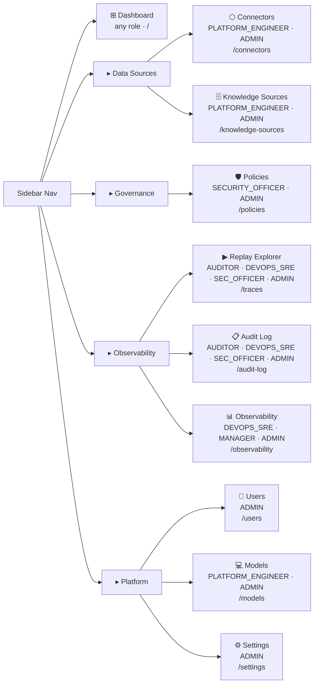

# ContextIQ — Information Architecture

## Metadata

| Field | Value |
|---|---|
| Artifact | `wireframe / information_architecture` |
| Source | `figma_spec_contextiq.md` v1.0 |
| Output path | `.propel/context/wireframes/information-architecture.md` |
| Date | 2026-07-14 |

---

## 1. Site Map

All 23 screens, hierarchical. Screen IDs are spec-traceable to `figma_spec_contextiq.md` Part 5.

```mermaid
flowchart TD
    ROOT([ContextIQ Platform]) --> AUTH & SHELL

    AUTH["AUTH-001 · /login\nSSO Login"]

    SHELL["SHELL-001 · App Shell\n(wraps all authenticated routes)"]
    SHELL --> DASH

    DASH["DASH-001 · /\nExecutive Overview"]

    SHELL --> DS
    subgraph DS["Data Sources"]
        CONN_LIST["CONN-001 · /connectors\nConnector List"]
        CONN_FORM["CONN-002 · /connectors/new\n/connectors/:id/edit\nAdd / Edit Connector"]
        CONN_DETAIL["CONN-003 · /connectors/:id\nConnector Health Detail"]
        KS_LIST["KS-001 · /knowledge-sources\nKnowledge Sources List"]
        KS_FORM["KS-002 · /knowledge-sources/new\n/knowledge-sources/:id/edit\nAdd / Edit Knowledge Source"]
    end

    CONN_LIST --> CONN_FORM & CONN_DETAIL
    KS_LIST --> KS_FORM

    SHELL --> GOV
    subgraph GOV["Governance"]
        POL_LIST["POL-001 · /policies\nPolicy List"]
        POL_EDITOR["POL-002 · /policies/new · /policies/:id\nPolicy Editor"]
        POL_SIM["POL-003 · /policies/:id/simulate\nPolicy Simulation"]
    end

    POL_LIST --> POL_EDITOR --> POL_SIM

    SHELL --> OBS
    subgraph OBS["Observability"]
        REPLAY_LIST["REPLAY-001 · /traces\nReplay Explorer"]
        TRACE_VIEW["REPLAY-002 · /traces/:id\nTrace Timeline"]
        PHASE_DRAWER["REPLAY-003 · (drawer)\nAgent Phase Detail"]
        AUDIT_LOG["AUDIT-001 · /audit-log\nAudit Log"]
        AUDIT_VERIFY["AUDIT-002 · /audit-log/verify\nChain Integrity Verification"]
        OBS_DASH["OBS-001 · /observability\nObservability Dashboard"]
    end

    REPLAY_LIST --> TRACE_VIEW --> PHASE_DRAWER
    AUDIT_LOG --> AUDIT_VERIFY

    SHELL --> PLAT
    subgraph PLAT["Platform"]
        USER_LIST["USER-001 · /users\nUser Management"]
        USER_ROLE["USER-002 · /users/:id\nUser Role Assignment"]
        MODEL_LIST["MODEL-001 · /models\nModel Registry"]
        MODEL_ADD["MODEL-002 · /models/add\nAdd / Edit Model"]
        MODEL_WT["MODEL-003 · /models/weights\nRouting Weights"]
    end

    USER_LIST --> USER_ROLE
    MODEL_LIST --> MODEL_ADD & MODEL_WT

    SHELL --> ERR
    subgraph ERR["Error Boundaries"]
        ERR_403["ERR-001 · /403\nAccess Denied"]
        ERR_UNAUTH["ERR-002 · redirect\nUnauthenticated → /login"]
    end
```

---

## 2. Navigation Tree

Sidebar navigation rendered in SHELL-001, ordered and role-gated.

---

## 3. Route → Screen Map

| Route | Screen ID | Guard (minimum role) |
|---|---|---|
| `/login` | AUTH-001 | none |
| `/` | DASH-001 | any authenticated |
| `/connectors` | CONN-001 | PLATFORM_ENGINEER, ADMIN |
| `/connectors/new` | CONN-002 | PLATFORM_ENGINEER, ADMIN |
| `/connectors/:id` | CONN-003 | PLATFORM_ENGINEER, ADMIN |
| `/connectors/:id/edit` | CONN-002 | PLATFORM_ENGINEER, ADMIN |
| `/knowledge-sources` | KS-001 | PLATFORM_ENGINEER, ADMIN |
| `/knowledge-sources/new` | KS-002 | PLATFORM_ENGINEER, ADMIN |
| `/knowledge-sources/:id/edit` | KS-002 | PLATFORM_ENGINEER, ADMIN |
| `/policies` | POL-001 | SECURITY_OFFICER, ADMIN |
| `/policies/new` | POL-002 | SECURITY_OFFICER, ADMIN |
| `/policies/:id` | POL-002 | SECURITY_OFFICER, ADMIN |
| `/policies/:id/simulate` | POL-003 | SECURITY_OFFICER, ADMIN |
| `/traces` | REPLAY-001 | AUDITOR, DEVOPS_SRE, SECURITY_OFFICER, ADMIN |
| `/traces/:id` | REPLAY-002 | AUDITOR, DEVOPS_SRE, SECURITY_OFFICER, ADMIN |
| `/audit-log` | AUDIT-001 | AUDITOR, DEVOPS_SRE, SECURITY_OFFICER, ADMIN |
| `/audit-log/verify` | AUDIT-002 | AUDITOR, SECURITY_OFFICER, ADMIN |
| `/users` | USER-001 | ADMIN |
| `/users/:id` | USER-002 | ADMIN |
| `/models` | MODEL-001 | PLATFORM_ENGINEER, ADMIN |
| `/models/add` | MODEL-002 | PLATFORM_ENGINEER, ADMIN |
| `/models/weights` | MODEL-003 | PLATFORM_ENGINEER, ADMIN |
| `/observability` | OBS-001 | DEVOPS_SRE, MANAGER, ADMIN |
| `/403` | ERR-001 | any authenticated |
| any protected (no session) | ERR-002 | — |

---

## 4. Role Access Matrix

✓ = access granted · — = redirected to ERR-001 (/403)

| Screen | DEVELOPER | PLATFORM_ENGINEER | DEVOPS_SRE | SECURITY_OFFICER | AUDITOR | MANAGER | ADMIN |
|---|---|---|---|---|---|---|---|
| DASH-001 | ✓ | ✓ | ✓ | ✓ | ✓ | ✓ | ✓ |
| CONN-001/002/003 | — | ✓ | — | — | — | — | ✓ |
| KS-001/002 | — | ✓ | — | — | — | — | ✓ |
| POL-001/002/003 | — | — | — | ✓ | — | — | ✓ |
| REPLAY-001/002/003 | — | — | ✓ | ✓ | ✓ | — | ✓ |
| AUDIT-001 | — | — | ✓ | ✓ | ✓ | — | ✓ |
| AUDIT-002 | — | — | — | ✓ | ✓ | — | ✓ |
| USER-001/002 | — | — | — | — | — | — | ✓ |
| MODEL-001/002/003 | — | ✓ | — | — | — | — | ✓ |
| OBS-001 | — | — | ✓ | — | — | ✓ | ✓ |
