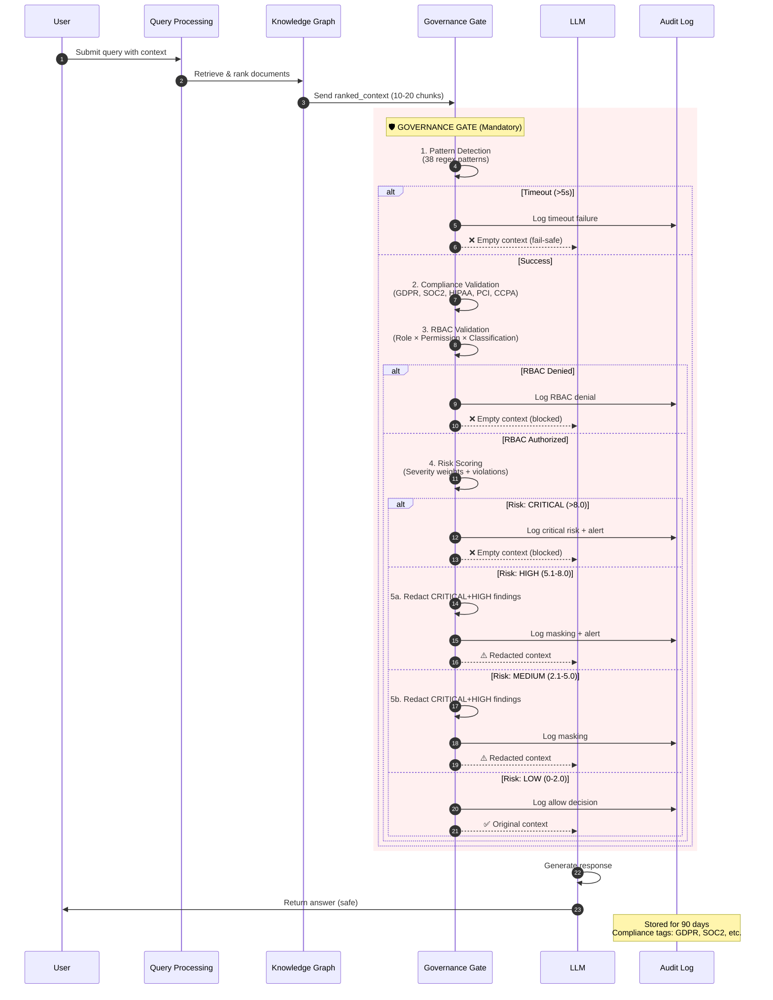
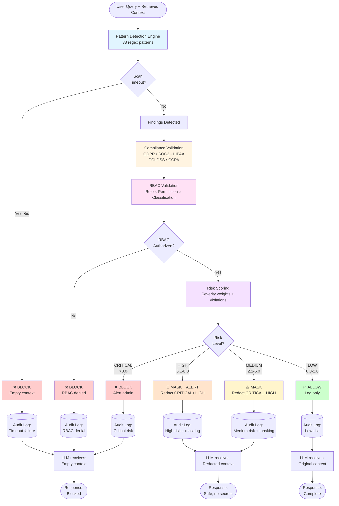
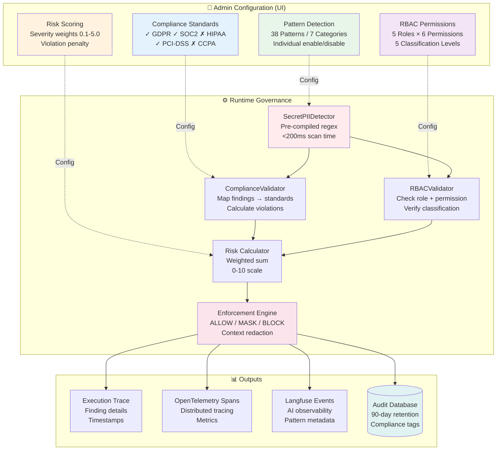

---

---

---

## Legend

**Risk Levels:**
- 🟢 **LOW** (0.0 - 2.0): Allow with logging only
- 🟡 **MEDIUM** (2.1 - 5.0): Allow with masking
- 🟠 **HIGH** (5.1 - 8.0): Allow with masking + alert
- 🔴 **CRITICAL** (8.1 - 10.0): Block + alert

**Actions:**
- ✅ **ALLOW**: Context passes through unchanged
- ⚠️ **MASK**: Critical/High findings redacted
- 🔶 **MASK + ALERT**: Redaction + notification
- ❌ **BLOCK**: Empty context sent to LLM

**Severity Levels:**
- **CRITICAL**: Secrets, API keys, passwords (weight: 5.0)
- **HIGH**: SSN, credit cards, private keys (weight: 3.0)
- **MEDIUM**: Emails, phone numbers (weight: 1.5)
- **LOW**: Common patterns (weight: 0.5)
- **INFO**: IP addresses (weight: 0.1)
