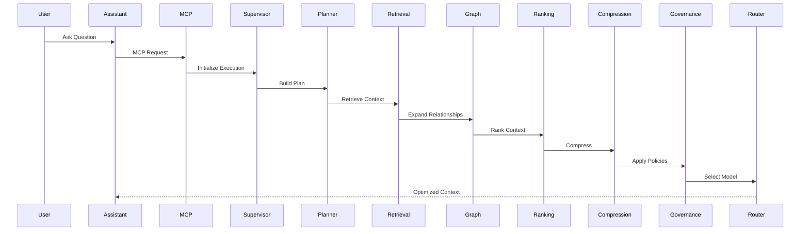
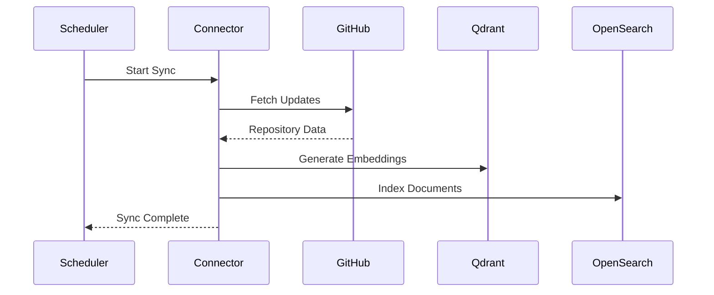
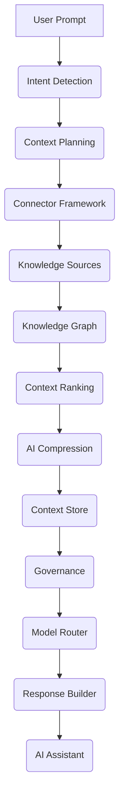

# ContextIQ

## Enterprise AI Context Engineering Platform

**Version:** 1.0

**Document Type:** Business Requirements Document (BRD)

**Author:** Vishal Bharath Kumar

**Status:** Draft

---

# 1. Executive Summary

## Overview

ContextIQ is an enterprise-grade AI Context Engineering Platform that enables AI coding assistants and Large Language Models (LLMs) to securely access, understand, optimize, and govern enterprise knowledge.

Unlike traditional Retrieval-Augmented Generation (RAG) systems, ContextIQ intelligently orchestrates enterprise context using a supervisor-based multi-agent architecture before any request reaches an AI model.

The platform integrates with enterprise systems such as source code repositories, documentation platforms, project management tools, monitoring systems, communication platforms, and internal APIs to deliver relevant, governed, and optimized context.

ContextIQ exposes these capabilities through the Model Context Protocol (MCP), enabling seamless integration with AI assistants including Cursor, GitHub Copilot, Claude Code, Windsurf, Continue, Cline, Roo Code, and custom enterprise AI applications.

The platform is designed to reduce AI token consumption, improve response quality, enforce governance policies, optimize model selection, and provide full observability of AI interactions.

---

# 2. Problem Statement

## Current Enterprise Challenges

Organizations increasingly rely on AI assistants for software development, incident investigation, documentation, and knowledge discovery.

However, these assistants face significant limitations:

- AI assistants lack access to enterprise knowledge.
- Enterprise knowledge is fragmented across multiple systems.
- Developers manually switch between tools to gather context.
- Existing RAG implementations retrieve excessive irrelevant information.
- Large prompts increase LLM cost and latency.
- Sensitive enterprise information may be exposed to external AI providers.
- Organizations lack governance and observability over AI interactions.
- Developers manually select AI models without considering cost or capability.

These limitations reduce productivity, increase operational cost, and create security and compliance risks.

---

# 3. Vision

To become the enterprise intelligence layer between organizational knowledge and AI assistants by delivering secure, governed, optimized, and context-aware AI interactions.

---

# 4. Mission

Enable every AI assistant to operate with the right enterprise context, at the right time, using the right model, while minimizing cost and ensuring enterprise governance.

---

# 5. Business Objectives

The platform aims to:

- Eliminate context switching for developers.
- Improve AI response quality through intelligent context engineering.
- Reduce LLM token consumption using AI-powered compression.
- Optimize AI costs through dynamic model routing.
- Enable secure access to enterprise knowledge.
- Enforce governance and compliance policies.
- Provide centralized observability for AI interactions.
- Offer vendor-neutral integration with multiple AI assistants and LLM providers.

---

# 6. Product Positioning

ContextIQ is not another chatbot or RAG application.

It is an enterprise platform that sits between AI assistants and enterprise systems.

Its primary responsibility is to engineer, optimize, govern, and deliver enterprise context.

```text
Enterprise Systems
        │
        ▼
ContextIQ Platform
        │
        ▼
AI Coding Assistants
        │
        ▼
LLMs
```

---

# 7. Target Users

## Primary Users

- Software Developers
- Platform Engineers
- DevOps Engineers
- Site Reliability Engineers (SREs)
- Solution Architects
- QA Engineers

## Secondary Users

- Engineering Managers
- Security Teams
- Compliance Officers
- Enterprise Architects
- Product Owners

## Platform Administrators

- Platform Engineering Team
- AI Governance Team
- Enterprise Administrators

---

# 8. Key Value Propositions

### AI Context Engineering

Intelligently retrieve and optimize enterprise knowledge before AI inference.

---

### Enterprise MCP Server

Expose enterprise knowledge and tools using the Model Context Protocol.

---

### AI Compression Engine

Reduce prompt size while preserving semantic meaning.

---

### Dynamic Model Router

Automatically select the most appropriate LLM based on intent, cost, latency, governance policies, and model capabilities.

---

### Knowledge Graph

Connect enterprise systems through relationships instead of isolated documents.

---

### Governance Engine

Protect enterprise data using policy-driven access control and sensitive data masking.

---

### Observability

Provide complete visibility into AI usage, cost, latency, and context engineering.

---

### Replay Engine

Replay and audit every AI interaction for debugging, governance, and compliance.

---

# 9. Scope

## In Scope

- Enterprise MCP Server
- Multi-Agent Context Orchestration
- AI Context Compression
- Dynamic Model Routing
- Knowledge Graph
- Enterprise Connectors
- Policy Engine
- Context Governance
- Replay Engine
- Observability Dashboard
- REST APIs
- Open Source Deployment
- Kubernetes Support

---

## Out of Scope (MVP)

- Fine-tuning LLMs
- AI model training
- Enterprise data warehouse
- Autonomous coding agents
- Mobile applications
- Voice interfaces

---

# 10. Success Metrics

The success of ContextIQ will be measured using the following KPIs:

| KPI | Target |
|------|--------|
| Context Retrieval Accuracy | ≥95% |
| Intent Detection Accuracy | ≥95% |
| Token Reduction | ≥80% |
| Context Compression Ratio | ≥90% |
| Average Response Latency | <2 seconds |
| AI Cost Reduction | ≥60% |
| Replay Availability | 100% |
| Policy Compliance | 100% |
| Connector Availability | ≥99.9% |
| Platform Uptime | ≥99.9% |

---

# 11. Assumptions

- Enterprises use AI coding assistants.
- Enterprise systems expose APIs.
- Users authenticate through SSO/OAuth2.
- LLM providers support API-based integration.
- Enterprise knowledge sources can be indexed or queried.

---

# 12. Constraints

- Enterprise data must remain governed.
- The platform should be vendor-neutral.
- The platform should support on-premises deployment.
- Open-source technologies should be preferred.
- AI model selection must respect organizational policies.

---

# 13. Risks

| Risk | Mitigation |
|------|------------|
| Connector API changes | Plugin architecture |
| LLM vendor changes | LiteLLM abstraction |
| Large enterprise datasets | Incremental indexing and caching |
| High token costs | AI Compression Agent |
| Sensitive data exposure | Governance Engine |
| Model outages | Dynamic Model Router with failover |
| Complex enterprise environments | Configurable connector framework |

---

# End of Part 1
# Part 2 – Functional Requirements & Enterprise Context Platform

---

# 14. Functional Overview

## Overview

ContextIQ provides an intelligent context engineering layer between Enterprise Knowledge Sources and AI Assistants.

Instead of allowing AI Assistants to directly query enterprise systems, ContextIQ orchestrates context retrieval, optimization, governance, and model selection before returning an optimized context package.

The platform is composed of the following functional modules:

- Enterprise MCP Gateway
- Context Orchestration
- Enterprise Connector Framework
- Knowledge Management
- AI Context Optimization
- Governance & Policy Enforcement
- Dynamic Model Routing
- Observability & Replay
- Administration Portal

---

# 15. Enterprise MCP Gateway

## Purpose

The Enterprise MCP Gateway exposes enterprise capabilities through the **Model Context Protocol (MCP)**, enabling AI Assistants to interact with enterprise knowledge using a standardized interface.

Supported AI Assistants include:

- Cursor
- GitHub Copilot
- Claude Code
- Windsurf
- Continue
- Cline
- Roo Code
- Custom AI Clients

The gateway acts as the single entry point for all AI requests.

---

## Responsibilities

The Enterprise MCP Gateway shall:

- Expose MCP-compatible tools.
- Authenticate AI assistants.
- Manage user sessions.
- Route requests to the AI Context Orchestrator.
- Stream responses.
- Track request metadata.
- Enforce security policies.

---

## Functional Requirements

### FR-001

The system shall expose an MCP endpoint.

Priority

P0

---

### FR-002

The system shall support MCP Tool Discovery.

Priority

P0

---

### FR-003

The system shall support MCP Tool Invocation.

Priority

P0

---

### FR-004

The system shall support streaming responses.

Priority

P1

---

### FR-005

The system shall support concurrent sessions.

Priority

P1

---

# 16. Enterprise Connector Framework

## Overview

The Connector Framework enables ContextIQ to integrate with enterprise knowledge sources.

The framework follows a plugin architecture where connectors can be installed, configured, enabled, or disabled without changing platform code.

---

## Supported Connector Categories

### Source Code

- GitHub
- GitLab
- Bitbucket
- Azure DevOps

---

### Documentation

- Confluence
- SharePoint
- Notion
- Markdown Repositories

---

### Project Management

- Jira
- Azure Boards
- Linear

---

### Communication

- Slack
- Microsoft Teams

---

### Monitoring

- Grafana
- Prometheus
- Loki
- Splunk
- Datadog

---

### CI/CD

- Jenkins
- GitHub Actions
- GitLab CI

---

### Cloud Platforms

- AWS
- Azure
- Google Cloud

---

### Databases

- PostgreSQL
- MySQL
- SQL Server
- Oracle

---

### Internal APIs

- REST
- GraphQL
- gRPC

---

## Functional Requirements

### FR-006

The platform shall support pluggable connectors.

Priority

P0

---

### FR-007

Connector configuration shall be UI-driven.

Priority

P0

---

### FR-008

Connectors shall support OAuth2, API Key, PAT, and JWT authentication.

Priority

P0

---

### FR-009

Connector health shall be monitored continuously.

Priority

P1

---

### FR-010

Connector synchronization schedules shall be configurable.

Priority

P1

---

# 17. Configurable Enterprise Knowledge Sources

## Overview

Enterprise knowledge sources must be configurable by administrators.

Knowledge sources can be added, removed, grouped, and prioritized without code changes.

---

## Source Configuration

Administrators can configure:

- Connector
- Authentication
- Repository
- Folder
- Branch
- Project
- Collection
- Refresh Interval
- Priority
- Indexing Strategy

---

## Example

```yaml
Knowledge Source:

Name:
Payment Documentation

Connector:
Confluence

Refresh:
15 Minutes

Priority:
High

Indexing:
Semantic + Keyword
```

---

## Functional Requirements

### FR-011

Knowledge sources shall be configurable.

Priority

P0

---

### FR-012

Knowledge sources shall support scheduled synchronization.

Priority

P1

---

### FR-013

Knowledge sources shall support incremental indexing.

Priority

P1

---

# 18. Enterprise Tool Registry

## Overview

Enterprise capabilities are exposed as MCP Tools.

Each tool represents a business capability rather than a direct API call.

---

## Example Tools

### Source Code

- search_code()
- explain_code()
- search_repository()
- compare_branches()

---

### Documentation

- search_documentation()
- architecture_search()
- summarize_document()

---

### Operations

- search_logs()
- deployment_history()
- service_health()

---

### Knowledge Graph

- dependency_graph()
- find_owner()
- related_services()

---

### AI Context

- generate_context()
- compress_context()
- replay_execution()

---

## Functional Requirements

### FR-014

The platform shall expose enterprise capabilities as MCP tools.

Priority

P0

---

### FR-015

Tool metadata shall include input schema, output schema, permissions, and version.

Priority

P1

---

### FR-016

Tools shall support semantic search and structured outputs.

Priority

P1

---

# 19. Context Request Lifecycle

## Overview

Every AI request follows a standardized lifecycle.

```text
AI Assistant

↓

Enterprise MCP Gateway

↓

Authentication

↓

Context Orchestrator

↓

Enterprise Connectors

↓

Knowledge Sources

↓

Context Optimization

↓

Governance

↓

Dynamic Model Router

↓

Optimized Context

↓

AI Assistant
```

---

## Functional Requirements

### FR-017

All AI requests shall pass through the Context Orchestrator.

Priority

P0

---

### FR-018

All requests shall be authenticated and authorized.

Priority

P0

---

### FR-019

All requests shall be replayable.

Priority

P0

---

# 20. Administration Portal

## Overview

The Administration Portal enables enterprise administrators to configure and manage the platform.

---

## Capabilities

### Connector Management

- Register Connectors
- Configure Authentication
- Test Connectivity
- Monitor Health

---

### Knowledge Source Management

- Add Sources
- Remove Sources
- Schedule Indexing
- Configure Priorities

---

### Tool Management

- Enable Tools
- Disable Tools
- Assign Permissions
- Configure Metadata

---

### User Management

- Roles
- Permissions
- Teams
- Departments

---

### Platform Settings

- Default Models
- Routing Policies
- Compression Settings
- Cache Configuration

---

## Functional Requirements

### FR-020

Administrators shall configure connectors through the UI.

Priority

P0

---

### FR-021

Administrators shall manage enterprise knowledge sources.

Priority

P0

---

### FR-022

Administrators shall manage MCP tools.

Priority

P1

---

### FR-023

Administrators shall configure platform-wide settings.

Priority

P1

---

# 21. Non-Functional Requirements

| Category | Requirement |
|-----------|-------------|
| Availability | ≥99.9% |
| Scalability | Horizontal |
| Authentication | OAuth2 / OIDC |
| Deployment | Kubernetes |
| API | REST + MCP |
| Database | PostgreSQL, Neo4j, Qdrant |
| Cache | Redis |
| Search | OpenSearch |
| Observability | Prometheus + Grafana |
| Tracing | OpenTelemetry |
| Security | RBAC + Policy Engine |
| Performance | <2s average response time |
| Vendor Lock-in | None |
| Deployment Model | Cloud / Hybrid / On-Prem |

---

# End of Part 2
# Part 3 – AI Context Orchestration & Multi-Agent Intelligence

---

# 22. AI Context Orchestration

## 22.1 Overview

The AI Context Orchestration Engine is the core intelligence layer of ContextIQ.

Unlike conventional Retrieval-Augmented Generation (RAG) systems that directly retrieve documents from a vector database, ContextIQ orchestrates enterprise knowledge through a coordinated multi-agent workflow.

Each incoming request is analyzed, planned, enriched, optimized, governed, and routed before being delivered to an AI Assistant.

This architecture improves:

- Context quality
- Response accuracy
- Token efficiency
- Cost optimization
- Security
- Explainability

The orchestration engine maintains a shared execution state that is updated by each agent during the lifecycle of a request.

---

# 22.2 Multi-Agent Architecture

ContextIQ follows a Supervisor-based Multi-Agent Architecture.

```text
                    AI Coding Assistant
                            │
                            ▼
                 Enterprise MCP Gateway
                            │
                            ▼
                   Supervisor Agent
                            │
      ┌─────────────────────┼─────────────────────┐
      │                     │                     │
      ▼                     ▼                     ▼
Intent Detection      Context Planner      Policy Agent
      │
      ▼
Retrieval Agent
      │
      ▼
Knowledge Graph Agent
      │
      ▼
Ranking Agent
      │
      ▼
Compression Agent
      │
      ▼
Governance Agent
      │
      ▼
Dynamic Model Router
      │
      ▼
Response Builder
      │
      ▼
                AI Coding Assistant
```

---

# 22.3 Shared Execution State

Every request maintains a shared execution state that is accessible to all agents.

```yaml
executionId:
sessionId:
user:
assistant:
intent:
confidence:
complexity:
executionPlan:
selectedConnectors:
retrievedDocuments:
knowledgeGraph:
rankedContext:
compressedContext:
governedContext:
selectedModel:
response:
metrics:
```

---

# 23. Supervisor Agent

## Purpose

The Supervisor Agent coordinates the complete execution lifecycle.

It does not perform retrieval or reasoning itself.

Instead, it delegates work to specialized agents and manages execution flow.

---

## Responsibilities

- Receive request from MCP Gateway
- Initialize execution state
- Invoke downstream agents
- Coordinate workflow
- Handle retries
- Merge agent outputs
- Track execution progress
- Record replay metadata
- Return final context package

---

## Inputs

- User Prompt
- User Identity
- Session Context
- Assistant Metadata

---

## Outputs

- Optimized Context
- Execution Summary
- Replay Metadata

---

# 24. Intent Detection Agent

## Purpose

Determine what the user intends to accomplish before any enterprise systems are queried.

Intent detection reduces unnecessary retrieval and helps optimize execution plans.

---

## Responsibilities

- Intent Classification
- Complexity Analysis
- Domain Identification
- Confidence Scoring
- Connector Recommendation

---

## Example

### User Prompt

```
Why did the Payment Service fail after Release 2.5?
```

### Agent Output

```yaml
Intent:
Incident Investigation

Confidence:
98%

Domain:
Operations

Complexity:
High

Recommended Sources:
- GitHub
- Grafana
- Jira
- Confluence
```

---

# 25. Context Planning Agent

## Purpose

The Planning Agent transforms the detected intent into an optimized execution strategy.

Instead of querying every enterprise system, the planner identifies only the sources required for the request.

---

## Responsibilities

- Connector Selection
- Tool Selection
- Parallel Execution Planning
- Token Budget Allocation
- Cost Estimation
- Latency Prediction

---

## Example Execution Plan

```yaml
Execution Mode:
Parallel

Connectors:
- GitHub
- Grafana
- Jira

Estimated Latency:
1.6 seconds

Estimated Tokens:
1600

Estimated Cost:
$0.002
```

---

# 26. Retrieval Agent

## Purpose

The Retrieval Agent executes the plan generated by the Planning Agent.

It retrieves structured and unstructured enterprise knowledge through the Connector Framework.

---

## Responsibilities

- Execute Connector Calls
- Normalize Responses
- Handle Retries
- Remove Duplicates
- Collect Metadata

---

## Retrieval Sources

- Source Code
- Documentation
- Monitoring Data
- Incidents
- Deployment History
- Wikis
- APIs
- Meeting Notes

---

# 27. Knowledge Graph Agent

## Purpose

Enterprise knowledge is highly interconnected.

The Knowledge Graph Agent expands retrieved information by discovering relationships between people, systems, services, repositories, incidents, APIs, and documentation.

---

## Example

```text
Payment Service
      │
      ▼
Repository
      │
      ▼
Owner
      │
      ▼
Deployment
      │
      ▼
Related Incident
      │
      ▼
Architecture Document
```

---

## Responsibilities

- Relationship Discovery
- Dependency Traversal
- Ownership Resolution
- Context Expansion
- Graph-Based Reasoning

---

# 28. Ranking Agent

## Purpose

The Ranking Agent prioritizes retrieved information before it is passed to the Compression Agent.

Only the highest-value context is retained.

---

## Ranking Criteria

- Relevance
- Freshness
- Confidence
- Source Reliability
- Semantic Similarity
- User Context

---

## Example Output

```yaml
Retrieved Documents:
142

Selected Documents:
8

Average Relevance Score:
96.2%
```

---

# 29. AI Compression Agent

## Purpose

Large prompts increase latency and cost.

The AI Compression Agent minimizes token usage while preserving semantic meaning.

---

## Multi-Stage Compression Pipeline

```text
Retrieved Context
        │
        ▼
Duplicate Removal
        │
        ▼
Chunk Merging
        │
        ▼
Semantic Compression
        │
        ▼
LLM-Based Summarization
        │
        ▼
Prompt Optimization
```

---

## Compression Techniques

### Rule-Based Compression

- Remove duplicate logs
- Remove repeated stack traces
- Remove boilerplate

---

### Semantic Compression

Merge semantically similar content.

---

### LLM Compression

Summarize only the most relevant context.

---

## Example

Before

```
46,800 Tokens
```

↓

After

```
820 Tokens
```

↓

Compression Ratio

```
98.2%
```

---

# 30. Governance Agent

## Purpose

Ensure that only compliant and authorized information reaches the LLM.

---

## Responsibilities

- Secret Detection
- PII Detection
- Data Masking
- RBAC Validation
- Compliance Enforcement

---

## Example

Original

```
AWS_SECRET_ACCESS_KEY=ABCD123456789
```

Output

```
AWS_SECRET_ACCESS_KEY=************
```

---

# 31. Dynamic Model Router

## Purpose

Automatically select the optimal LLM for each request.

Users can choose **Auto** in their AI assistant, allowing ContextIQ to determine the best model based on request characteristics and enterprise policies.

---

## Inputs

- Intent
- Complexity
- Estimated Tokens
- User Preferences
- Organization Policies
- Model Health
- Cost
- Latency
- Context Window

---

## Model Capability Registry

Every model is registered with metadata.

| Capability | Example |
|------------|---------|
| Coding Score | 95 |
| Reasoning Score | 92 |
| Max Context | 1M Tokens |
| Cost | $0.002 / 1K Tokens |
| Average Latency | 900 ms |
| Function Calling | Yes |
| Vision | Yes |
| On-Prem | Yes |

---

## Routing Workflow

```text
Intent
      │
      ▼
Planner Output
      │
      ▼
Policy Evaluation
      │
      ▼
Model Capability Registry
      │
      ▼
Cost & Latency Analysis
      │
      ▼
Best Model Selected
```

---

## Example

| Scenario | Selected Model |
|-----------|----------------|
| Code Completion | DeepSeek-Coder |
| Incident Investigation | Claude Sonnet |
| Architecture Review | GPT-4.1 |
| Long Documentation | Qwen 3 |
| Cost Optimized | Llama 3 |
| On-Prem Deployment | Mistral |

---

# 32. Response Builder Agent

## Purpose

The Response Builder combines outputs from all agents into a final context package for the AI Assistant.

---

## Responsibilities

- Merge Context
- Attach Citations
- Include Confidence Scores
- Record Compression Metrics
- Record Selected Model
- Generate Execution Summary

---

## Response Structure

```yaml
Response

Context

Sources

Confidence

Compression Ratio

Selected Model

Policies Applied

Execution Time

Estimated Cost
```

---

# 33. End-to-End Context Orchestration Flow

```text
User Prompt
      │
      ▼
Enterprise MCP Gateway
      │
      ▼
Supervisor Agent
      │
      ▼
Intent Detection
      │
      ▼
Context Planning
      │
      ▼
Enterprise Connectors
      │
      ▼
Knowledge Graph Expansion
      │
      ▼
Context Ranking
      │
      ▼
AI Compression
      │
      ▼
Governance & Policy
      │
      ▼
Dynamic Model Routing
      │
      ▼
Response Builder
      │
      ▼
AI Coding Assistant
```

---

# 34. Functional Requirements

| ID | Requirement | Priority |
|----|-------------|----------|
| FR-024 | The system shall detect user intent before retrieval. | P0 |
| FR-025 | The system shall generate an execution plan. | P0 |
| FR-026 | The system shall retrieve context from configured enterprise sources. | P0 |
| FR-027 | The system shall expand relationships using a Knowledge Graph. | P0 |
| FR-028 | The system shall rank retrieved context. | P0 |
| FR-029 | The system shall compress context before LLM invocation. | P0 |
| FR-030 | The system shall enforce governance policies. | P0 |
| FR-031 | The system shall dynamically select the optimal model. | P0 |
| FR-032 | The system shall generate an execution summary for replay and observability. | P1 |

---

# End of Part 3
# Part 4 – Enterprise Governance, Security & AI Operations

---

# 35. Enterprise Governance

## 35.1 Overview

Enterprise AI systems must ensure that sensitive organizational data is protected before it reaches an AI model.

ContextIQ provides a Governance Layer that evaluates every request and every piece of retrieved context before it is returned to an AI Assistant.

The Governance Layer enforces:

- Data Privacy
- Security Policies
- Access Control
- Compliance
- Data Masking
- Auditability

Governance is applied regardless of the AI assistant or LLM provider.

---

## Governance Workflow

```text
Retrieved Context
        │
        ▼
Context Classification
        │
        ▼
PII Detection
        │
        ▼
Secret Detection
        │
        ▼
Role Validation
        │
        ▼
Policy Evaluation
        │
        ▼
Data Masking
        │
        ▼
Approved Context
```

---

# 36. Context Governance Engine

## Purpose

The Context Governance Engine ensures that only authorized and compliant information is included in the final context package.

---

## Responsibilities

- Identify sensitive information
- Mask confidential data
- Validate user permissions
- Apply organization policies
- Filter restricted documents
- Generate governance metadata

---

## Governed Data Types

The platform shall detect and protect:

- Personally Identifiable Information (PII)
- Secrets
- API Keys
- Passwords
- Access Tokens
- Connection Strings
- Certificates
- Financial Information
- Customer Data
- Protected Health Information (PHI)
- Internal Architecture Documents
- Source Code (when restricted)

---

## Example

Original

```text
AWS_SECRET_ACCESS_KEY=ABCD123456789XYZ
```

Governed Output

```text
AWS_SECRET_ACCESS_KEY=***************
```

---

# 37. Policy Engine

## Overview

The Policy Engine evaluates enterprise rules before context is returned.

Policies are centrally managed and version-controlled.

ContextIQ integrates with **Open Policy Agent (OPA)** for policy evaluation.

---

## Policy Categories

### Access Policies

Determine which users may access specific knowledge sources.

---

### Model Policies

Restrict which LLMs can be used for specific departments or projects.

---

### Connector Policies

Control access to enterprise connectors.

---

### Cost Policies

Limit AI spending based on organization rules.

---

### Compliance Policies

Enforce regulatory requirements such as:

- GDPR
- HIPAA
- PCI DSS
- ISO 27001
- SOC 2

---

## Example OPA Policy

```rego
package contextiq.policy

default allow = false

allow {
    input.user.role == "Developer"
    input.connector == "GitHub"
}

allow {
    input.user.role == "SRE"
    input.connector == "Grafana"
}
```

---

## Functional Requirements

| ID | Requirement | Priority |
|----|-------------|----------|
| FR-033 | The system shall evaluate access policies before retrieval. | P0 |
| FR-034 | The system shall support policy versioning. | P1 |
| FR-035 | The system shall integrate with OPA. | P1 |

---

# 38. Role-Based Access Control (RBAC)

## Overview

Every operation in ContextIQ must be authorized based on the user's assigned role.

---

## Default Roles

| Role | Permissions |
|------|-------------|
| Administrator | Full platform access |
| Platform Engineer | Connector and platform configuration |
| Developer | Code, documentation, AI context |
| DevOps Engineer | Infrastructure and deployment context |
| SRE | Monitoring, incidents, logs |
| Security Analyst | Security events and policies |
| Auditor | Replay, logs, reports |

---

## Permission Types

- Read
- Write
- Configure
- Execute
- Replay
- Audit
- Manage Policies
- Manage Connectors

---

# 39. Enterprise Authentication

## Supported Authentication

- OAuth2
- OpenID Connect (OIDC)
- SAML 2.0
- LDAP / Active Directory
- JWT
- API Keys (for service accounts)

---

## Identity Providers

Supported providers include:

- Keycloak
- Microsoft Entra ID
- Okta
- Auth0
- Google Workspace

---

# 40. AI Execution Replay

## Overview

Every AI interaction is recorded as an immutable execution trace.

Replay enables debugging, auditing, optimization, and compliance.

---

## Replay Captures

- User Prompt
- Assistant Metadata
- Intent
- Execution Plan
- Selected Connectors
- Retrieved Context
- Ranking Decisions
- Compression Metrics
- Governance Actions
- Selected Model
- Response
- Latency
- Token Usage
- Cost

---

## Replay Timeline

```text
User Prompt
      │
      ▼
Intent Detection
      │
      ▼
Planning
      │
      ▼
Retrieval
      │
      ▼
Knowledge Graph
      │
      ▼
Ranking
      │
      ▼
Compression
      │
      ▼
Governance
      │
      ▼
Model Routing
      │
      ▼
Response
```

---

## Functional Requirements

| ID | Requirement | Priority |
|----|-------------|----------|
| FR-036 | Every AI request shall be replayable. | P0 |
| FR-037 | Replay shall include execution timeline. | P1 |
| FR-038 | Replay shall record model routing decisions. | P1 |

---

# 41. AI Observability

## Overview

ContextIQ provides complete visibility into AI operations.

Observability covers:

- Requests
- Agents
- Models
- Connectors
- Costs
- Performance
- Governance

---

## Observability Stack

| Capability | Open Source Tool |
|------------|------------------|
| Metrics | Prometheus |
| Dashboards | Grafana |
| Tracing | Jaeger |
| Logs | Loki |
| AI Traces | Langfuse |
| Telemetry | OpenTelemetry |

---

## Dashboard Modules

### Executive Dashboard

- Total Requests
- Active Users
- Total Cost
- Average Latency
- Compression Ratio
- Model Usage
- Policy Violations

---

### AI Operations Dashboard

- Agent Execution Time
- Intent Distribution
- Planner Performance
- Compression Performance
- Retrieval Accuracy
- Ranking Quality

---

### Connector Dashboard

- Connector Health
- Synchronization Status
- Response Times
- Error Rates
- Last Refresh

---

### Model Router Dashboard

- Selected Models
- Routing Decisions
- Cost Savings
- Average Latency
- Failure Rate
- Auto vs Manual Selection

---

### Governance Dashboard

- Policy Evaluations
- Blocked Requests
- Masked Secrets
- PII Detections
- Compliance Violations

---

### Knowledge Dashboard

- Indexed Documents
- Graph Nodes
- Vector Count
- Search Accuracy
- Cache Hit Ratio

---

# 42. Audit Logging

## Overview

Every significant action is logged for compliance and forensic analysis.

---

## Logged Events

- Login
- Logout
- Connector Registration
- Policy Changes
- Knowledge Source Updates
- AI Requests
- Model Routing
- Governance Actions
- Replay Access
- Administration Changes

---

## Log Fields

- Timestamp
- User ID
- Session ID
- Execution ID
- Trace ID
- Action
- Resource
- Result
- IP Address
- User Agent

---

# 43. Alerts & Notifications

## Supported Alert Types

- Connector Failure
- Policy Violation
- Authentication Failure
- High AI Cost
- High Latency
- Model Unavailable
- Indexing Failure
- Synchronization Failure

---

## Notification Channels

- Email
- Slack
- Microsoft Teams
- Webhooks

---

# 44. Compliance & Data Retention

## Supported Compliance Standards

- GDPR
- HIPAA
- PCI DSS
- ISO 27001
- SOC 2

---

## Retention Policies

| Data Type | Default Retention |
|-----------|-------------------|
| Replay Metadata | 90 Days |
| Audit Logs | 1 Year |
| Metrics | 30 Days |
| Traces | 30 Days |
| AI Requests | Configurable |
| Knowledge Indexes | Until Removed |

---

# 45. Functional Requirements

| ID | Requirement | Priority |
|----|-------------|----------|
| FR-039 | The system shall classify retrieved context before LLM invocation. | P0 |
| FR-040 | The system shall detect and mask secrets. | P0 |
| FR-041 | The system shall support RBAC for all platform operations. | P0 |
| FR-042 | The system shall evaluate OPA policies before retrieval. | P0 |
| FR-043 | The system shall provide immutable execution replay. | P0 |
| FR-044 | The system shall expose AI observability dashboards. | P0 |
| FR-045 | The system shall generate audit logs for all administrative actions. | P1 |
| FR-046 | The system shall support configurable retention policies. | P1 |
| FR-047 | The system shall generate alerts for policy violations and platform failures. | P1 |

---

# End of Part 4
# Part 5A – Open Source Architecture & Supervisor Multi-Agent System

---

# 46. Solution Architecture

## 46.1 Overview

ContextIQ is designed as a cloud-native, open-source, vendor-neutral AI Context Engineering Platform.

The platform follows a modular microservice architecture with clear separation between:

- Control Plane
- Data Plane

This separation enables centralized governance and configuration while allowing AI request processing to scale independently.

The architecture is fully containerized and designed for deployment on Kubernetes, supporting cloud, hybrid, and on-premises environments.

---

# 46.2 Architecture Principles

The platform is designed around the following principles:

### AP-001 Cloud Native

Deploy on Kubernetes without vendor lock-in.

---

### AP-002 Open Standards

Use:

- MCP
- REST
- OpenAPI
- OAuth2
- OpenTelemetry

---

### AP-003 Vendor Neutral

Support multiple:

- LLM Providers
- Vector Databases
- Identity Providers
- Cloud Platforms

---

### AP-004 Stateless Services

All business services remain stateless.

State is stored externally.

---

### AP-005 Event Driven

Microservices communicate asynchronously through Kafka.

---

### AP-006 AI First

Every request passes through AI orchestration before any LLM invocation.

---

### AP-007 Secure by Default

Authentication, authorization, governance, and auditing are enforced for every request.

---

### AP-008 Observable by Design

Every request generates:

- Metrics
- Logs
- Traces
- Replay Metadata

---

# 47. High-Level Architecture

```text
+-----------------------------------------------------------+
|                     CONTROL PLANE                         |
+-----------------------------------------------------------+

 Admin Portal

 Connector Management

 Knowledge Source Configuration

 Policy Engine

 RBAC

 Model Registry

 Prompt Templates

 Observability

 Replay

 Dashboard

+-----------------------------------------------------------+

                         │

                         ▼

+-----------------------------------------------------------+
|                      DATA PLANE                           |
+-----------------------------------------------------------+

 AI Coding Assistant

         │

         ▼

 Enterprise MCP Gateway

         │

 Authentication

 Session Manager

         │

         ▼

 Supervisor Agent

         │

 ┌────────────────────────────────────────────┐
 │ Intent Detection Agent                     │
 │ Context Planning Agent                     │
 │ Retrieval Agent                            │
 │ Knowledge Graph Agent                      │
 │ Ranking Agent                              │
 │ AI Compression Agent                       │
 │ Governance Agent                           │
 │ Dynamic Model Router                       │
 │ Response Builder                           │
 └────────────────────────────────────────────┘

         │

 Connector Framework

         │

 GitHub

 Jira

 Confluence

 SharePoint

 Slack

 Teams

 Grafana

 Datadog

 Splunk

 REST APIs

 GraphQL APIs

         │

 PostgreSQL

 Neo4j

 Qdrant

 OpenSearch

 Redis

         │

 LLM Providers

 OpenAI

 Anthropic

 Gemini

 Ollama

 vLLM

 LM Studio
```

---

# 48. Control Plane

## Overview

The Control Plane manages platform configuration and governance.

It never participates in AI request execution.

---

## Responsibilities

- Connector Configuration
- Knowledge Source Management
- Policy Management
- RBAC
- Prompt Template Management
- Model Registry
- Observability
- Replay
- User Administration

---

## Components

### Admin Portal

Configure platform settings.

---

### Connector Manager

Registers enterprise connectors.

---

### Knowledge Source Manager

Configures repositories, documentation, APIs, and data sources.

---

### Policy Manager

Maintains governance rules using Open Policy Agent.

---

### Model Registry

Maintains metadata about all available LLMs.

---

### Prompt Template Manager

Stores reusable prompt templates.

---

### Observability Service

Aggregates metrics, traces, logs, and dashboards.

---

### Replay Service

Stores execution metadata for replay and auditing.

---

# 49. Data Plane

## Overview

The Data Plane processes every AI request.

It performs context engineering before invoking an LLM.

---

## Request Flow

```text
AI Assistant

↓

MCP Gateway

↓

Authentication

↓

Supervisor Agent

↓

Multi-Agent Workflow

↓

Response Builder

↓

LLM

↓

AI Assistant
```

---

# 50. Supervisor Agent

## Overview

The Supervisor Agent coordinates all AI agents.

It is responsible for execution lifecycle management.

---

## Responsibilities

- Receive requests
- Initialize execution state
- Invoke agents
- Handle retries
- Aggregate results
- Record replay data
- Return optimized context

---

## Shared Execution State

```yaml
executionId:
sessionId:
user:
assistant:
intent:
plan:
retrievedContext:
knowledgeGraph:
rankedContext:
compressedContext:
governedContext:
selectedModel:
response:
metrics:
```

---

# 51. AI Agent Responsibilities

| Agent | Responsibility |
|--------|----------------|
| Intent Detection | Identify user intent and domain |
| Context Planner | Build execution strategy |
| Retrieval | Query enterprise knowledge sources |
| Knowledge Graph | Expand relationships and dependencies |
| Ranking | Prioritize relevant context |
| AI Compression | Reduce token usage |
| Governance | Mask sensitive data and enforce policies |
| Dynamic Model Router | Select optimal LLM |
| Response Builder | Assemble final context package |

---

# 52. Connector Framework

## Overview

The Connector Framework provides a plugin-based integration model.

Each connector is independently deployable and configurable.

---

## Supported Connector Categories

### Source Code

- GitHub
- GitLab
- Bitbucket
- Azure DevOps

---

### Documentation

- Confluence
- SharePoint
- Notion

---

### Project Management

- Jira
- Azure Boards
- Linear

---

### Communication

- Slack
- Microsoft Teams

---

### Monitoring

- Grafana
- Prometheus
- Loki
- Splunk
- Datadog

---

### CI/CD

- Jenkins
- GitHub Actions
- GitLab CI

---

### Cloud Platforms

- AWS
- Azure
- Google Cloud

---

### Databases

- PostgreSQL
- MySQL
- SQL Server
- Oracle

---

### Custom Sources

- REST APIs
- GraphQL APIs
- gRPC Services

---

## Connector Lifecycle

```text
Register

↓

Authenticate

↓

Health Check

↓

Metadata Discovery

↓

Synchronization

↓

Indexing

↓

Ready
```

---

## Connector SDK Interface

```python
class BaseConnector:

    authenticate()

    discover()

    search()

    fetch()

    sync()

    health()

    metadata()
```

---

# 53. Open Source Technology Stack

| Layer | Technology |
|--------|------------|
| Language | Python |
| API Framework | FastAPI |
| MCP Server | FastMCP |
| Multi-Agent Framework | LangGraph |
| LLM Gateway | LiteLLM |
| Vector Database | Qdrant |
| Graph Database | Neo4j |
| Relational Database | PostgreSQL |
| Cache | Redis |
| Search | OpenSearch |
| Object Storage | MinIO |
| Event Streaming | Apache Kafka |
| Authentication | Keycloak |
| Policy Engine | Open Policy Agent |
| Observability | OpenTelemetry |
| Metrics | Prometheus |
| Dashboards | Grafana |
| Logs | Loki |
| Tracing | Jaeger |
| AI Tracing | Langfuse |
| Workflow Engine | Temporal (Optional) |
| Deployment | Kubernetes |
| Package Manager | Helm |
| GitOps | ArgoCD |
| Secrets | HashiCorp Vault |
| Service Mesh (Optional) | Istio |

---

# 54. Functional Requirements

| ID | Requirement | Priority |
|----|-------------|----------|
| FR-048 | The platform shall separate Control Plane and Data Plane responsibilities. | P0 |
| FR-049 | The Supervisor Agent shall orchestrate all AI agents. | P0 |
| FR-050 | The Connector Framework shall support pluggable integrations. | P0 |
| FR-051 | The platform shall support vendor-neutral LLM providers through LiteLLM. | P0 |
| FR-052 | The platform shall support Kubernetes deployment. | P1 |
| FR-053 | All services shall expose OpenTelemetry metrics and traces. | P1 |

---

# End of Part 5A
# Part 5B – Data Architecture, APIs & Enterprise Communication

---

# 55. Data Architecture

## 55.1 Overview

ContextIQ follows a **Polyglot Persistence Architecture**, where each data store is optimized for a specific workload.

Instead of relying on a single database, the platform uses specialized storage systems for transactional data, graph relationships, semantic search, caching, context reuse, and analytics.

This architecture improves scalability, performance, and maintainability.

---

## Data Storage Strategy

| Data Type | Storage Technology |
|------------|-------------------|
| Users | PostgreSQL |
| Organizations | PostgreSQL |
| Projects | PostgreSQL |
| Connectors | PostgreSQL |
| Policies | PostgreSQL |
| Replay Metadata | PostgreSQL |
| Knowledge Graph | Neo4j |
| Embeddings | Qdrant |
| Search Index | OpenSearch |
| Session Cache | Redis |
| Context Cache | Redis |
| Context Store | PostgreSQL + MinIO |
| AI Artifacts | MinIO |

---

# 56. PostgreSQL

## Purpose

Stores all transactional and configuration data.

---

## Core Tables

### Users

```text
id
name
email
role
status
created_at
```

---

### Organizations

```text
id
name
subscription
```

---

### Projects

```text
id
organization_id
name
```

---

### Connectors

```text
id
project_id
type
status
configuration
last_sync
```

---

### Policies

```text
id
name
version
status
rego_policy
```

---

### Executions

Stores metadata for every AI request.

Fields include:

- Execution ID
- User ID
- Session ID
- Intent
- Selected Model
- Latency
- Token Count
- Cost
- Timestamp

---

# 57. Neo4j Knowledge Graph

## Purpose

Represents enterprise relationships.

Rather than storing isolated documents, Neo4j enables ContextIQ to understand dependencies between systems.

---

## Node Types

- Repository
- Service
- API
- Developer
- Team
- Incident
- Deployment
- Database
- Wiki
- Architecture
- Business Capability

---

## Relationship Types

```text
Developer

OWNS

Repository

DEPLOYS

Service

CALLS

API

USES

Database

RELATED_TO

Incident

DOCUMENTED_BY

Wiki
```

---

## Example Graph Query

```cypher
MATCH (s:Service)-[:DEPENDS_ON]->(d:Database)
RETURN s,d
```

---

# 58. Qdrant Vector Database

## Purpose

Stores semantic embeddings for enterprise content.

---

## Collections

- Source Code
- Documentation
- Incidents
- Logs
- Architecture
- Meeting Notes
- Wikis

---

## Metadata

Each vector contains:

- Source
- Repository
- Owner
- Tags
- Language
- Timestamp
- Chunk ID
- Embedding

---

# 59. OpenSearch

## Purpose

Provides high-performance keyword and hybrid search.

---

## Indexed Sources

- Logs
- Documentation
- Wikis
- Jira
- Slack
- Architecture
- Incidents

---

## Supported Searches

- Keyword
- Wildcard
- Regex
- Fuzzy
- Hybrid Search

---

# 60. Redis Cache

## Purpose

Improve response latency by caching frequently accessed data.

---

## Cache Types

### Session Cache

Stores active conversation state.

---

### Connector Cache

Stores recent connector responses.

---

### Prompt Cache

Stores optimized prompts.

---

### Compression Cache

Stores compressed context.

---

### Response Cache

Stores AI responses.

---

## Cache Flow

```text
User Request
      │
      ▼
Redis Lookup
      │
 ┌────┴────┐
 │         │
Hit       Miss
 │         │
 ▼         ▼
Return   Execute Workflow
            │
            ▼
      Store in Cache
```

---

# 61. Context Store

## Purpose

The Context Store is a unique capability of ContextIQ.

Instead of recomputing enterprise context for similar requests, optimized context packages are stored and reused.

---

## Stored Data

- Compressed Context
- Ranked Documents
- Prompt Templates
- Execution Plans
- Knowledge Graph Snapshots
- AI Summaries

---

## Benefits

- Lower Token Usage
- Faster Responses
- Reduced Connector Calls
- Consistent AI Output

---

# 62. MinIO Object Storage

## Purpose

Stores binary artifacts.

---

## Stored Objects

- Replay Snapshots
- Prompt Archives
- Architecture Diagrams
- Documents
- Images
- AI Reports

---

# 63. Event-Driven Architecture

## Overview

ContextIQ uses Apache Kafka for asynchronous communication.

Events enable decoupled processing and scalability.

---

## Kafka Topics

```text
intent.events

planner.events

retrieval.events

knowledge.events

ranking.events

compression.events

governance.events

model.events

response.events

replay.events

observability.events
```

---

## Event Example

```json
{
  "event": "compression.completed",
  "executionId": "ctx-12345",
  "compressionRatio": 97.8,
  "originalTokens": 18240,
  "compressedTokens": 410
}
```

---

# 64. REST API Specification

## Base URL

```
/api/v1
```

---

## Authentication APIs

```text
POST /auth/login
POST /auth/logout
POST /auth/refresh
```

---

## Connector APIs

```text
GET    /connectors
POST   /connectors
PUT    /connectors/{id}
DELETE /connectors/{id}
GET    /connectors/{id}/health
```

---

## Knowledge APIs

```text
GET  /knowledge/search
POST /knowledge/index
GET  /knowledge/graph
```

---

## Policy APIs

```text
GET  /policies
POST /policies
PUT  /policies/{id}
DELETE /policies/{id}
```

---

## Replay APIs

```text
GET /replay
GET /replay/{executionId}
```

---

## Dashboard APIs

```text
GET /dashboard
GET /dashboard/metrics
GET /dashboard/traces
GET /dashboard/cost
```

---

# 65. Enterprise MCP Tool Registry

## Overview

Enterprise capabilities are exposed as MCP tools rather than raw APIs.

---

## Tool Metadata

Each tool contains:

- Name
- Description
- Input Schema
- Output Schema
- Version
- Permissions
- Connector
- Tags

---

## Example Tool

### search_code()

Input

```json
{
  "repository": "payment-service",
  "query": "retry logic"
}
```

Output

```json
{
  "summary": "Retry mechanism identified.",
  "files": [
    "RetryHandler.java"
  ],
  "confidence": 0.97
}
```

---

## Standard Tool Catalog

### Source Code

- search_code()
- explain_code()
- search_repository()

---

### Documentation

- search_documentation()
- summarize_document()
- architecture_search()

---

### Operations

- search_logs()
- deployment_history()
- service_health()

---

### Knowledge Graph

- dependency_graph()
- related_services()
- find_owner()

---

### AI Context

- generate_context()
- compress_context()
- replay_execution()

---

# 66. Sequence Diagrams

## End-to-End Request Flow



---

## Connector Synchronization



---

## Context Engineering Flow



---

# 67. Error Handling

All platform services return a standardized error response.

```json
{
  "timestamp": "2026-07-08T10:30:00Z",
  "traceId": "trace-001",
  "service": "Planner",
  "errorCode": "CTX-PLN-001",
  "message": "Connector timeout",
  "severity": "HIGH"
}
```

---

## Retry Strategy

```text
Failure
   │
   ▼
Immediate Retry
   │
   ▼
Exponential Backoff
   │
   ▼
Circuit Breaker
   │
   ▼
Dead Letter Queue
   │
   ▼
Alert
```

---

# 68. Logging Standard

Every service shall emit structured logs containing:

- Timestamp
- Trace ID
- Execution ID
- User ID
- Connector
- Selected Model
- Intent
- Latency
- Token Count
- Compression Ratio
- Cost
- Status

Logs are exported using OpenTelemetry to:

- Loki
- OpenSearch
- Grafana
- Jaeger
- Langfuse

---

# End of Part 5B
# Part 5C – Deployment, Security, AI Gateway & Platform Operations

---

# 69. Deployment Architecture

## 69.1 Overview

ContextIQ is designed as a cloud-native platform based on Kubernetes.

Every platform capability is deployed as an independent microservice.

Services scale independently based on workload.

The platform supports:

- Cloud Deployment
- Hybrid Deployment
- Air-gapped Deployment
- On-Premises Deployment

---

## Deployment Model

```text
                 Internet

                     │

              Ingress Controller

                     │

              API Gateway (NGINX)

                     │

         Enterprise MCP Gateway

                     │

      Supervisor & AI Agent Services

                     │

        Enterprise Connector Layer

                     │

 Databases / AI Gateway / LLM Providers
```

---

# 70. Kubernetes Architecture

## Kubernetes Components

| Component | Purpose |
|-----------|----------|
| Namespace | Environment isolation |
| Deployment | Stateless services |
| StatefulSet | Databases |
| ConfigMap | Configuration |
| Secret | Credentials |
| Service | Internal networking |
| Ingress | External access |
| Horizontal Pod Autoscaler | Automatic scaling |
| Persistent Volume | Data persistence |

---

## Example Namespaces

```text
contextiq-system

contextiq-platform

contextiq-observability

contextiq-databases

contextiq-connectors

contextiq-security
```

---

## Auto Scaling

Auto scaling is based on:

- CPU
- Memory
- Queue Length
- Active AI Requests
- Connector Load
- Token Throughput

---

# 71. Helm & GitOps

## Helm

Every ContextIQ component is packaged as an independent Helm chart.

Examples:

```
contextiq-mcp

contextiq-supervisor

contextiq-connectors

contextiq-gateway

contextiq-dashboard

contextiq-observability
```

---

## GitOps

ArgoCD continuously synchronizes Kubernetes manifests from Git repositories.

Deployment Workflow

```text
Git Push

↓

GitHub

↓

ArgoCD

↓

Kubernetes

↓

Production
```

---

# 72. AI Gateway (LiteLLM)

## Overview

The AI Gateway provides a single entry point for all LLM requests.

Instead of communicating directly with model providers, the Dynamic Model Router forwards requests to the gateway.

---

## Responsibilities

- Unified API
- Authentication
- Rate Limiting
- Retry Logic
- Fallback
- Request Logging
- Cost Tracking
- Model Abstraction

---

## Supported Providers

- OpenAI
- Anthropic
- Google Gemini
- Azure OpenAI
- Ollama
- vLLM
- LM Studio
- OpenRouter

---

## AI Gateway Flow

```text
Dynamic Model Router

↓

LiteLLM Gateway

↓

OpenAI

Anthropic

Gemini

Ollama

vLLM
```

---

# 73. Dynamic Model Router

## Overview

The Dynamic Model Router automatically selects the best LLM for every request.

Unlike manual model selection, routing decisions are based on live execution metadata and enterprise policies.

---

## Inputs

- Intent
- Complexity
- Context Size
- Estimated Tokens
- Cost Budget
- User Preferences
- Organization Policies
- Model Health
- Latency
- Availability

---

## Model Capability Registry

Every available model is registered with metadata.

| Capability | Example |
|------------|---------|
| Coding Score | 95 |
| Reasoning Score | 93 |
| Context Window | 1M Tokens |
| Cost / 1K Tokens | $0.002 |
| Avg. Latency | 850 ms |
| Vision Support | Yes |
| Function Calling | Yes |
| On-Prem Support | Yes |
| Health Status | Healthy |

---

## Routing Workflow

```text
Intent
    │
    ▼
Execution Plan
    │
    ▼
Policy Evaluation
    │
    ▼
Model Capability Registry
    │
    ▼
Cost Analysis
    │
    ▼
Latency Analysis
    │
    ▼
Health Check
    │
    ▼
Best Model Selected
```

---

## Example Routing

| Scenario | Model |
|----------|-------|
| Code Generation | DeepSeek Coder |
| Architecture Design | GPT-4.1 |
| Incident Investigation | Claude Sonnet |
| Long Context | Gemini 2.5 |
| Offline Deployment | Qwen / Mistral |
| Low Cost | Llama 3 |

---

# 74. Security Architecture

## Authentication

Supported Identity Providers

- Keycloak
- Microsoft Entra ID
- Okta
- Auth0

Protocols

- OAuth2
- OIDC
- SAML

---

## Authorization

Role-Based Access Control (RBAC)

Policy-Based Access Control (OPA)

Connector Permissions

Knowledge Source Permissions

---

## Secrets Management

HashiCorp Vault stores:

- API Keys
- Connector Credentials
- Database Passwords
- LLM Keys
- Certificates

---

## Encryption

In Transit

TLS 1.3

At Rest

AES-256

---

# 75. Observability Architecture

## OpenTelemetry

Every service exports telemetry using OpenTelemetry.

Collected Signals

- Metrics
- Logs
- Traces

---

## Metrics

Prometheus

---

## Dashboards

Grafana

---

## Logs

Loki

---

## Distributed Tracing

Jaeger

---

## AI Observability

Langfuse

Captures

- Prompt
- Context
- Selected Model
- Cost
- Token Usage
- Latency
- Agent Timeline

---

## Dashboard Categories

### Platform Dashboard

- Service Health
- CPU
- Memory
- Pod Status

---

### AI Dashboard

- Request Count
- Intent Distribution
- Compression Ratio
- Model Usage
- Cost

---

### Connector Dashboard

- Connector Status
- Sync Health
- Errors
- Latency

---

### Governance Dashboard

- Policy Violations
- Secrets Masked
- Blocked Requests

---

# 76. CI/CD Pipeline

## Development Workflow

```text
Developer

↓

GitHub

↓

GitHub Actions

↓

Unit Tests

↓

Security Scan

↓

Docker Build

↓

Container Registry

↓

ArgoCD

↓

Kubernetes
```

---

## Pipeline Stages

- Lint
- Unit Test
- Integration Test
- Security Scan
- Docker Build
- Push Image
- Helm Packaging
- GitOps Deployment

---

## Security Scanning

- Trivy
- Grype
- Gitleaks
- Semgrep

---

# 77. High Availability

## Platform Requirements

- Multi-node Kubernetes Cluster
- Multi-AZ Deployment
- Automatic Failover
- Horizontal Scaling
- Database Replication
- Rolling Updates

---

# 78. Disaster Recovery

Recovery Objectives

| Metric | Target |
|--------|--------|
| RPO | <15 Minutes |
| RTO | <30 Minutes |

---

Backups

- PostgreSQL
- Neo4j
- Qdrant
- MinIO
- OpenSearch

---

# 79. Technology Stack

| Layer | Technology |
|--------|------------|
| Language | Python |
| Backend | FastAPI |
| MCP | FastMCP |
| Multi-Agent | LangGraph |
| AI Gateway | LiteLLM |
| Vector DB | Qdrant |
| Graph DB | Neo4j |
| SQL DB | PostgreSQL |
| Cache | Redis |
| Search | OpenSearch |
| Object Storage | MinIO |
| Messaging | Apache Kafka |
| Auth | Keycloak |
| Policy | Open Policy Agent |
| Secrets | HashiCorp Vault |
| Metrics | Prometheus |
| Dashboards | Grafana |
| Logs | Loki |
| Tracing | Jaeger |
| AI Observability | Langfuse |
| GitOps | ArgoCD |
| Deployment | Kubernetes |
| Packaging | Helm |
| Container Runtime | Docker |

---

# 80. Functional Requirements

| ID | Requirement | Priority |
|----|-------------|----------|
| FR-054 | The platform shall support Kubernetes deployment. | P0 |
| FR-055 | The platform shall support GitOps deployment using ArgoCD. | P1 |
| FR-056 | The platform shall expose telemetry through OpenTelemetry. | P0 |
| FR-057 | The platform shall provide AI Gateway capabilities using LiteLLM. | P0 |
| FR-058 | The platform shall dynamically select models using the Model Capability Registry. | P0 |
| FR-059 | The platform shall securely manage credentials using Vault. | P1 |
| FR-060 | The platform shall support rolling updates with zero downtime. | P1 |

---

# End of Part 5C
# Part 6 – Product Experience, MVP Roadmap & Future Vision

---

# 81. Product Experience (UI/UX)

## 81.1 Design Principles

The ContextIQ user interface is designed to provide a simple, intuitive, and enterprise-ready experience.

### Design Goals

- Minimal learning curve
- Configuration over coding
- Real-time visibility into AI operations
- Explainable AI decisions
- Responsive across desktop and tablet
- Consistent navigation

---

## 81.2 User Personas

### Enterprise Administrator

Responsibilities:

- Configure connectors
- Manage users and roles
- Configure policies
- Register AI models
- Monitor platform health

---

### Platform Engineer

Responsibilities:

- Deploy platform
- Monitor infrastructure
- Configure Kubernetes
- Manage integrations

---

### Developer

Responsibilities:

- Connect AI assistants
- Search enterprise knowledge
- Generate optimized context
- Replay AI executions

---

### Security Officer

Responsibilities:

- Review governance policies
- Monitor policy violations
- Audit AI requests
- Review sensitive data access

---

# 82. User Interface Modules

## 82.1 Dashboard

The landing page provides a real-time overview of platform health.

### Widgets

- AI Requests Today
- Active Users
- Connector Status
- Token Savings
- AI Cost
- Compression Ratio
- Average Response Time
- Model Usage
- Policy Violations

---

## 82.2 AI Request Explorer

Allows administrators to inspect AI requests.

Features:

- Prompt
- Selected Model
- Retrieved Context
- Compression Metrics
- Token Usage
- Cost
- Latency
- Replay Button

---

## 82.3 Connector Management

Capabilities:

- Register Connector
- Test Connection
- Configure Authentication
- Schedule Synchronization
- View Health
- View Logs

Supported Connectors:

- GitHub
- GitLab
- Jira
- Confluence
- SharePoint
- Slack
- Teams
- Grafana
- Datadog
- REST APIs

---

## 82.4 Knowledge Sources

Capabilities:

- Register Repository
- Configure Documentation
- Configure APIs
- Configure Databases
- Configure Priority
- Configure Indexing
- Enable / Disable Sources

---

## 82.5 AI Model Registry

Administrators can manage available LLMs.

Fields:

- Provider
- Model Name
- Context Window
- Coding Score
- Reasoning Score
- Cost
- Latency
- Availability
- Health
- Default Status

---

## 82.6 Policy Management

Capabilities:

- Create Policy
- Edit Policy
- Version Policies
- Simulate Policy
- Enable / Disable

---

## 82.7 Observability Dashboard

Sections:

### Platform Health

- CPU
- Memory
- Storage
- Kubernetes Pods

---

### AI Operations

- Intent Distribution
- Compression Ratio
- Retrieval Time
- Ranking Accuracy
- Routing Decisions

---

### Model Dashboard

- Model Usage
- Cost Breakdown
- Latency
- Failures
- Fallback Events

---

### Governance Dashboard

- Policy Violations
- Secret Detection
- PII Detection
- Blocked Requests

---

### Connector Dashboard

- Synchronization
- Health
- Error Rate
- Average Response Time

---

## 82.8 Replay Explorer

Capabilities:

- Replay Request
- View Timeline
- Compare Executions
- Export Execution
- Download Report

---

# 83. AI Assistant Experience

The end user interacts with ContextIQ entirely from their preferred AI coding assistant.

Supported Assistants:

- Cursor
- GitHub Copilot
- Claude Code
- Windsurf
- Continue
- Cline
- Roo Code
- Custom MCP Clients

Users do not need to access the ContextIQ dashboard for daily work.

The assistant automatically communicates with the Enterprise MCP Gateway.

---

## Example User Flow

Developer asks:

```
Why did Payment Service fail after Release 2.5?
```

ContextIQ automatically:

1. Detects intent.
2. Plans execution.
3. Retrieves enterprise context.
4. Expands relationships.
5. Ranks context.
6. Compresses context.
7. Applies governance.
8. Selects optimal model.
9. Returns optimized context.

The developer receives a response enriched with enterprise knowledge, without manually searching across multiple systems.

---

# 84. MVP Scope

## Included in MVP

### Enterprise MCP Gateway

✔

### Supervisor Agent

✔

### Intent Detection Agent

✔

### Context Planning Agent

✔

### Retrieval Agent

✔

### Knowledge Graph

✔

### Ranking Engine

✔

### AI Compression Agent

✔

### Dynamic Model Router

✔

### LiteLLM AI Gateway

✔

### PostgreSQL

✔

### Neo4j

✔

### Qdrant

✔

### Redis

✔

### OpenSearch

✔

### GitHub Connector

✔

### Confluence Connector

✔

### Jira Connector

✔

### Grafana Connector

✔

### Policy Engine

✔

### RBAC

✔

### Replay Engine

✔

### Observability Dashboard

✔

---

## Deferred to Phase 2

- Slack Connector
- Teams Connector
- SharePoint
- Splunk
- Datadog
- ML-based Ranking
- AI Memory Layer
- Multi-Tenant SaaS
- Marketplace for Connectors
- Voice Interface
- Mobile App

---

# 85. Product Roadmap

## Phase 1

Foundation

Duration:

4–6 Weeks

Deliverables:

- MCP Gateway
- Supervisor
- Retrieval
- Compression
- Routing
- Dashboard

---

## Phase 2

Enterprise Readiness

Duration:

6–8 Weeks

Deliverables:

- Policy Engine
- Replay
- Knowledge Graph
- Observability
- RBAC

---

## Phase 3

Advanced Intelligence

Duration:

8–12 Weeks

Deliverables:

- AI Memory
- Self-Learning Ranking
- Auto Connector Discovery
- Prompt Optimization
- Cost Prediction

---

## Phase 4

Enterprise Scale

Deliverables:

- Multi-Tenant
- SaaS Deployment
- Connector Marketplace
- AI Analytics
- Enterprise Billing

---

# 86. User Stories

## Administrator

As an administrator, I want to configure enterprise connectors so that AI assistants can securely access organizational knowledge.

---

## Developer

As a developer, I want my AI assistant to automatically retrieve relevant enterprise context so that I spend less time searching for information.

---

## Platform Engineer

As a platform engineer, I want to monitor AI requests and connector health so that I can quickly identify operational issues.

---

## Security Officer

As a security officer, I want governance policies to be applied before context reaches an LLM so that sensitive information remains protected.

---

## Engineering Manager

As an engineering manager, I want visibility into AI usage, cost, and productivity improvements so that I can measure platform value.

---

# 87. Success Metrics (KPIs)

| Category | KPI | Target |
|----------|-----|--------|
| Performance | Average Response Time | <2 seconds |
| AI Efficiency | Context Compression | >90% |
| Cost | AI Cost Reduction | >60% |
| Quality | Intent Detection Accuracy | >95% |
| Quality | Context Ranking Accuracy | >95% |
| Reliability | Platform Availability | 99.9% |
| Reliability | Connector Availability | 99.9% |
| Governance | Policy Compliance | 100% |
| User Experience | AI Request Success Rate | >99% |
| Adoption | Daily Active Users | Organization Defined |

---

# 88. Future Enhancements

## AI Memory Layer

Persistent long-term memory for AI-assisted workflows.

---

## Autonomous Context Optimization

The platform continuously improves context retrieval based on previous successful executions.

---

## Self-Learning Model Router

Automatically updates routing decisions using historical performance data.

---

## AI Cost Optimizer

Predicts request cost before model invocation and recommends lower-cost alternatives.

---

## Connector Marketplace

Community-developed connectors with versioning and certification.

---

## Prompt Engineering Studio

Visual interface for designing, testing, and versioning prompt templates.

---

## AI Workflow Builder

Drag-and-drop designer for creating custom multi-agent workflows.

---

## Multi-Tenant SaaS

Support for multiple organizations with isolated data, policies, and billing.

---

## Enterprise Analytics

Advanced dashboards for productivity, AI adoption, cost trends, and ROI.

---

# 89. Conclusion

ContextIQ is an Enterprise AI Context Engineering Platform that enables organizations to securely connect AI assistants with enterprise knowledge.

By combining:

- Enterprise MCP Gateway
- Supervisor-based Multi-Agent Architecture
- AI Context Compression
- Knowledge Graph
- Dynamic Model Routing
- Governance Engine
- Observability
- Replay
- Open-source deployment

ContextIQ transforms AI assistants into enterprise-aware engineering partners.

The platform reduces token usage, lowers AI costs, improves response quality, and provides the governance, security, and operational visibility required for enterprise adoption.

---

# End of Business Requirements Document