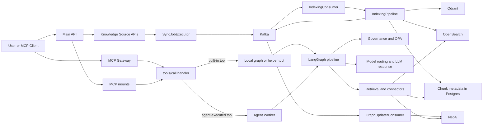
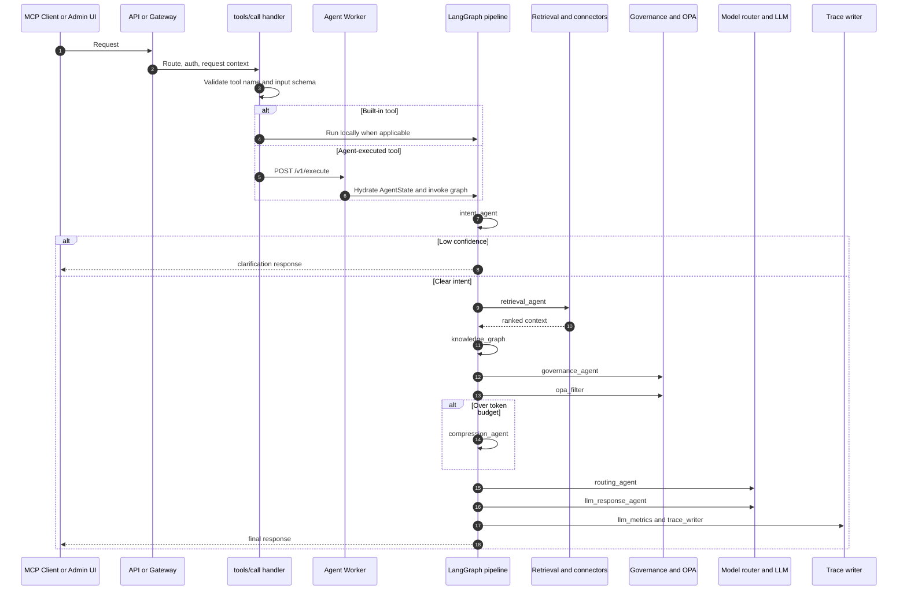
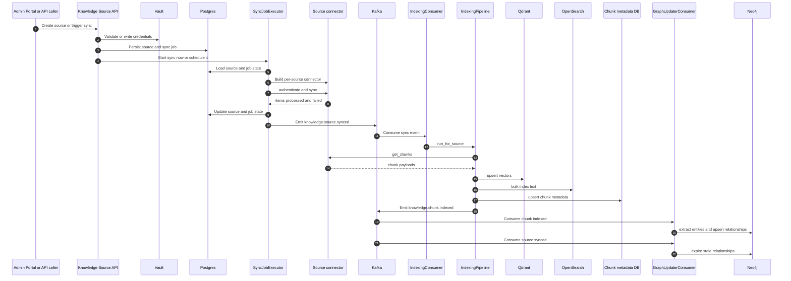

# Application Workflow

## Purpose

This document describes the end-to-end application workflow in ContextIQ.
It complements [mcp-request-workflow.md](mcp-request-workflow.md), which is
focused on MCP request handling, by covering the broader runtime topology:

- request execution through the API, gateway, and agent worker
- knowledge-source sync and indexing
- knowledge-graph enrichment
- the highest-risk handoffs between those stages

## Related Documents

- [mcp-request-workflow.md](mcp-request-workflow.md) for the MCP-specific request path
- [pipeline-topology.md](pipeline-topology.md) for the LangGraph node topology
- [workflow-refactoring-plan.md](workflow-refactoring-plan.md) for the proposed simplification plan

## Runtime Surfaces

The application is split across three main runtime surfaces.

| Surface | Primary file | Responsibility |
|---|---|---|
| Main API | `src/main.py` | Hosts admin APIs, auth, metrics, knowledge-source routes, MCP mounts, graph runtime, and the cron sync scheduler |
| MCP Gateway | `src/gateway/main.py` | Hosts MCP transports, middleware, request isolation, tool dispatch, and optional local graph execution |
| Agent Worker | `src/agent_worker/main.py` | Compiles and executes the LangGraph pipeline behind `POST /v1/execute` |

This split gives the platform two valid request topologies:

1. in-process graph execution inside the API or gateway runtime
2. remote graph execution through the agent worker

## System Overview

## AI Request Workflow

The AI request path starts at the MCP-facing surface and ends in the shared
LangGraph pipeline.

### Request Stages

1. The request enters either the mounted MCP transport in `src/main.py` or the
   standalone gateway in `src/gateway/main.py`.
2. `src/gateway/handlers/tools_call.py` validates the requested tool and its
   input schema, then attaches request and trace context.
3. Built-in tools can run locally. Agent-executed tools are forwarded through
   `src/gateway/clients/agent_worker_client.py` to `POST /v1/execute`.
4. The agent worker constructs the initial `AgentState` in
   `src/agent_worker/routers/execute.py` and invokes the compiled graph.
5. The graph topology in `src/agents/graph.py` drives intent classification,
   retrieval, graph expansion, governance filtering, optional compression,
   routing, response generation, metrics, and trace writing.

## Knowledge-Source Ingestion Workflow

The ingestion path is asynchronous after sync is triggered. REST initiates the
work, but Kafka carries the pipeline from sync to indexing to graph enrichment.

### Ingestion Stages

1. The knowledge-source routes in
   `src/knowledge_sources/routers/knowledge_source_router.py` create sources,
   trigger health checks, and queue on-demand sync jobs.
2. `src/knowledge_sources/services/knowledge_source_service.py` validates or
   writes Vault credentials before persisting a source.
3. `src/knowledge_sources/sync/executor.py` builds a connector for the specific
   source, runs the sync with retries, updates source and job status, and emits
   `knowledge.source.synced`.
4. `src/indexing/consumer.py` consumes the sync event and invokes
   `src/indexing/pipeline.py`.
5. The indexing pipeline fetches chunks, embeds them, writes them to Qdrant,
   OpenSearch, and PostgreSQL chunk metadata, then emits
   `knowledge.chunk.indexed`.
6. `src/knowledge_graph/updater/consumer.py` consumes chunk and sync events to
   update Neo4j entities and relationships.

## Shared Control Points

Several responsibilities appear in more than one runtime.

| Responsibility | Where it appears | Why it matters |
|---|---|---|
| Graph initialization | `src/main.py`, `src/gateway/main.py`, `src/agent_worker/main.py` | Drift here causes different behavior between local execution and worker execution |
| Connector registry wiring | `src/main.py`, `src/gateway/main.py`, `src/agent_worker/main.py` | Retrieval and sync both depend on the registry being loaded and injected |
| Routing runtime setup | `src/main.py`, `src/gateway/main.py`, `src/agent_worker/main.py` | Model-routing behavior depends on the same Redis and database-backed runtime state |
| OPA client and health | `src/main.py`, `src/gateway/main.py`, `src/agent_worker/main.py` | Policy posture changes if one runtime starts in degraded mode while another does not |

The architecture is intentionally flexible, but duplicated bootstrapping means
the platform has a real configuration-drift risk.

## Highest-Risk Handoffs

1. Gateway-to-worker dispatch in `src/gateway/handlers/tools_call.py` and
   `src/gateway/clients/agent_worker_client.py`.
   Authentication, correlation headers, or worker availability failures stop
   requests before the graph runs.
2. Graph bootstrapping across `src/main.py`, `src/gateway/main.py`, and
   `src/agent_worker/main.py`.
   A missing dependency in only one runtime produces inconsistent behavior.
3. Sync-to-indexing event emission in `src/knowledge_sources/sync/executor.py`.
   If the Kafka payload drifts from the consumer schema, sync can appear to
   succeed while indexing silently does nothing useful.
4. Source-specific connector loading in `src/indexing/pipeline.py`.
   The startup registry is type-oriented, but indexing often needs a connector
   constructed from a single knowledge-source row with its own scope and Vault
   path.
5. Indexing-to-graph enrichment in
   `src/knowledge_graph/updater/consumer.py`.
   Successful indexing does not guarantee the knowledge graph is current,
   because graph enrichment is another asynchronous stage.

## Operational Interpretation

The practical shape of the system is:

1. synchronous control-plane APIs for source management and tool entry
2. a shared LangGraph execution core for AI workflow
3. Kafka-backed asynchronous ingestion and enrichment after sync

That separation is clean at a high level, but the same graph and connector
dependencies are wired in multiple places. Any future simplification effort
should treat duplicated startup and per-source connector construction as the
first places to normalize.