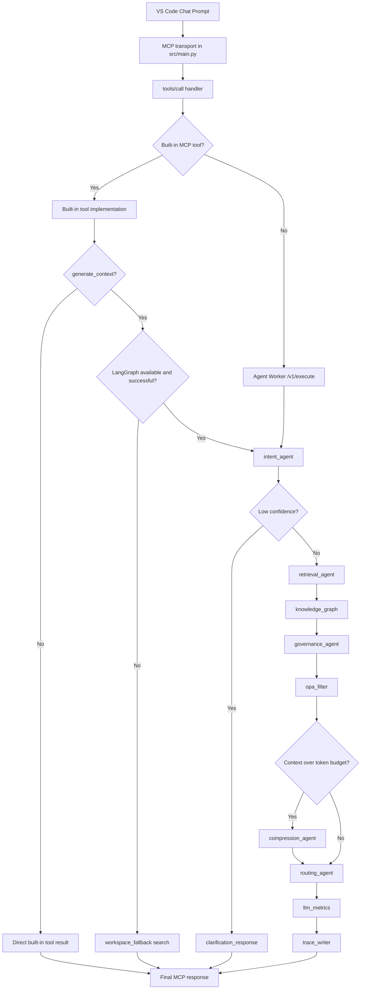

# ContextIQ MCP Request Workflow

## Purpose

This document describes how a prompt travels through the ContextIQ MCP server,
which components participate in the full agent pipeline, when connectors are
required, and where governance and policy enforcement apply.

It also records the current live behavior observed in local Docker development
so there is a clear distinction between the intended full pipeline and the
fallback path that is currently serving some MCP requests.

## Related Documents

- [application-workflow.md](application-workflow.md) for the broader system workflow beyond MCP
- [pipeline-topology.md](pipeline-topology.md) for the LangGraph node and edge layout
- [workflow-refactoring-plan.md](workflow-refactoring-plan.md) for the architectural cleanup plan derived from this flow

## Entry Points

There are two relevant application entry points:

- `src/main.py`
  - The FastAPI application that currently serves the MCP HTTP and SSE mounts at
    `/mcp` and `/mcp/sse`.
  - Also owns auth routes, admin APIs, metrics, and the startup lifecycle that
    prepares the MCP runtime dependencies.
- `src/gateway/main.py`
  - A gateway-focused application factory with equivalent MCP runtime wiring.
  - Useful as the reference implementation for graph, connector, and OPA setup.

The actual MCP server instance and tool registration live in `src/gateway/mcp_server.py`.

## High-Level Request Paths

### Path A: Built-in MCP tool path

This is the path used by `generate_context`, `compress_context`,
`replay_execution`, and the enterprise tools registered directly on the FastMCP
server.

1. VS Code prompt selects a ContextIQ MCP tool.
2. The request enters the MCP transport mounted by `src/main.py`.
3. `src/gateway/handlers/tools_call.py` validates the tool name and arguments.
4. If the tool is built in, the handler executes it locally in-process.
5. `generate_context` first tries the LangGraph pipeline.
6. If graph execution is unavailable or fails, it returns a local
   `workspace_fallback` context package instead.

### Path B: Agent worker dispatch path

This is the path for non-built-in registered tools that are validated by the
gateway and then dispatched to the agent worker.

1. VS Code prompt selects a ContextIQ MCP tool.
2. The MCP tool call enters `src/gateway/handlers/tools_call.py`.
3. The handler builds a `ToolCallDispatch` payload.
4. The payload is forwarded to the agent worker client.
5. The agent worker executes the compiled LangGraph graph via
   `POST /v1/execute` in `src/agent_worker/routers/execute.py`.
6. The worker returns a structured success or error payload to the MCP layer.

## End-to-End Topology

## Full Pipeline Stages

### 1. Intent classification

File: `src/agents/nodes/intent.py`

- Classifies the prompt into one of the canonical intent types.
- Produces `intent_type`, `intent_confidence`, selected source list, and an
  execution plan.
- Uses `LiteLLMChain` with a local Ollama-backed model.

### 2. Source selection and execution planning

Files:

- `src/agents/source_selector.py`
- `src/agents/planning/plan_generator.py`

This stage determines which source ids the retrieval layer should query.

Examples:

- `debugging` -> `github`, `stackoverflow`, `jira`
- `architecture` -> `confluence`, `github`, `miro`
- `incident` -> `grafana`, `jira`, `pagerduty`

### 3. Retrieval agent

File: `src/agents/nodes/retrieval.py`

- Requires `ConnectorRegistry` to be loaded and injected.
- Dispatches connector fetches in parallel.
- Aggregates raw and ranked context.
- Records degraded or failed sources.

This is the first stage where real external connectors are required.

### 4. Knowledge graph expansion

File: `src/knowledge_graph/nodes/knowledge_graph_node.py`

- Uses entity linking and Neo4j traversal.
- Appends graph-derived context items to the ranked context.
- Skips if there is no budget or no seed entities.

### 5. Governance gate

File: `src/governance/nodes/governance_node.py`

- Scans ranked context for secrets and PII.
- Applies compliance checks.
- Applies RBAC checks.
- Redacts high-severity findings.
- Can block context entirely.

### 6. OPA policy filter

File: `src/governance/nodes/opa_filter_node.py`

- Evaluates chunk-level allow/deny policy via OPA.
- Filters denied chunks from `ranked_context`.
- Records decisions into execution trace.

This is where policy enforcement is applied after governance scanning.

### 7. Compression

File: `src/agents/nodes/compression.py`

- Executes only when the context exceeds the token budget.
- Deduplicates, semantically compresses, and optionally summarizes chunks.

### 8. Routing and final response

File: `src/agents/nodes/routing.py`

- Selects the model path.
- Produces the final `context_package` payload.
- Includes governance summary and degraded sources.

## Where Connectors Are Needed

Connectors are required only when the request reaches `retrieval_agent`.

They are not required for:

- MCP handshake
- `tools/list`
- local built-in helper tools that do not retrieve enterprise context
- `workspace_fallback` behavior

They are required for:

- full `generate_context` pipeline mode
- non-built-in tools dispatched through the agent worker
- any retrieval path that needs GitHub, Confluence, Jira, Grafana, or other
  configured enterprise sources

## Where Governance and Policy Apply

Governance and policy are only applied inside the full graph path.

- Governance scan: after retrieval and knowledge graph expansion
- OPA authorization filter: after governance scan and before routing or compression

If a request returns `mode = workspace_fallback`, governance and OPA filtering
did not run for that response.

## Current Local Development Status

As of 2026-07-30, the local MCP stack exhibits the following observed behavior:

### Fixed during this debugging session

- `src/main.py` now wires the MCP-serving app with:
  - `ConnectorRegistry` injection for retrieval
  - trace-writer dependencies
  - compiled LangGraph initialization
  - `clarification_reply` graph injection
  - OPA client initialization with degraded startup handling
- `src/agents/nodes/intent.py` now imports `settings`, fixing a runtime
  `NameError` in the first graph node.
- `src/gateway/handlers/tools_call.py` now logs info-level MCP tool receipt
  lines including `request_id`, `session_id`, `user_id`, and execution mode.

### Still observed live

- `generate_context` now enters the graph handoff and reaches `intent_agent`.
- The graph still falls back to `workspace_fallback` because `intent_agent`
  returns a failed state with:

  - `failed_node = intent_agent`
  - `error_type = KeyError`
  - `message = '"intent_type"'`

- OPA is reachable, but startup bundle verification remains degraded because
  `GET /v1/status` returns `500 status plugin not enabled` in the local OPA
  container.

## How To Tell Which Path Ran

### MCP connected successfully

Signals:

- VS Code MCP output shows `Discovered 16 tools`
- API log shows `tools/call received: tool=generate_context ...`

### Built-in fallback path ran

Signals:

- Response payload contains `"mode": "workspace_fallback"`
- No downstream pipeline success log from the agent worker path

### Full graph path ran

Signals:

- API logs show `node_entry` / `node_exit` for graph nodes
- Response payload contains `"mode": "pipeline"`
- Context payload includes routing and governance-derived fields rather than a
  simple local search package

## Full-Pipeline Checklist

Use this checklist when you want a request to exercise the full agent pipeline.

1. MCP client is connected and authenticated.
2. `src/main.py` has initialized the compiled graph during startup.
3. Ollama is reachable and the required local model is available.
4. `ConnectorRegistry` is loaded and the selected connectors are registered.
5. Connector credentials are valid for any source ids selected by the intent node.
6. Neo4j is reachable if knowledge graph expansion is expected.
7. OPA is reachable and its policy data path responds as expected.
8. The prompt reaches `intent_agent` without schema or parser failure.
9. The request does not terminate in clarification or failed state.
10. The final payload reports `mode = pipeline`.

## Key Files

- `src/main.py`
- `src/gateway/mcp_server.py`
- `src/gateway/handlers/tools_call.py`
- `src/gateway/tools/enterprise/context_tools.py`
- `src/agents/graph.py`
- `src/agents/nodes/intent.py`
- `src/agents/nodes/retrieval.py`
- `src/knowledge_graph/nodes/knowledge_graph_node.py`
- `src/governance/nodes/governance_node.py`
- `src/governance/nodes/opa_filter_node.py`
- `src/agents/nodes/compression.py`
- `src/agents/nodes/routing.py`
- `src/agent_worker/routers/execute.py`